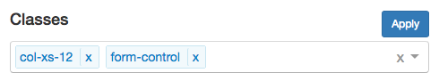

# Classes, Attributes and Styles

The property grid tries to provide a quick means for modifying classes and attributes for a given element.

## Classes

The Classes section is used to add and remove classes from a given element. You can either click in the control for a dropdown to appear or you can type a class in the input element. If you use the dropdown and select an element, you must click on the blue apply button to apply your changes to the element. Otherwise, you can simply hit enter in the input element to add the class directly to the selected element in the designer.

The following is a screen shot of the classes section:

This is a screen shot of the dropdown for selecting an existing class. The contents of the dropdown corresponds to the CSS library selected:

### Attributes

The Attributes section is used to add and remove attributes from a given element. You must click on the blue check button to apply your changes to the element. It consists of two parts:

* **Name** - this is the name of the attribute
* **Value** - this is the value assigned to the attribute

The following is a screen shot of the attributes section:

### Styles

The Styles section is used to add and remove styles directly on a given element. You must click on the blue apply button to apply your changes to the element.

The following is a screen shot of the styles section:

[ <- Previous ](preview) | [ Home ](home) | [ Next -> ](data-bind)
