# Designer

The designer is where you will be able to quickly drag and drop elements onto the designer surface. You will be able to build complete screens or simply a component you wish to save for resule for building hybrid screens later.

The following screen shot illustrates what you would see if you created a new screen without making it a data form.

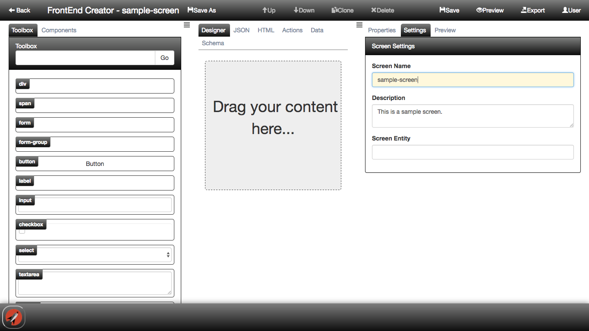

Let's now break down each section and go over what they do:

## Header

The designer header provides a lot of capabilities. The following is a screen shot of the header:

Here are the capabilities of the header:

* **Back button** - this will return you to the previous (Screens) screen.
* **Title** - this will display the product name as well the name of the screen you are currently working on.
* **Save As button** - this will allow you to clone the screen and save it as a new one. You must be sure to provide a new name for the screen.
* **Up button** - this will only be enabled when an item is selected on the designer surface. It will allow you to move the selected item up.
* **Down button** - this will only be enabled when an item is selected on the designer surface. It will allow you to move the selected item down.
* **Clone button** - this will only be enabled when an item is selected on the designer surface. It will allow you to clone the selected item and append it to the same location.
* **Delete button** - this will only be enabled when an item is selected on the designer surface. It will allow you to remove the selected item.
* **Save button** - this will allow you to save your current work.
* **Preview button** - this will allow you to launch a new browser tab and preview your work. Remember to save so that your changes will be reflected!
* **Export button** - this will allow you to export the screen as a view (.html) and view-model (.js) file for you to play with outside the tool.
* **User button** - this will allow you to logout and see the database you are currently connected to. It also provides a link to help documentation.

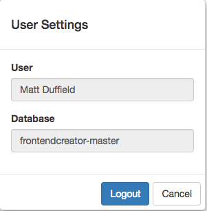

## Footer

The footer provides a menu. You can jump back to projects or any other applications that are available to you. The following is a screen shot of the footer in action:

## Left Dock Pane

The left dock pane contains the Toolbox and Components tabs. You can collapse the pane so that you have more surface to work on as well.

You can open/close the dock pane by clicking on the hamburger icon. The following animation shows how you can toggle the left dock pane:

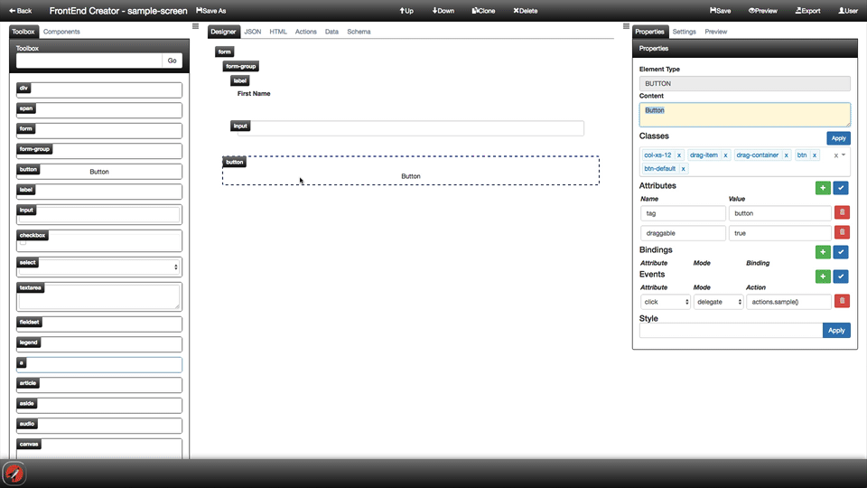

### Toolbox

The Toolbox provides a list of all the elements that you can drag and drop onto the designer surface. You have the ability to search for a given element. If you want to revert back to all of the elements, simply clear the search input.

The following animation shows how you can use the toolbox as well as filter its contents:

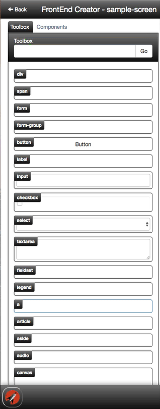

As you saw in the animation, the search input uses partial name matching as well as tags. The following is a list of existing tags that controls are grouped by:

* flow
* form
* image
* inline
* input
* list
* media
* phrase
* sectioning
* table
* text
 
To add an element on to the designer surface, simply click and drag the element from the toolbox onto the designer surface.

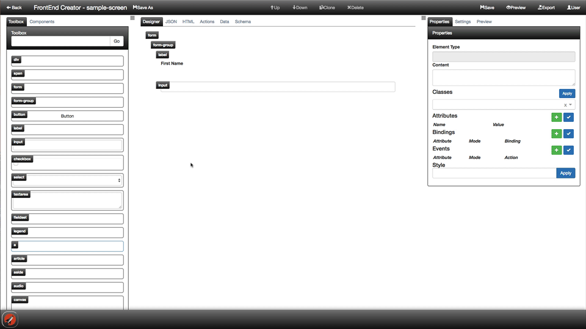

### Components

The components provides a list of all of the screens that you have authored for this project. This list is exactly the same as the list on the Project Screens screen. It is available here to allow you to compose hybrid screens by adding them to the designer surface. This promotes component reuse and allows you to mitigate redundancies as much as possible. Also, notice that the icon selected when creating the screen will show up here as well.

The following is a screen shot of the components tab:

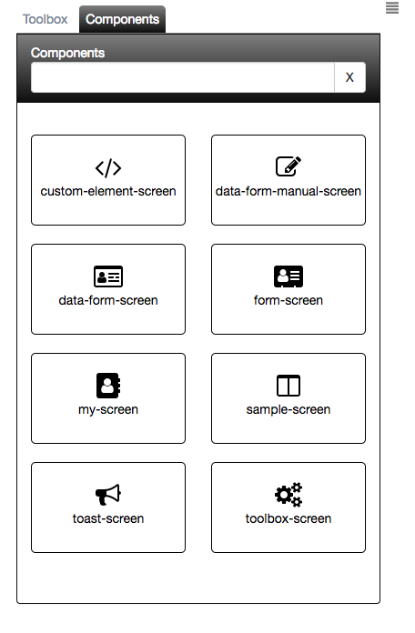

To add a component on to the designer surface, simply click and drag the element from the components tab onto the designer surface.

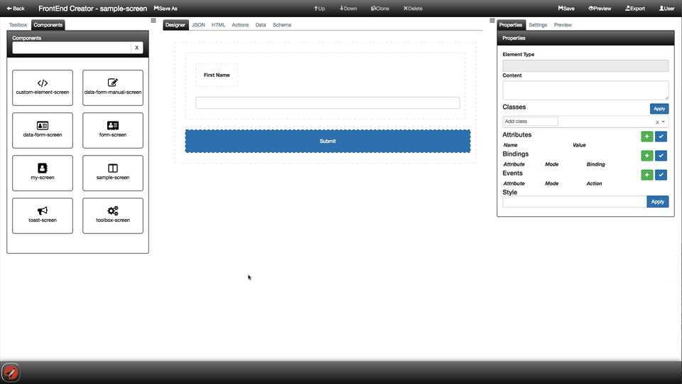

## Right Dock Pane

The right dock pane contains the Properties, Settings, and live Preview tabs. You can collapse the pane so that you have more surface to work on as well.

You can open/close the dock pane by clicking on the hamburger icon. The following animation shows how you can toggle the right dock pane:

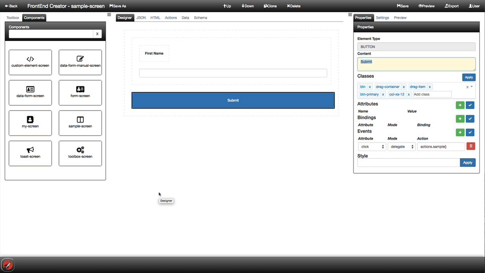

### Properties

The properties tab is dynamic and shows different properties depending on the selected item on the designer surface. If the right dock pane is closed and you click on an element on the designer surface, the pane will open automatically.

The following is a screen shot of the properties tab:

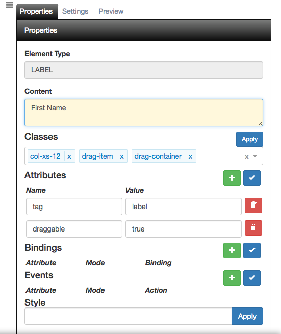

### Settings

The screen settings tab is the same as the one you saw on the Project Screens screen. It allows you to do quick changes to the name or description without leaving the view.

The following is a screen shot of the settings tab:

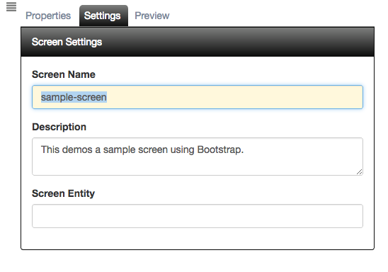

The screen name is an important property. **FrontEnd Creator** will use it as the dynamic route when you preview your work. Therefore, it is important to be sure that you have a valid name entry. It is best not to put any spaces or special characters in the name.

### Preview

The preview tab allows you to preview your changes live as you work on the designer surface or the HTML tab.

The following is a screen shot of the designer surface after adding a form, form-group, label, input element, and button:

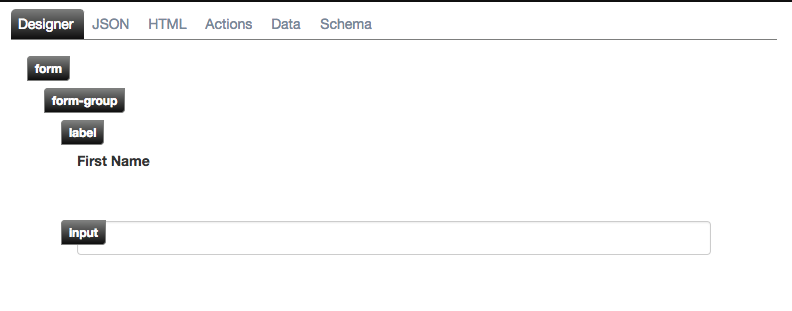

The following is a screen shot of the preview tab:

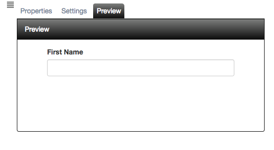

## Main Designer Surface

This areas is where all the layout design is accomplished either by the designer tab or by the HTML tab.

### Designer

The designer tab is used to drag and drop elements from the Toolbox and also configure properties. When using the designer tab, you will most likely use the properties tab from the right dock pane.

The following is a screen shot of the designer surface with the properties tab:

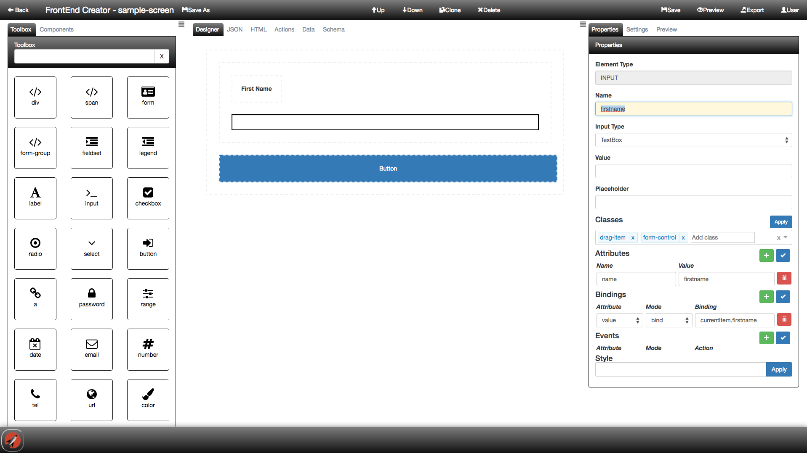

#### Up/Down Buttons

The Up/Down buttons give you the ability to move the selected element up/down within the same parent container.

The following animation demonstrates this:

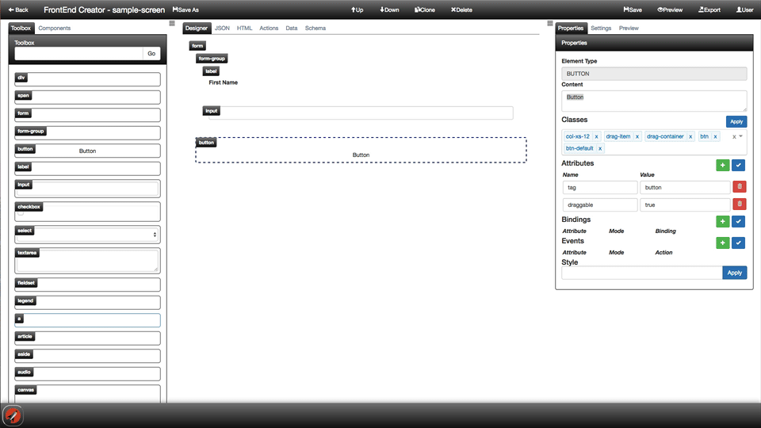

#### Clone/Delete Buttons

The Clone/Delete buttons give you the ability to clone/delete the selected element.

The following animation demonstrates this:

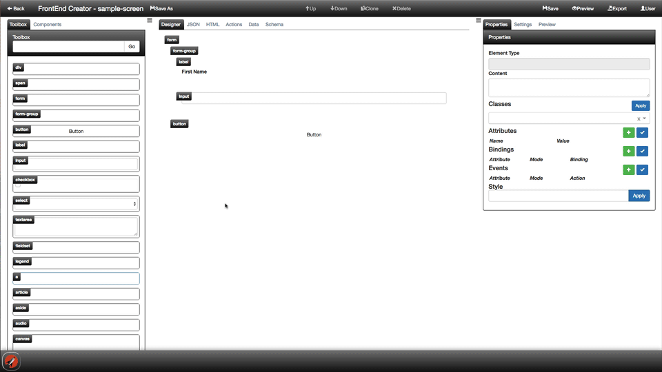

### JSON

All data is stored as JSON back to the server. The JSON tab is a representation of the data that is saved. It is read-only.

The following is a screen shot of the JSON tab:

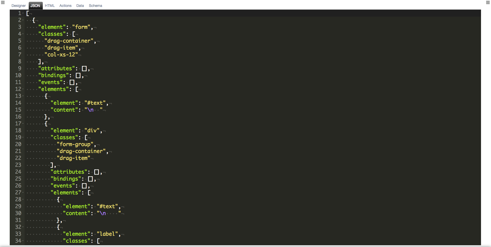

### HTML

Besides defining layout with the designer tab, you can go into the HTML tab and modify markup there. You can then go back to the designer tab and review your changes or vice versus. You also can preview any of your changes live using the preview tab from the right dock pane.

The following is a screen shot of the HTML tab:

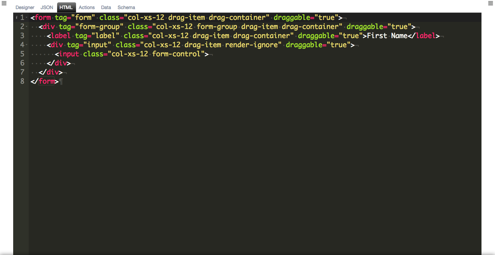

### Actions

As with any screen development, there may come a time when you will want to provide custom behavior. This is accomplished using the Actions tab. You have the ability to inject your own behavior here. The application uses convention over configuration and if you name a function 'activate' or 'attached', it will execute these during the screen activation lifecycle.

The following is a screen shot of the actions tab:

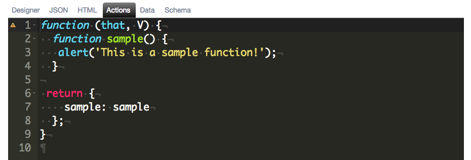

There will be a whole section dedicated to actions and how to use them in your screens.

### Data

The data tab provides you with the ability to data-bind and test out your screen. It also allows you to pass in data that is considered static and will not be pulled dynamically from a Web API call, etc. 

The following is a screen shot of the data tab:

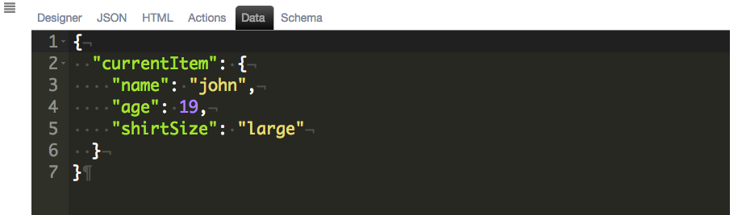

There will be a whole section dedicated to data and how to use it in your screens.

### Schema

The schema tab provides you with the ability to support validation in your screen if you are using the data-form custom element. You have the ability to use it when you create a new screen. The schema you provide be used against the data that the data-form is bound to.

The following is a screen shot of the schema tab:

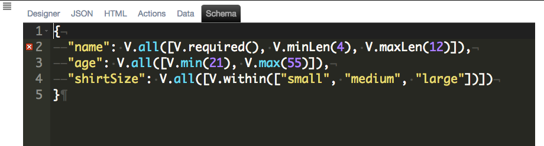

There will be a whole section dedicated to schema and how to use it in a data-form.

[ <- Previous ](screens) | [ Home ](home) | [ Next -> ](preview)
