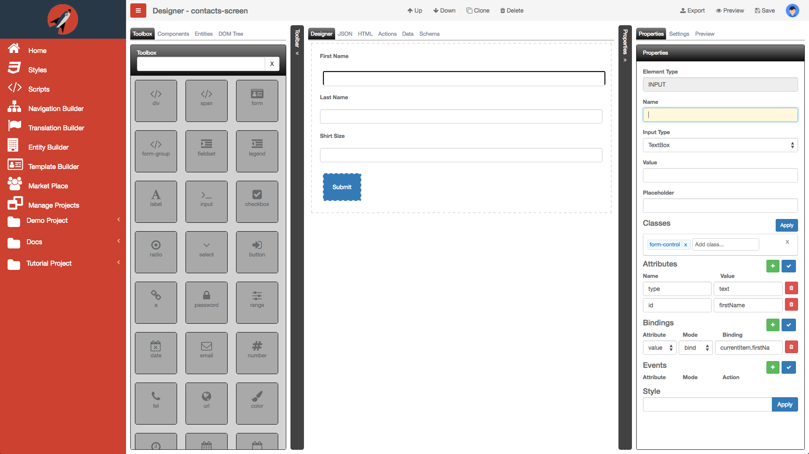

# Introducing FrontEnd Creator

Building applications with Aurelia has never been so much fun and the **FrontEnd Creator** makes it even more enjoyable. The tool allows you to group your applications into projects. Within each project you have multiple screens. You are able to drag and drop standard HTML elements as well as custom elements onto the designer surface. You can then configure properties of a selected element using the dynamic property grid. 

<!--  -->

Everything is saved as JSON and you have the ability to live preview your changes immediately as well as share links for a given screen with co-workers or clients so that they can interact with your design.

## See it in action

The following animation shows how little work it takes to rapidly create a screen and preview it live using **FrontEnd Creator**:


  https://youtu.be/dNkkJqlopDY


As you can see, you have the ability to edit the HTML directly and see the changes reflected in the designer tab. You can either preview directly in the editor or launch a new tab for preview.

## Extensibility

Currently, **FrontEnd Creator** supports Twitter Bootstrap 3 for building responsive applications. Support for other frameworks will follow. It also targets Aurelia for markup and data-binding but it will be possible to use other targets such as Angular as well.

The **FrontEnd Creator** has been built with extensibility in mind from the ground up. Everything in this application was built using the rendering engine. In fact all screens that make up **FrontEnd Creator** use the rendering engine as well.

## Next steps

Currently, **FrontEnd Creator** is in a *closed beta*. Please send an email to [Support@frontendcreator.com](mailto:support@frontendcreator.com)

Space is limited but you will have full access to the application.

Our goal is to make this a first class solution for building web applications!

[ www.frontendcreator.com ](http://www.frontendcreator.com)

