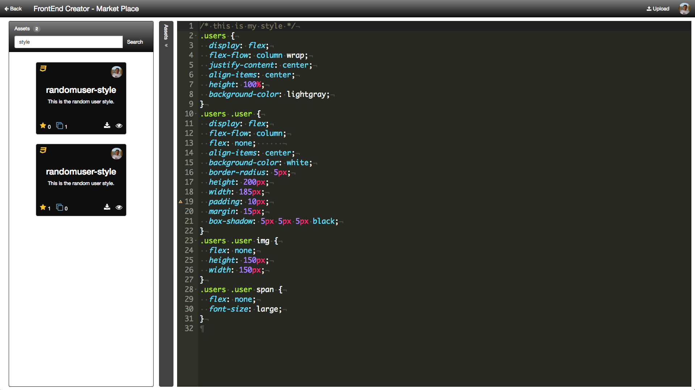
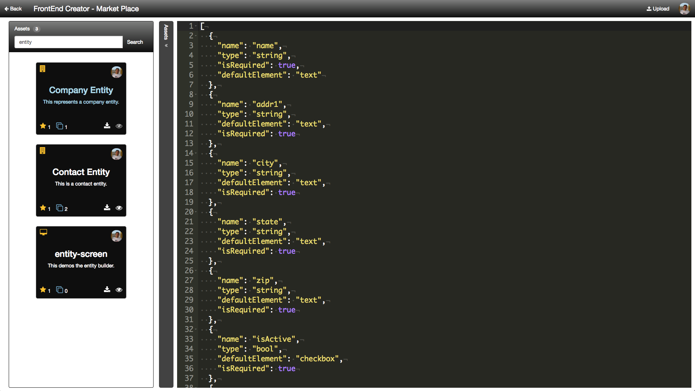
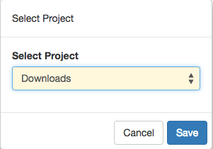
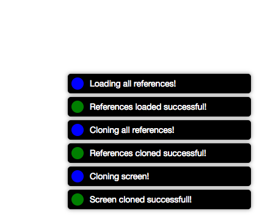

# Market Place

The Market Place is meant to allow developers to share and explore content uploaded by other developers. 

When you first go to the Market Place, you are presented with an Assets panel with a search box and a preview panel.

You can begin exploring the Market Place by first understanding that there are four different types of assets available: 

* screen - refers to screens created using the designer. Any referenced scripts, styles, or language will be bundled when downloaded
* script - refers to scripts created using the Scripts editor
* style - refers to styles created using the Style editor
* entity - refers to the entities created using the Entity Builder
* language - refers to the language mappings created using the Multilingual Builder

When you perform a search and see some results, you will be presented some key information.

* All assets will have an icon in the top left corner to identify the type of asset
* All assets will have an avatar that will provide attribution to who created the asset. This will be fleshed out further in future releases
* All assets have a `star` icon that you can click on to up the number of stars
* All assets have a `clone` icon with number to identify how many times the asset has been downloaded
* All assets have a `download` icon that a user can click on to initiate a download
* All assets have a `preview` icon that a user can click to preview the asset

You can search for each of these by its type as well as by tags. You have the ability to provide tags to items that you upload to the Market Place.

The following is a screenshot of searching using the `screen` keyword:

You can click on the eye icon to preview any screen.

If you type in `script` and search, you will see an output similar to the following: 

Next, type in `style` and search, you should see something like the following:

> #### danger::
> It is possible to upload the same thing multiple times so be careful.

If you type in `entity` and search, you should see something like the following:

Finally, if you search on `language`, you will something like the following:

> #### danger::
> There is no easy way to update an asset uploaded to the Market Place. It will be important to allow for updating your assets as well as managing tags and other settings.

Let's now look at what happens when we attempt to download an asset. We will download the `randomusers-screen`. When you attempt to download an asset, it will want you to provide an existing Project. For the following example, we have set up a `Downloads` project. Consider the following screenshot:

Here, you can download to any project you like. Click the Save button to begin the download. You will see several messages indicating the process. Remember that if it is a screen and it has references to scripts, styles, or a language mapping, those assets will also be downloaded so that the screen will function properly locally to your project.

The following is a screenshot of the messages you will see when downloading a screen:

Let's now click the Back button and then go into the project you selected, we will go into the Downloads project. You should now see the `randomusers-screen`. 

You can now launch the screen and begin editing or modifying it in the designer as a local copy. 

Hopefully, you see how easy it is to use the Market Place. This is just the beginning and we want to make this feature as polished as possible. We also want to allow for accessing the Market Place publically but only authenticated users would be able to download and clone an assets. You would still be able to preview any asset though.
