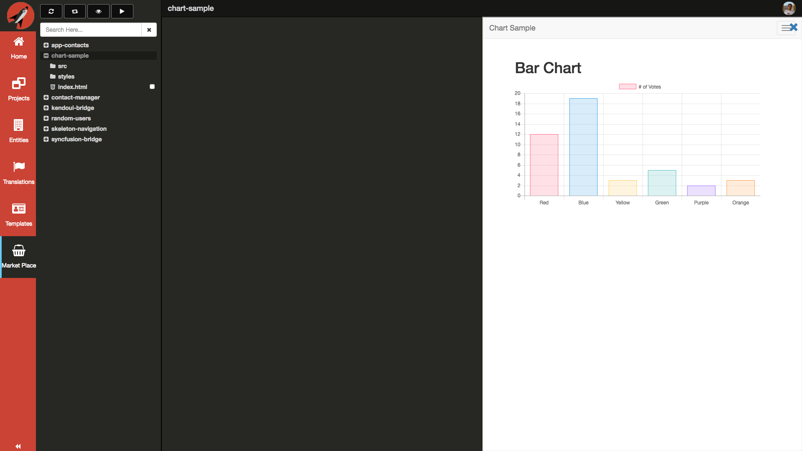
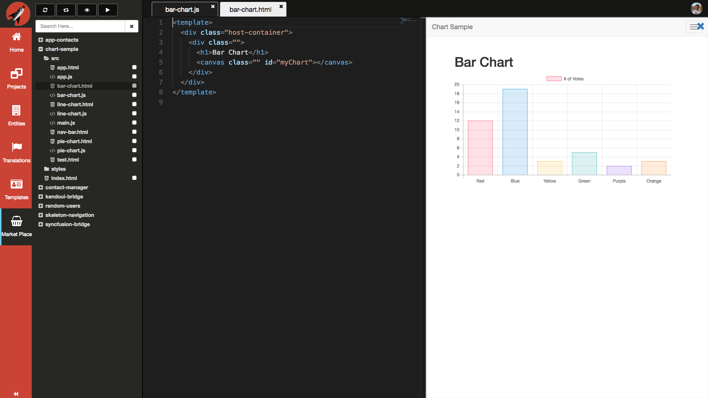
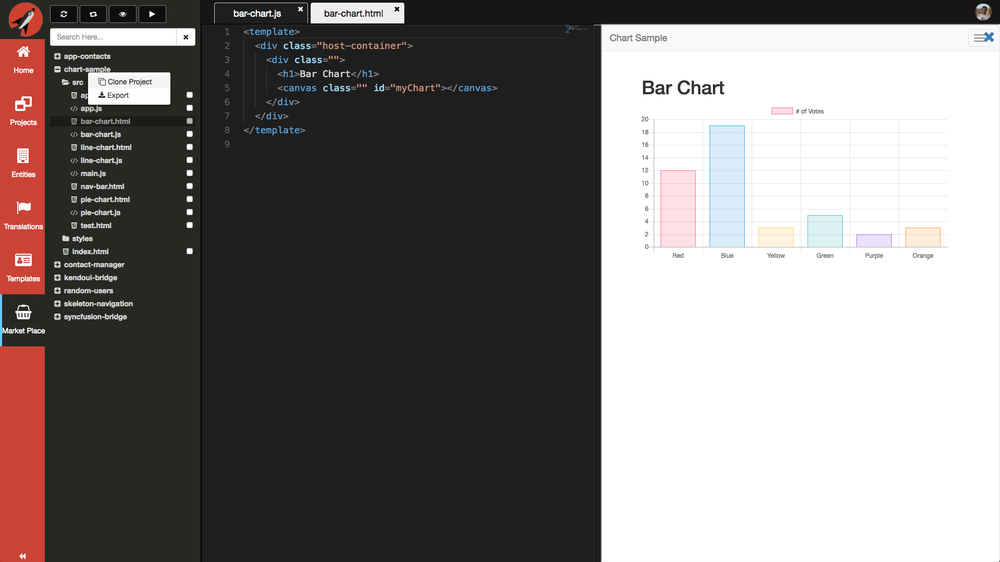
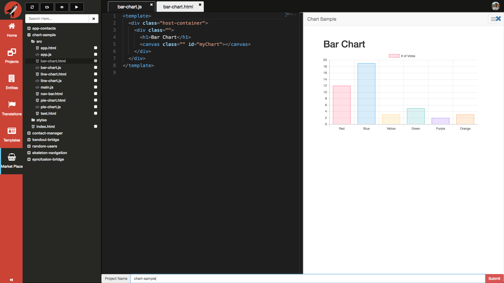
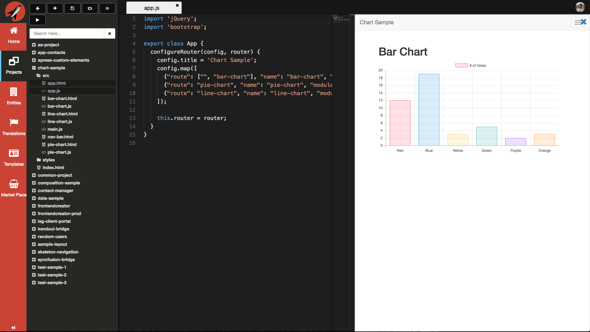

# Market Place

The Market Place is meant to allow developers to share and explore content uploaded by other developers. You are able to preview what is on the Market Place without even loading a file.

All files in the Market Place are opened read-only. This gives you a chance to look at the files but not make any changes.

## Cloning a Project

When you are ready to bring a project from the Market Place into your own projects, simply right-click on the project folder and cick on the **Clone Project** menu item.

You will be prompted to provide a name to be used in your projects folder. In the screen shot below, we are providing the same name as the one from the Market Place.

After you hit submit, the project will be cloned and you will see a toast notification stating so. Click on the **Projects** menu and you should now see your cloned project. The following is an example of loading a file and previewing the project:

## Exporting a Project

If you would like to export a Market Place project and host locally, simply right-click on the project folder and cick on the **Export** menu item.

After several seconds, you will get a ZIP file containing all of the files that are part of the project. Once you extract the contents of the ZIP file into a location of your choice, you can then host a web server over that location and test locally. 
