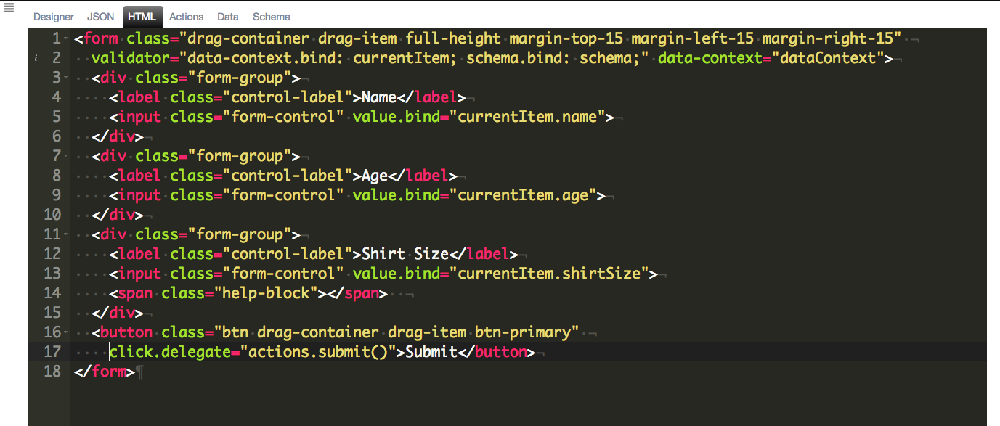
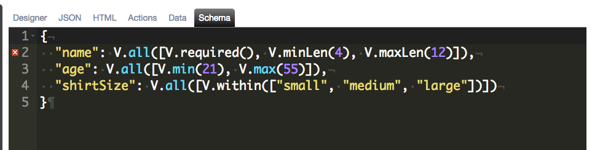

# Validation - Key Concepts

The validator is a custom attribute designed to provide form validation without a lot of ceremony. The validation engine is a functional implementation that uses RamdaJS. You are able to perform batch validation across your form or when you blur away from a control. You also have the ability to validate deep objects.

The validator has the following properties you can set:

* **data-context** - this determines the root object where validation starts.
* **schema** - this is the object that holds the validation rules.
* **show-validation-summary** - this specifies whether or not to display a validation summary.

The following is an example of the HTML markup required to get a data-form configured. If you create a new screen and select Is DataForm, then this will already be set for you:

Here is a screen shot of the Schema tab:

You can learn more about using the Validator [ here ](./advanced-concepts.md).

Here is a screen shot of the Data tab:

Here you can see the validator in action:

As you can see from the animation, you can use the validation summary to navigate to each individual validation error.

**Remember** You can learn more about using [ Validation - Advanced Concepts ](./advanced-concepts.md).

