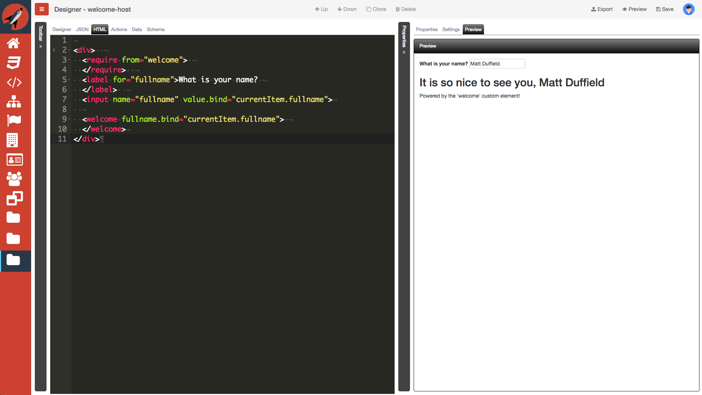
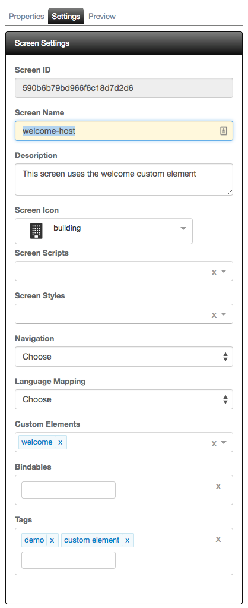

# Custom Elements

It is important to note that any screen that you create can be used in subsequent screens as custom elements. This makes it really easy to start consuming a screen as a custom element.

The following is a screenshot of using a custom element that expects a binding:

## Overview

As you have already seen, it is possible to create a new screen with a hybrid of previosly saved screens by simply dragging and dropping the screen from the `Components` tab. This is great, but the moment you drop the element on the designer surface, you now have a copy of the HTML and it becomes static. Also, if you had previously wired up any behavior, you will now need to copy any actions from the previous component and paste them into the current screen's `Actions` tab.

In Aurelia, custom elements provide great encapsulation of behavior and markup. This allows you, the developer, to create a custom element and use it on multiple views. Later, if you need to change the look and feel, you can simply update the custom element and all views using it will now have the update along with behavior. 

## Custom Element Workflow

It is possible to have any screen treated as a custom element from another screen design. Since we will be referencing all custom elements using the `require` syntax in HTML, it is recommended to use lowercase spelling and avoid spaces. 

You can also have your markup have bindings that are expected to be set on the custom element tag. This is accomplished by providing all of the bindable names by clicking the Settings tab in the designer and setting the names under the Bindables section.

This is now possible with **FrontEnd Creator**. You can select any other screen to be used as a custom element under the `Settings` tab. There is a label, "Custom Elements" that allows you to select the screens you wish to use.

The following is a screenshot with a screen selected:

Next, you will need to **require** the custom element, just as you would a standard Aurelia custom element. Then, you can simply use the element in your markup as show below:

As you can see, once you save, the `Preview` tab renders the contents of the custom element. 

> #### danger::
> The designer does not know how to render the custom element as it treats it as pure markup. 

Now, if you were to change the `welcome` text, etc. and save. You would immediately get those changes the next time you rendered your new screen.

Refer to the [ Custom Element Tutorial ](../../tutorials/custom-element.md) for tutorial on working with custom elements in your screens.

