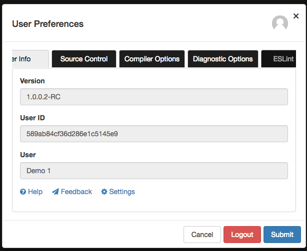
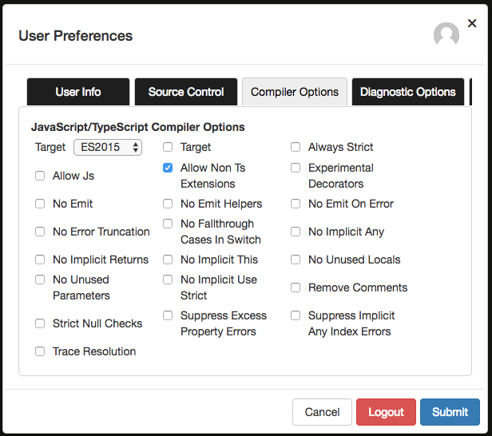
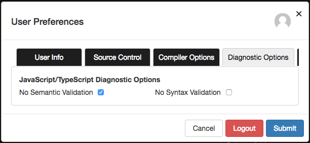

# Editor Options
**Frontend Creator** uses the Monaco Editor. This is the same editor that is used for Visual Studio Code. The editor has a lot of capabilities and features that can be configured for your development scenarios. **Frontend Creator** gives you the ability to configure both compiler and diagnostic optoins for the editor.

You can view the settings by clicking on the user icon on the top-right corner of the application. 

You may need to scroll the tabs in order to get the ESLint Rules section:

## Compiler Options
The compiler options are based on Monaco Editor options found 
[here](https://microsoft.github.io/monaco-editor/api/interfaces/monaco.languages.typescript.compileroptions.html)

Take some time to play with these settings.

## Diagnostic Options
The diagnostic options are based on the `Monaco Editor` and can be [here](https://microsoft.github.io/monaco-editor/api/interfaces/monaco.languages.typescript.diagnosticsoptions.html)

Take some time to play with these settings.

Finally, click on `Submit` to save

> #### danger::
> We also offer ESLint if you find that you want more specific rules enforced as you author your code.

