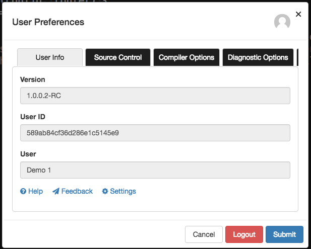
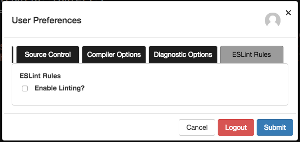
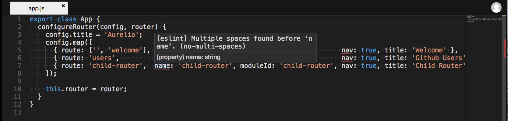

# ESLint
**Frontend Creator** uses ESLint for linting JavaScript and JSX projects. You can turn on linting by clicking on the user icon on the top-right corner of the application. 

You may need to scroll the tabs in order to get the ESLint Rules section:

Finally, click on the `Enable Linting?` checkbox and then click on `Submit` to save

You will notice that the linting will begin for all your JavaScript files:

> #### danger::
> In the upcoming release, we will offer the ability to configure the rules to better suit your own development style.

