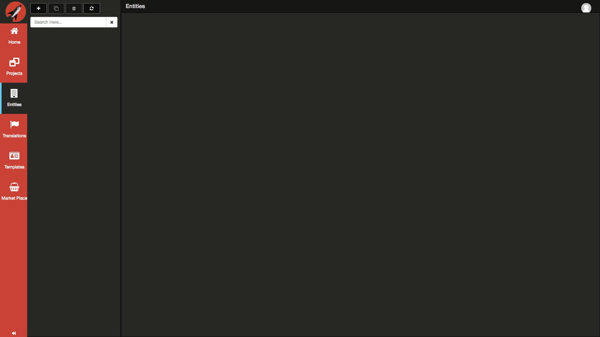
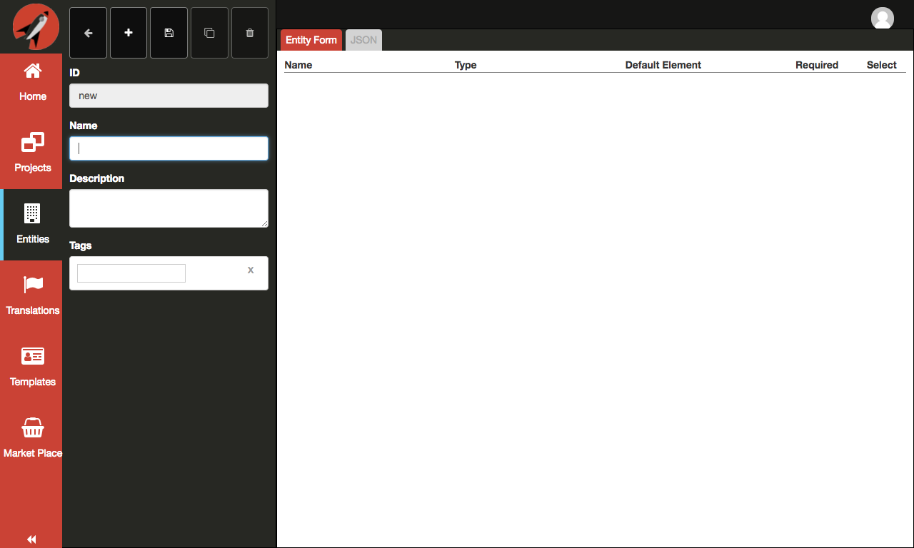
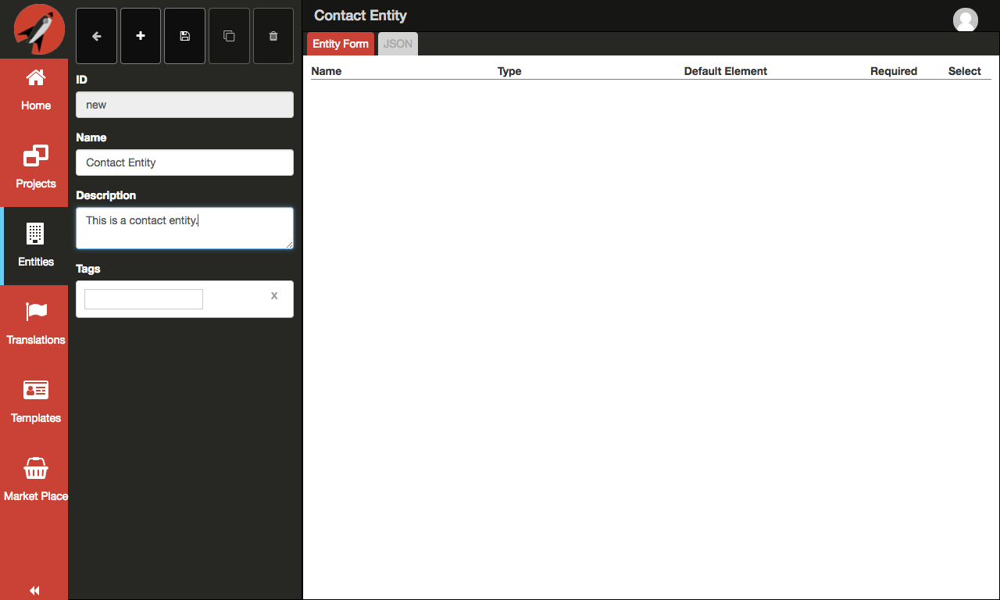
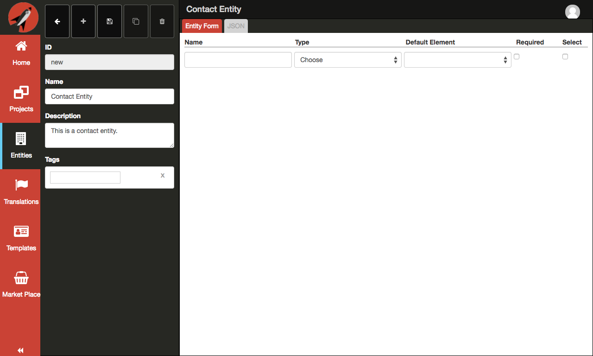
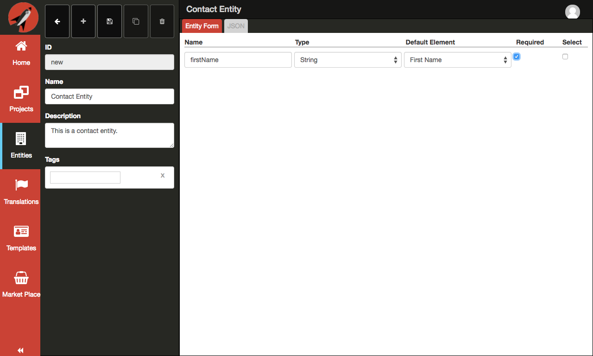
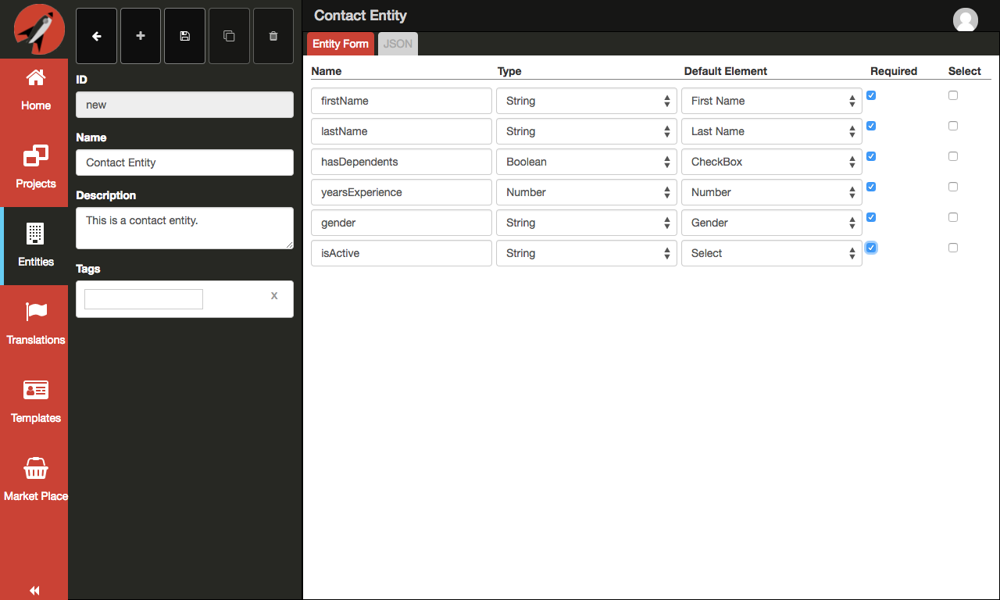
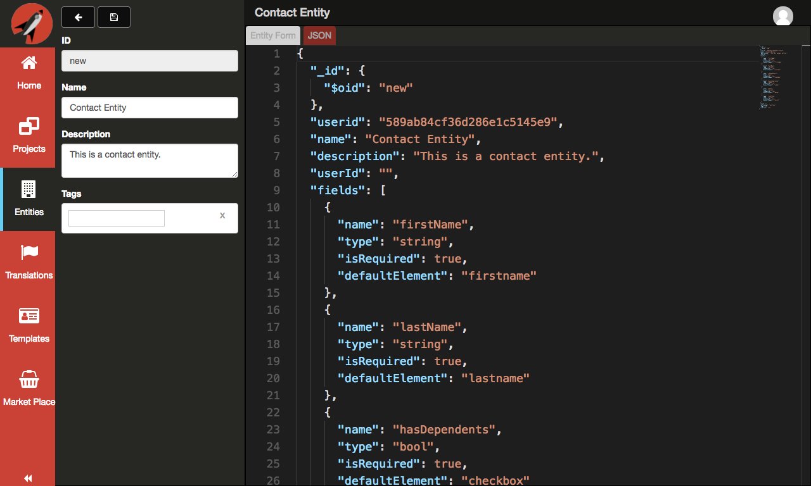
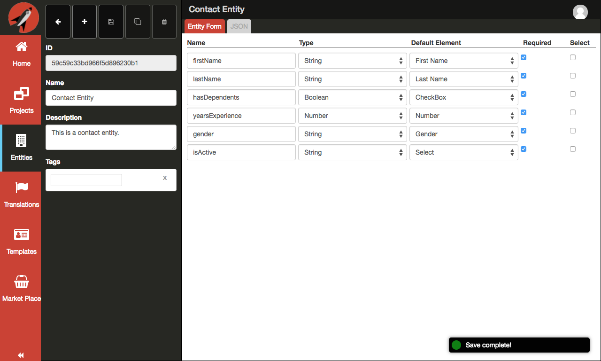
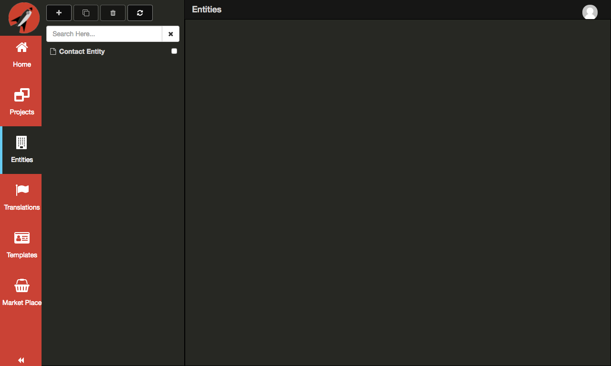

# Creating a new Entity

The following are the steps required to create a new Entity:

1. When you click on the Entities button on the left navigation menu, you will be presented wit the following screen:

  

2. Click on the `Plus` button at the top of the navigation panel: 

  

3. First, enter `Contact Entity` for the `Name` field. Next, enter `This is a contact entity.` for the `Description` field:

  

4. Let's now create some fields by clicking on the `Plus` button on the top left part of the page:

  

5. Fill out the row with the following as seen by the screen shot below:

  

6. We will repeat this several times to complete our entry:

  

7. Now, let's take a look at the JSON produced from the form:

  

8. Click on the `Save` button at the top of the navigation panel to save the entity. You should see the ID update as well as a toast notification:

  

9. Click the `Back` button at the top of the navigation panel to return to the list of Entities:

  

10. Congratulations! You have created your first Entity!
