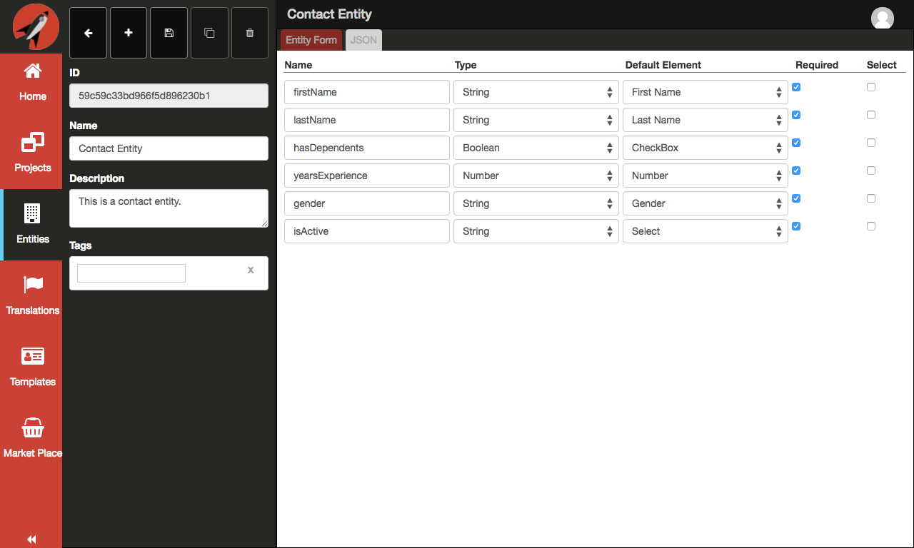
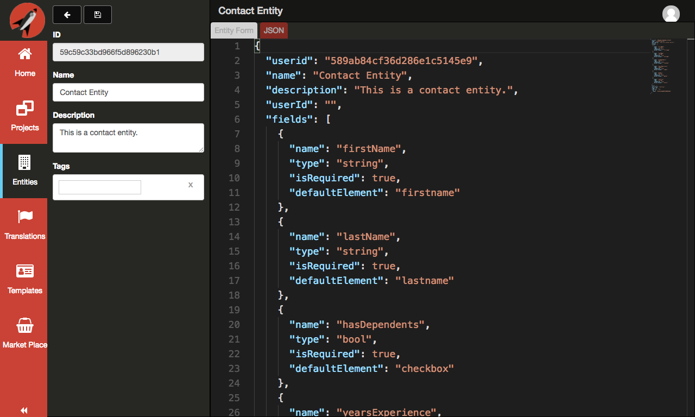

# Entities

The entity builder allows you to quickly create domain models and map them to HTML elements for user entry. It is really meant to speed up your development process when it comes to creating forms. Take a look at the following animation of the designer creating a screen using the Entities tab and an entity created using the **Entity Builder**:

When you click on the Entities button on the left navigation menu, you will be presented wit the following screen:

The following is a screen shot of a new created entity:

## Entity Fields

When creating a field, you provide the following:

- **Name** - this is used for both the label and binding of the field. The system will try to normalize the name with spacing if you use camel-casing
- **Type** - you have the option of `String`, `Boolean`, `Number`, or `Computed`
- **Default Element** - this determines what HTML element to use when creating the form in the designer
- **Required** - this represents making the element required. This will change moving forward to work in conjunction with the `Validator`
- **Actions** - this gives you the ability to delete the field

The following is a table represents the options available for a **String** type:

### String element types
Name | Element | Preview Data
---- | ------- | ------------
TextBox | input[type='text'] | String
Date | input[type='date'] | Date
Email | input[type='email'] | Email
Password | input[type='password'] | Password
Color | input[type='color'] | Color
DateTime-Local | input[type='date'] | Date
Telephone | input[type='tel'] | Telephone
URL | input[type='url'] | url
Radio | input[type='radio'] | Radio values
Select | select | Select options
Image Large | img | Large image source
Image Medium | img | Medium image source
Image | img | Image source
Name | input[type='text'] | Person's name
First Name | input[type='text'] | Person's first name
Last Name | input[type='text'] | Person's last name
Gender | input[type='radio'] | Value between 'Male' and 'Female'
Street | input[type='text'] | Street address
City | input[type='text'] | City
State | input[type='text'] | State
Zip | input[type='text'] | Postal code

The following is a table represents the options available for a **Number** type:

### Number element types
Name | Element | Preview Data
---- | ------- | ------------
TextBox | input[type='text'] | Number
Number | input[type='number'] | Number
Range | input[type='range'] | Number
Month| input[type='month'] | Month number
Week | input[type='week'] | Week number
Radio | input[type='radio'] | Number
Select | select | Select option numbers

The following is a table represents the options available for a **Boolean** type:

### Boolean element types
Name | Element | Preview Data
---- | ------- | ------------
TextBox | input[type='checkbox'] | true or false
TextBox | input[type='radio'] | true or false

> #### info::
> A preview data section was added to the tables to help when you are using the [ Template Builder ](../template-builder/readme.md) and want to visualize your templates immediately.

Click the save button after you have entered the fields you like. Next, if you click on the Entity JSON tab, you should see the following:

