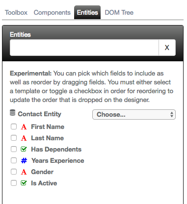
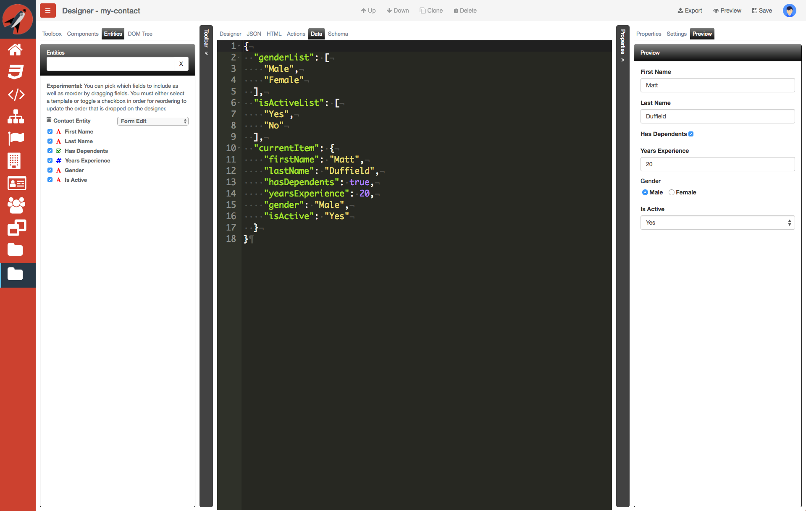
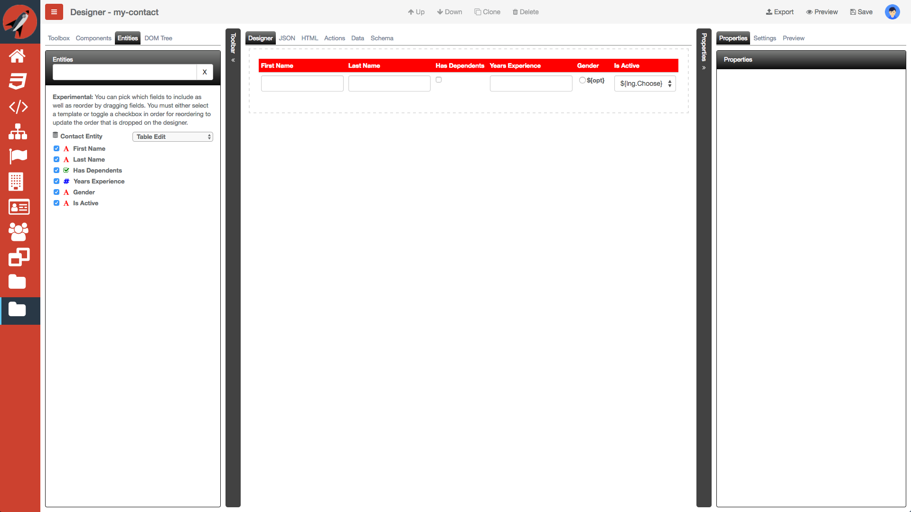

# Using the Entity in the Designer

We have created our entity and now want to use it in the designer. Let's take a look at a simple screen where we will use this capability. Consider the screenshot below:


We are going to create a new screen, `my-contact` that will utilize the new Contact Entity we created. In case you have not created a project, create one called, `Demo`. Next, add a screen called, `my-contact`. 


Now, the designer should be loaded. Click on the Entities tab on the left-side and you should now see the `Contact Entity` we created.

If you click on the label or icon, you should see the following:



You will see color coding and symbols to represent the different data types that were selected when creating the entity. 

If you click on the dropdown, you will be able to choose from the following different types of layout:

- Form Edit - creates a form with editable elements
- Form View - creates a form with non-editable elements
- Table Edit - creates a table with editable elements
- Table View  - creates a table with non-editable elements

Select the type with `Form Edit` and drag the entity onto our designer surface. You should now see the following:


If you save and then click on the Preview tab on the right side, you should see something like the following:


You will notice that the *Gender* element is incomplete. This due to the fact that the HTML is expecting gender values. We will take of that in just a second.

> #### danger::
> The system makes the assumption that you are binding to an object called, `currentItem`. You can change this and anything else to be sure that all is working properly. Also, the system puts placeholders for the Radio bindings and the Select option bindings. You will need to provide the valid objects in order for this to work properly. Sometimes, it is easier to adjust these settings by looking at the HTML tab.

The following is a screenshot of the HTML tab:


Let's leave everything as the default and switch over to the Data tab and add the following:

```javascript
{
  "genderList": [
    "Male",
    "Female"
  ],
  "isActiveList": [
    "Yes",
    "No"
  ],
  "currentItem": {
    "firstName": "Matt",
    "lastName": "Duffield",
    "hasDependents": true,
    "yearsExperience": 20,
    "gender": "Male",
    "isActive": "Yes"
  }
}
```

If you save and now click on the Preview tab, you shoud finally see the following:



Okay, one last twist, let's delete what we have on the designer and drag a Table Edit layout this time. Your designer should look like the following:



> #### danger::
> You may encounter that drag and drop stops working. Simply save your changes and reload the screen.

We will need to change our Data just a little in order to support rows of data instead of a single data object. Switch over to the Data tab and make sure it looks like the following:

```javascript
{
  "genderList": [
    "Male",
    "Female"
  ],
  "isActiveList": [
    "Yes",
    "No"
  ],
  "data": [
    {
      "id": 1,
      "firstName": "Matt",
      "lastName": "Duffield",
      "hasDependents": true,
      "yearsExperience": 20,
      "gender": "Male",
      "isActive": "Yes"
    },
    {
      "id": 2,
      "firstName": "Veronica",
      "lastName": "Duffield",
      "hasDependents": false,
      "yearsExperience": 3,
      "gender": "Female",
      "isActive": "No"
    }
  ]
}
```

Now, save and click on the Preview tab. You may have to drag out the Properties vertical bar so that the rows are all lined up correctly.


Hopefully, you see how easy it is to make changes and adjustments to your screens with minimal coding.

