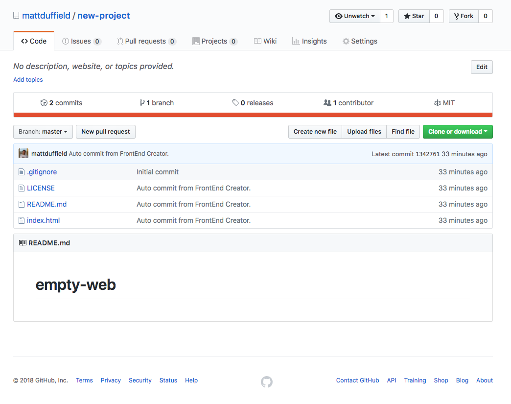
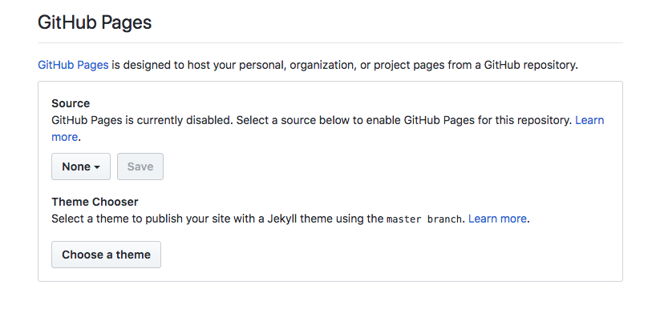
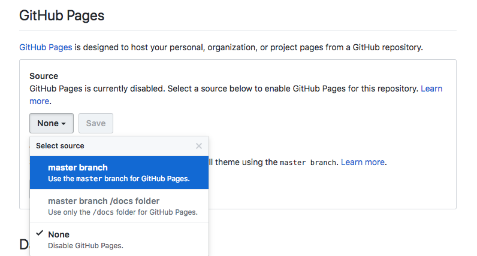
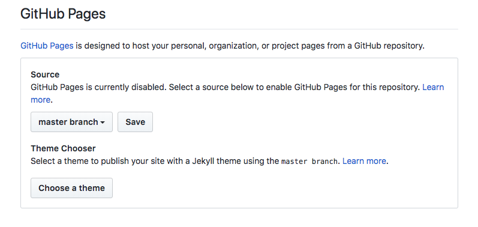
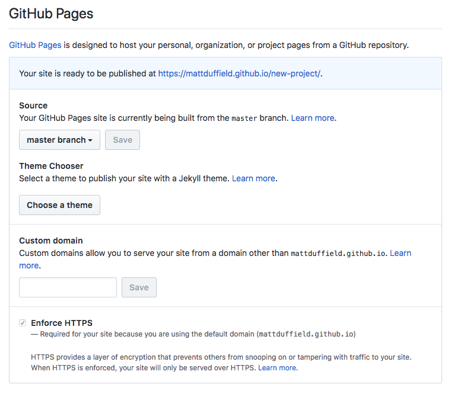
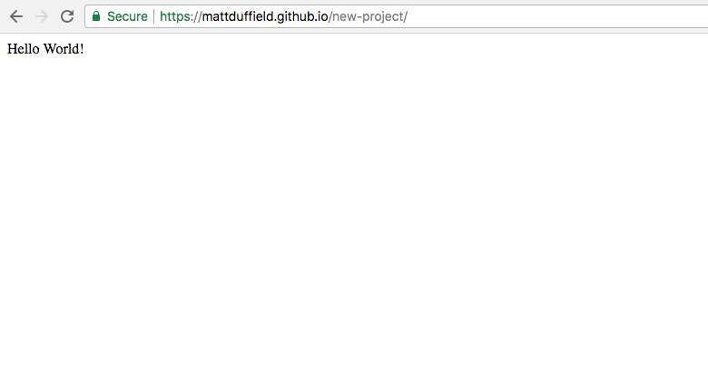

# GitHub Pages
Once you have created or cloned a project, you will need to go into your GitHub settings for the repository and configure it to use GitHub Pages.

The following are the steps for configuring your GitHub repository for using GitHub Pages:

1. Log into GitHub.com
2. Click on your avatar and select *Settings*
  
3. On the settings page, scroll down to the GitHub Pages section
  
4. Click on the dropdown and select `master branch`
  
5. Click on the `Save` button
  
6. The page will refresh. Scroll down to the GitHub Pages section and click on the link where your site has been published
  
7. The browser will navigate to your site.
  

> #### danger::
>It can take some time for your site to be published. Also, remember that this will really only work for web projects that are static using frameworks like Aurelia, Angular, React, Vue, etc.

8. Finally, you should be able to verify that you can preview your site from **Frontend Creator**

  

Congratulations! You have successfully configured GitHub Pages!
