# GitHub Configuration
If you recently setup your account, you will need to provide your GitHub username and an access token. If you try to load projects or create a new project prior to configuring your GitHub settings, you will be presented with the following message box.

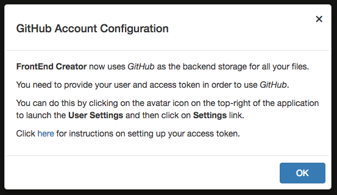

Clicking on the link in the dialog will direct you to this page.

The following are the steps for configuring your GitHub account to use with **Frontend Creator**:

1. Log into GitHub.com
2. Click on your avatar and select *Settings*
  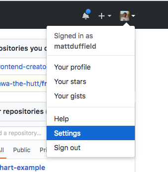
3. On your profile page, click on the *Developer Settings* link 
  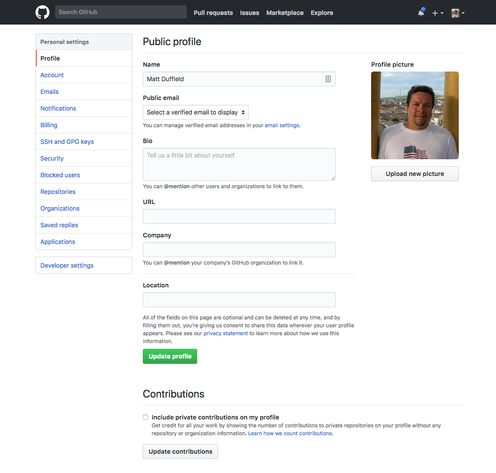
4. On the developer settings page, click on the *Personal access tokens* link
  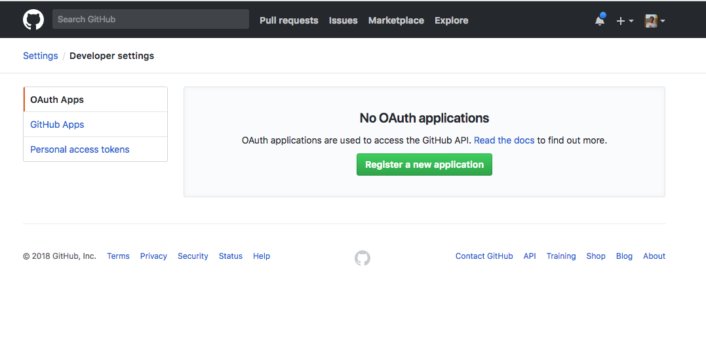
5. On the personal access tokens page, click on the *Generate new token* button
  
6. You will be required to provide your password
7. On the new personal access token, provide a meaningful description and then provide all the scopes as shown below
  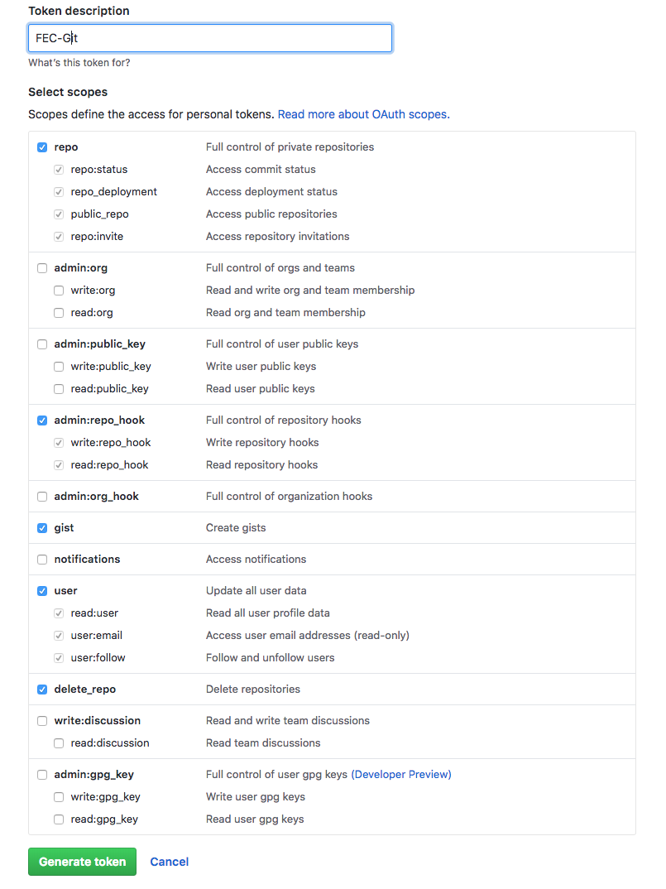
8. Your new token will show up on the personal access tokens page. Be sure copy the token and store it in a safe place as you will not be able to access it again!
  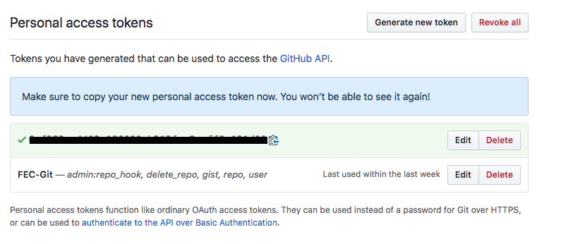
9. Now, go back to **Frontend Creator** and log in.
10. Click on the avatar to launch the *User Settings* dialog
  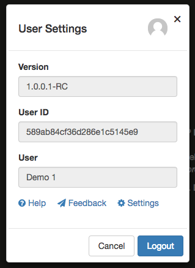
11. Click on the *Settings* link to launch the *Application Settings* dialog
  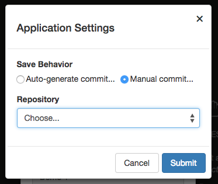
12. Click on the select element under the *Repository* label and change it to GitHub
  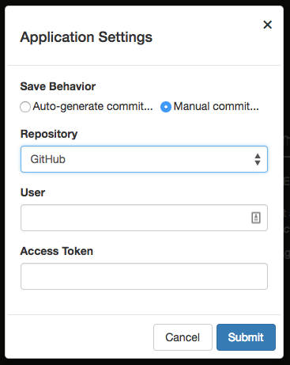
13. You will now be able to add your user and access token
  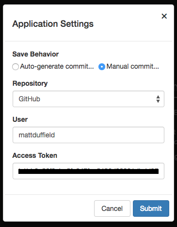
14. Click on the *Submit* button to save your changes. You will be presented with a final dialog asking you to log out and log back in to pick up the changes. You should have also seen a toast message stating that your changes were saved
  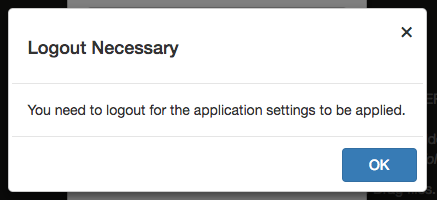

You are now ready to begin using **FrontEnd Creator** with *GitHub*!
