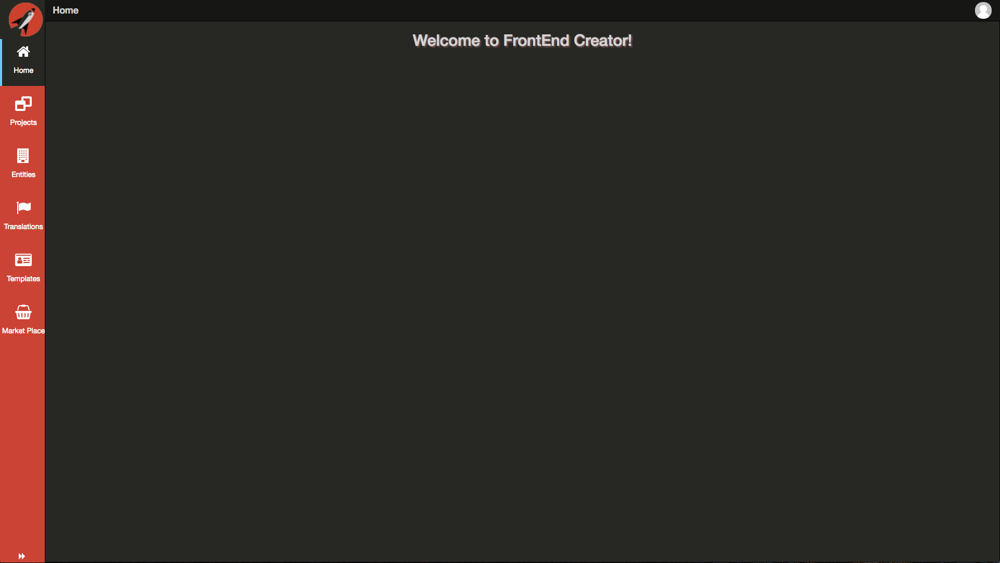

# Navigation Menu

Once you are logged in, you will see the Navigation Menu on the left side of the screen:

This menu can be partially collapsed, or fully collapsed by clicking on the hamburger button  once, or twice respectively.

Clicking on the buttons will navigate you to either the Screens, Scripts, or Styles screen correspondingly.

## Navigation Menu Contents

#### Styles
The Styles screen is where you are presented with an editor and a list of existing styles for your project. You can perform all actions necessary for managing styles. You author styles using standard CSS syntax.

#### Scripts
The Scripts screen is where you are presented with an editor and a list of existing scripts for your project. You can perform all actions necessary for managing screens. You author scripts using ES6 class syntax.

#### Navigation Builder
The Navigation Builder screen is...

#### Translation Builder
The Translation Builder screen is...

#### Entity Builder
The Entity Builder screen is...

#### Template Builder
The Template Builder screen is...

#### Market Place
The Market Place screen is...

#### Manage Projects
The Manage Projects screen is...

#### Projects (by name)
The Projects that are listed here...

