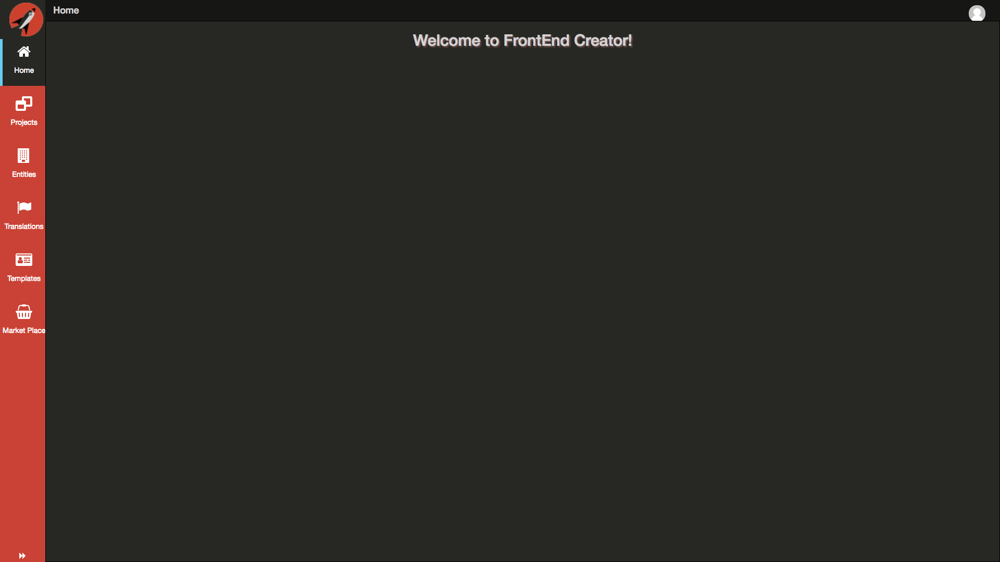
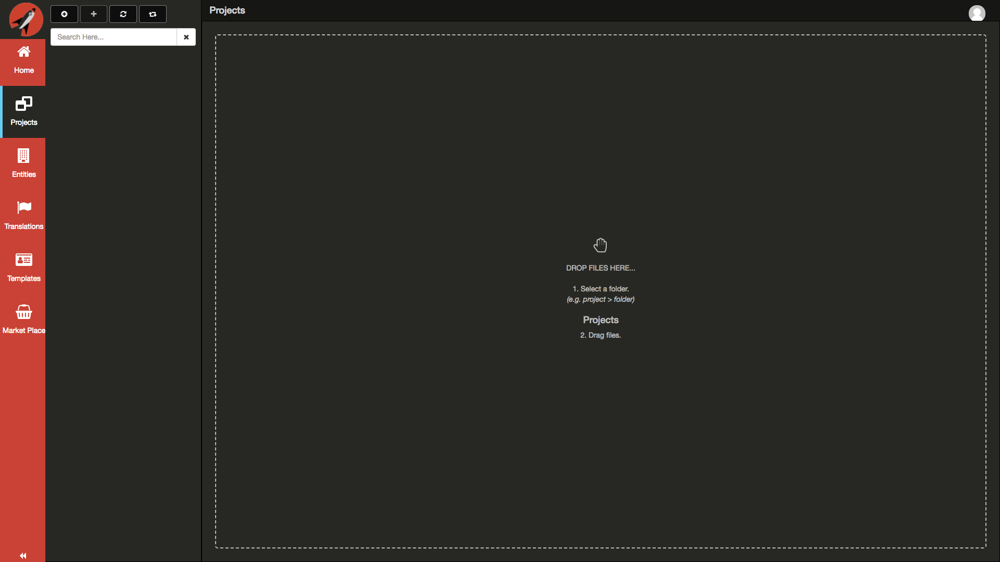

# Navigation Menu

Once you are logged in, you will see the Navigation Menu on the left side of the screen:

This menu contains all of the top-level navigation actions. The menu also contains a **Navigation Panel** that opens up to interact with your projects, entities, translations, templates, and the market place.

Clicking on each individual menu item will load any content created already available. The following screen shots display what your screen would look like if you had just signed up without any content.

## Projects

The following is a screen shot after the **Projects** menu has been clicked:

Projects will only appear after you have created your first project or cloned one from the **Market Place**. You can create as many projects as you like. Projects will appear in a tree structure. Projects can have as many files and folders as you desire.

## Entities

The following is a screen shot after the **Entities** menu has been clicked:

The Entity Builder screen is where you define entity schema. This is used primarily in the desinger when you want to create data forms quickly. The Entity Builder currently supports generating the following types:

Type | Description
---- | -----------
Edit Form | A form with data entry fields
View Form | A form with view only fields
Edit Table | A table with data entry fields
View Table | A table with view only fields

The Entity Builder has special `type` and `default element` values that work with the Template Builder.

## Translations

The following is a screen shot after the **Translations** menu has been clicked:

The Translation Builder screen is where you can define multiple translations for you application. You will always have a base translation which all other translations will reference using the `Group With` select element. 

The Translation Builder uses a simple convention. When you select a translation from the Settings tab in the designer, you have the ability to then bind off of it and the translation engine will do the rest provided you have more than one translation available. The parent object you bind off is the `lng` object.

## Templates

The following is a screen shot after the **Templates** menu has been clicked:

The Template Builder screen is where you create reusable templates in a quick code and preview manner. It supports a templating syntax that allows you to reference position layout for values the correspond to an entity defined by the Entity Builder. 

The Template Builder is allows you to create advanced screen mockups with very little coding.

## Market Place

The following is a screen shot after the **Market Place** menu has been clicked:

The Market Place is where you can upload and download content from other users. There will be free content as well as commercial content. In the Market Place, you are able to browse the content read-only. 

<!-- This menu can be partially collapsed, or fully collapsed by clicking on the hamburger button  once, or twice respectively. You can also use the keyboard mnemonic `Cmd|Ctrl + F1` to toggle through each width.

The navigation menu is broken up into two sections. The upper section consists of tools to help you with building your web applications. The lower section is below the `Manage Projects` tool. This section is dynamic based on the projects you have created using the `Manage Projects` tool.

## Navigation Menu Contents

The screens that have vertical sliders allow you to click on them to toggle open or closed states. You can also use the keyboard mnemonic `Cmd|Ctrl + F2` or  `Cmd|Ctrl + F3` for the left and right panes respectively.

#### Styles
The Styles screen is where you are presented with an editor and a list of existing styles for your project. You can perform all actions necessary for managing styles. You author styles using standard CSS syntax.

#### Scripts
The Scripts screen is where you are presented with an editor and a list of existing scripts for your project. You can perform all actions necessary for managing screens. You author scripts using ES6 class syntax.

#### Navigation Builder
The Navigation Builder screen is where you defines routes for your application. It is typically one of the final steps in building your application. The routes you define are standard Aurelia routes. The navigation builder allows you to define a hierarchy with your routes so that you can also use the routes as a menu.

You also have the ability to have labels and placeholder just like the Navigation Menu itself and the dynamic projects.

Finally, it from the Navigation Builder that you are able to `export` your application for self-hosting.

#### Translation Builder
The Translation Builder screen is where you can define multiple translations for you application. You will always have a base translation which all other translations will reference using the `Group With` select element. 

The Translation Builder uses a simple convention. When you select a translation from the Settings tab in the designer, you have the ability to then bind off of it and the translation engine will do the rest provided you have more than one translation available. The parent object you bind off is the `lng` object.

#### Entity Builder
The Entity Builder screen is where you define entity schema. This is used primarily in the desinger when you want to create data forms quickly. The Entity Builder currently supports generating the following types:

Type | Description
---- | -----------
Edit Form | A form with data entry fields
View Form | A form with view only fields
Edit Table | A table with data entry fields
View Table | A table with view only fields

The Entity Builder has special `type` and `default element` values that work with the Template Builder.

#### Template Builder
The Template Builder screen is where you create reusable templates in a quick code and preview manner. It supports a templating syntax that allows you to reference position layout for values the correspond to an entity defined by the Entity Builder. 

The Template Builder is allows you to create advanced screen mockups with very little coding.

#### Market Place
The Market Place screen is where you can upload and download content from other users. It is meant as a place for learning and sharing.

#### Manage Projects
The Manage Projects screen is where you go to create, edit, and delete existing projects.

#### Projects (by name)
These projects will only appear after you have created your first project. You can create as many projects as you like. It is from the individual projects that you are able to lauch a sub-menu showing all of the screens pertaining to that project. In the sub-menu, you can create, edit, and delete existing screens.

 -->