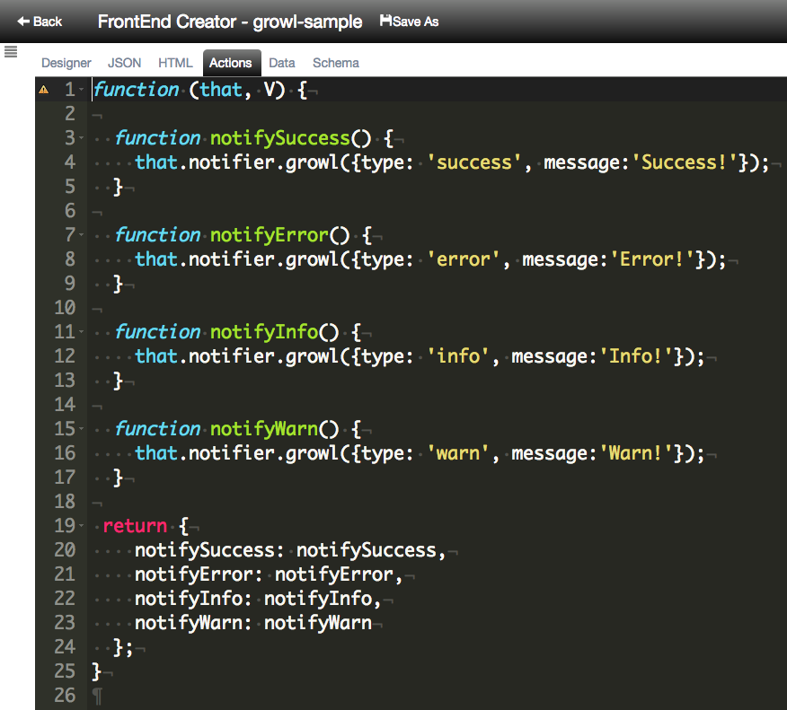
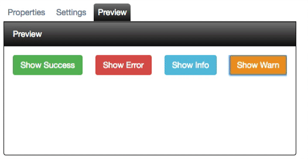

# Notification

**FrontEnd Creator** uses growl like notifications to communicate back to the user. You can use this same notification engine in your applications as well. 

## Notification Types

The following are the different types of notifications:

Type | Description
---- | -----------
success | displays a success notification
error | displays an error notification
info | displays an info notification
warn | display a warn notification

## Notification API

The following are the properties you can set when using the Notification API:

Property | Description
-------- | -----------
title | represents the title of a notification
message | represents the message of a notification
footer | represents the footer of a notification
type | represents the type of notification (success,error,info,warn), defaults to `success`
showClose | determines if there is a close button, defaults to `false`
isModal | determines if the notification is modal, defaults to `false`
theme | determines the theme of the notification, defaults to `note-dark`
timeout | determines the timeout of the notification, defaults to `3000 ms`

The following is a screen shot of the markup with click delegates wired. It also displays the live preview:

The following are the actions defined for the click delegates in the Actions tab:

As you can see from the sample code above, it is fairly simple to provide notifications in your applications.

The following animation demonstrates clicking on each button and see the notifications in action:

Refer to the [ Notification Screen Tutorial ](../../tutorials/notification-screen.md) for tutorial on working with the Notification API in your screens.

