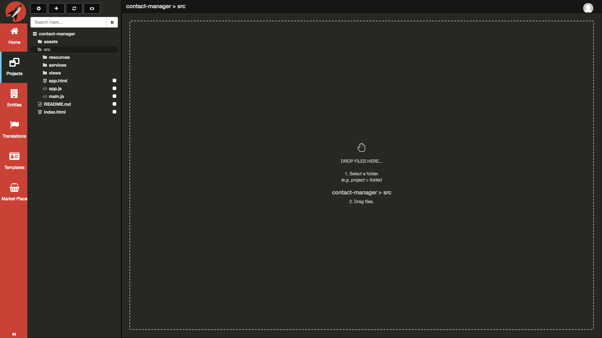
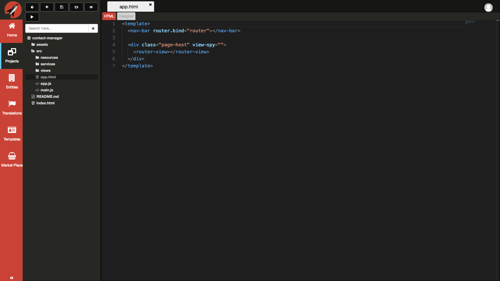
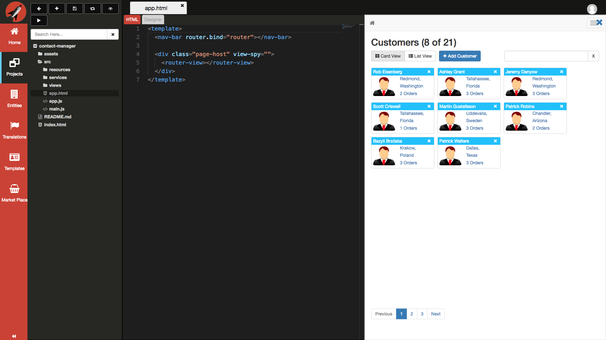
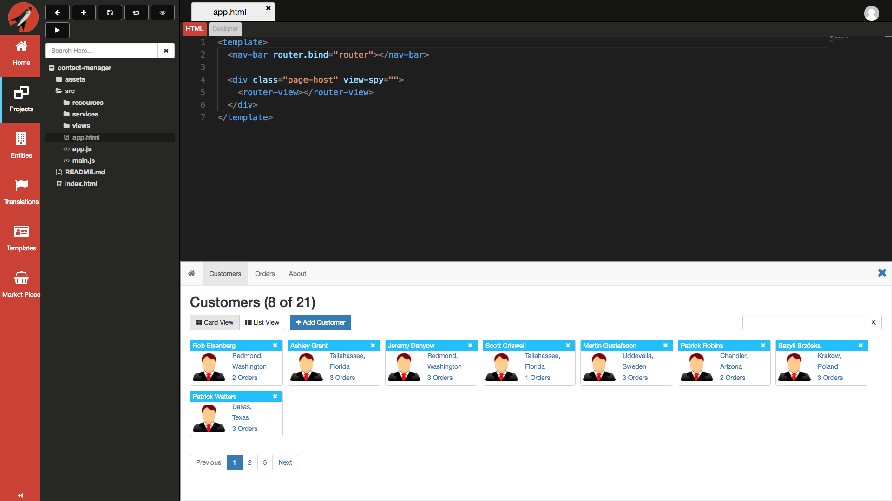
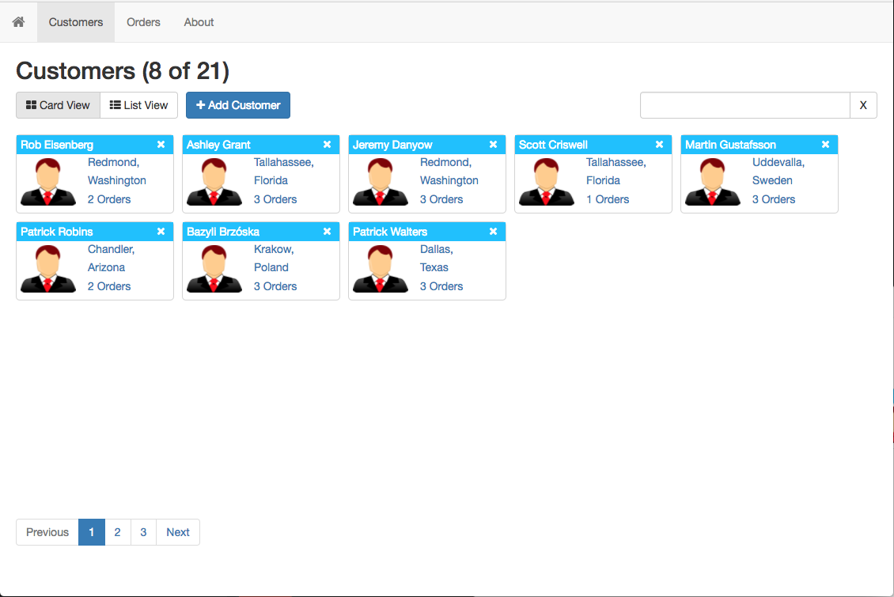
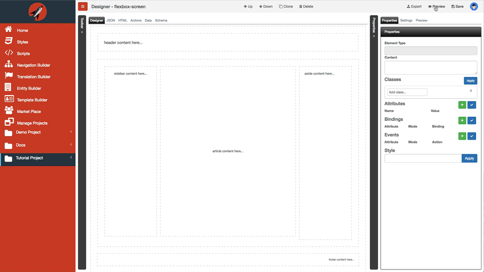

# Preview

**FrontEnd Creator** provides two ways to preview your projects. You have the option to preview your application right along with your editor either horizontally or vertically. You can also preview your project by launching another tab.

## Inline Preview

The following are steps required to preview a project inline:

1. Click on the `contact-manager` folder or whatever folder you have to expand it.

  

2. Click on the `src` folder to expand it.

  

3. Click on the `app.html` file to load it.

  

4. Click on the button with the `eye` icon to Preview your project.

  

5. Click on the button with the `eye` icon to toggle the Preview.

  

6. Click on the button with the `eye` icon one last time to hide the Preview. You can also click on the blue `X` in the top-right corner of the preview to hide the preview.

  

These screens allow you to preview exactly what your users would see.

## Tab Preview

The following are steps required to preview a project inline:

1. Click on the `contact-manager` folder or whatever folder you have to expand it.

  

2. Click on the `src` folder to expand it.

  

3. Click on the `app.html` file to load it.

  

4. Click on the button with the `play` icon to Preview your project in a separate tab.

  

## Sharing Links

The same links that you use to preview your project can be shared with your clients. When you launch the preview in a separate tab, you can copy the link and share it. Using this link requires no authentication from **FrontEnd Creator**.

> #### danger::
> You must save any changes in order for them to be reflected in the Preview window.

<!-- The following animation demonstrates launching a new browser tab to preview:

Take note that this preview screen is outside of routes as no security is enforced. This means that you can only preview one screen at a time statically.
 -->
