# Designer
If you open an HTML file and click on the **Designer** tab, you will have the ability to drag and drop HTML elements on the designer surface.

## Navigation Panel Buttons
When working with Projects, there are several buttons that you will use. 

- Load - this launches the Open Project dialog
- New - this launches the New Project dialog
- Save - this will only appear when a file has changes
- Toggle Preview - this toggles the inline preview
- Launch Preview - this launches a preview in a separate browser tab
- Toggle Expand - this toggles the expansion of the tree

> #### danger::
>If the splitter is too small, you are able to scroll the buttons to the left or right.

## Navigation Panel Buttons - Designer 
When you are working with `HTML` files and decide to use the *Designer* tab, the **Navigation Panel** buttons change.

As you can see, we have the same buttons as before but we now have a few more.

- Toolbox (wrench) - this will display standard HTML elements for dragging on to the designer surface
- Bootstrap (flag) - this will display Bootstrap 3 elements for dragging on to the designer surface
- Entities (database) - this will display Entities that have been define for quickly adding Forms or Tables
- Toggle DOM Tree (sitemap) - this will toggle the display of the DOM tree

### Toolbox Panel
The **Toolbox Panel** gives us access to standard HTML elements. You can easily select an element and drag and drop it on the the designer surface.

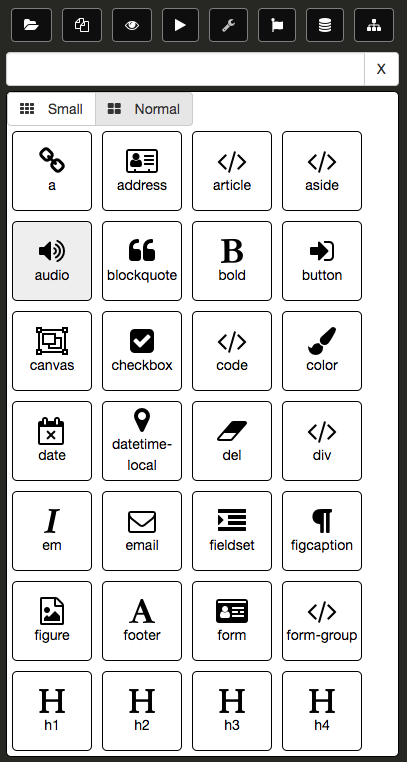

It is possible to filter out the items in the **Toolbox Panel**. The following is a list of existing tags that the elements in the **Toolbox Panel** are grouped:

- flow
- form
- image
- inline
- input
- list
- media
- phrase
- sectioning
- table
- text

If you enter a any of these terms, the **Toolbox Panel** will only display items tagged with the corresponding term. The following is an example using the term, `media`:

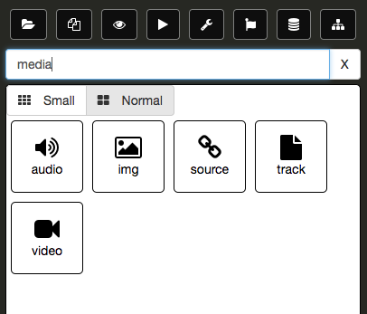

You can also perform matches on element name or partial matches. The following is an example using the letter, `h`:

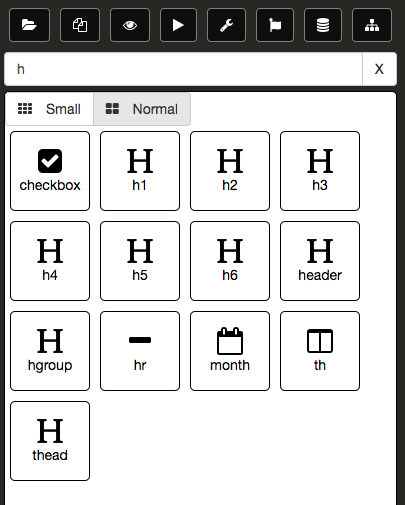

You also have the ability to change the size of the items in the **Toolbox Panel**. The following is **Toolbox Panel** using the `Small` button:

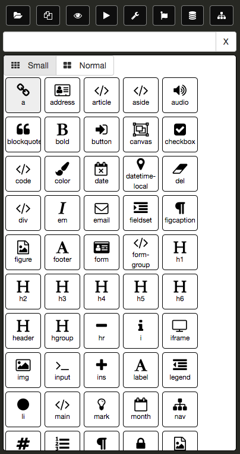

In the following example, we have selected a **Button** element and dragged it onto the designer surface.

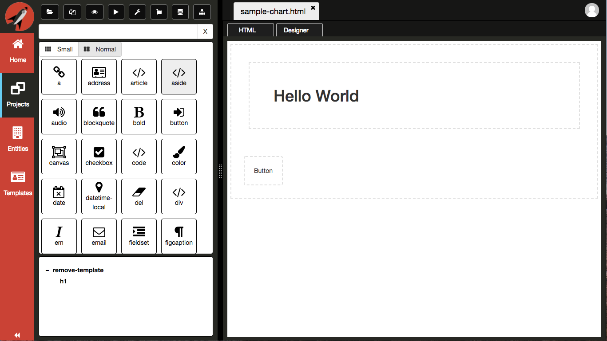

If you click on the **Button** element on the designer surface, the **Navigation Panel** will switch to the **Property Grid** displaying all relevant options you can set on the **Button**.

You will also notice that you now have some more buttons in the top right corner.

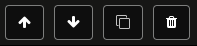

- Move Up - this will move the selected element up, relative within the parent element
- Move Down - this will move the selected element down, relative within the parent element
- Clone Element - this will make a duplicate of the element
- Delete Element - this will remove the element from the DOM

Take some time to play around with the **Toolbox Panel** and drag some elements to the designer.

> #### danger::
>Currently bindings and events are only in the format for `Aurelia`. Now that we have topics, we will be able to extend the **Property Grid** to contextually change based on the repository topics defined.

You can toggle between the **Property Grid** and the **Toolbox Panel** simply by clicking on the element on the designer surface.

### Bootstrap
The **Bootstrap Panel** gives us access to Bootstrap elements. You can easily select an element and drag and drop it on the the designer surface.

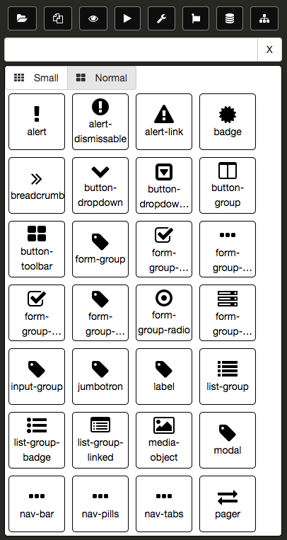

In the following example, we have selected a **form-group** element and dragged it onto the designer surface.

Again, you have the ability to select the **form-group**, which actually a *DIV* element with `form-group` class assigned to it, and move it around or adjust some properties.

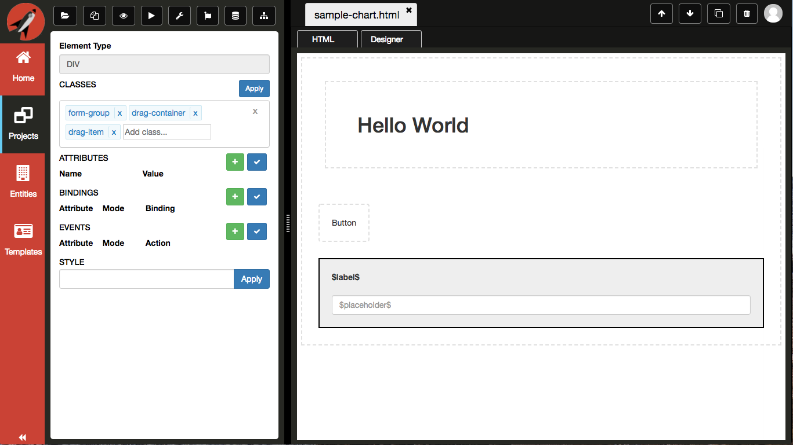

### Entities
The **Entities Panel** gives you access to all of the Entities that you have authored from the **Navigation Menu**. 

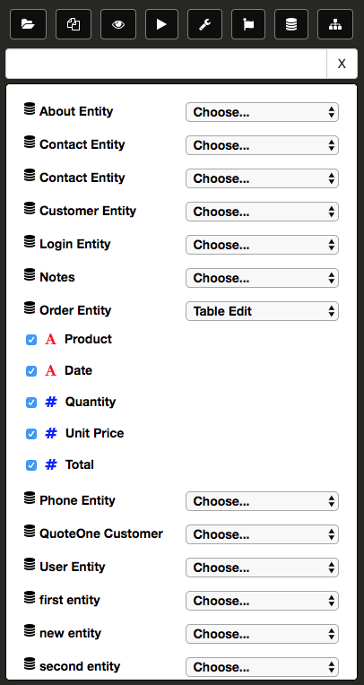

You will need to create some entities before you will be able to use the **Entities Panel**. Clicking on an individual entity will expand it and display all of the fields. Click on the fields you want included when you drag and drop. Finally, you will need to pick which template you want added to the DOM. Currently, there are four options:

Type | Description
---- | -----------
Form Edit | Creates a form with editable elements
Form View | Creates a form with non-editable elements
Table Edit | Creates a table with editable elements
Table View | Creates a table with non-editable elements

The following is an example of a dragging an *Order* entity onto the designer surface as an editable form.

Here another example of dragging an *Order* entity onto the designer surface as an editable table.

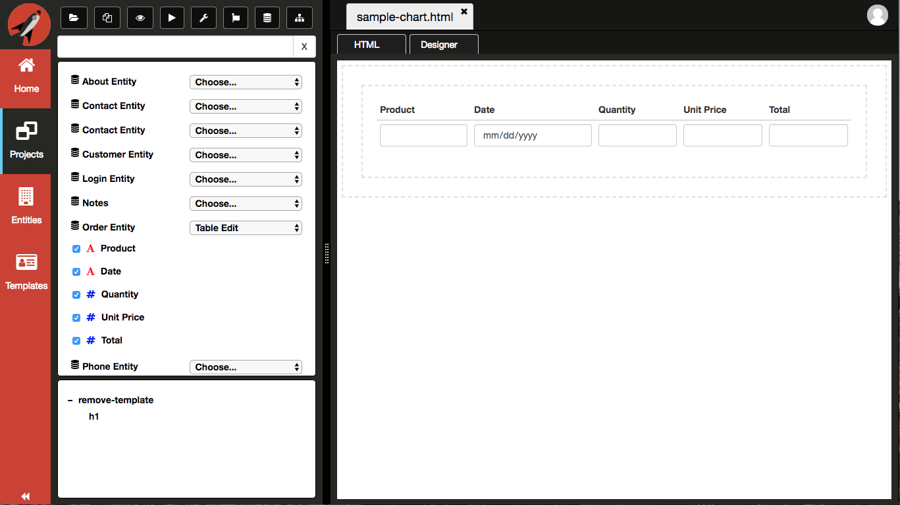

### DOM Tree
The **DOM Tree** gives you the ability to select an element on the designer surface. It is a hierarchical representation of the designer surface. The following is an example of using the **DOM Tree** where the mouse is hovering over the `form` object in the **DOM Tree**:

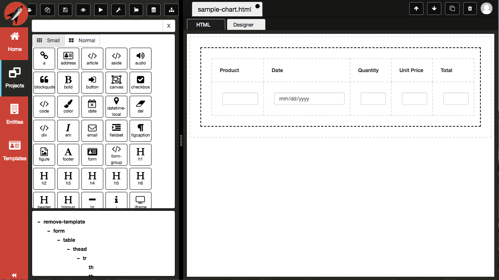

You can see that the designer surface shows that the `form` is being hovered.

If you click on the `form` object in the **DOM Tree**, the same will be selected on the designer surface and the **Navigation Panel** will switch to the **Property Grid**.

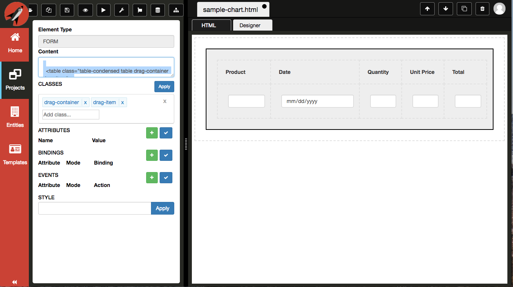

> #### danger::
>In order for the **DOM Tree** to update, you must toggle to the **HTML** tab and then back to the **Designer** tab.

The `DOM Tree Toggle` icon allows you to collapse the pane so that you have more surface for the other panes.

### Property Grid
The **Property Grid** will display all information pertinent to the currently selected element on the designer surface. The following is an example of selecting an `input` element on the designer surface:

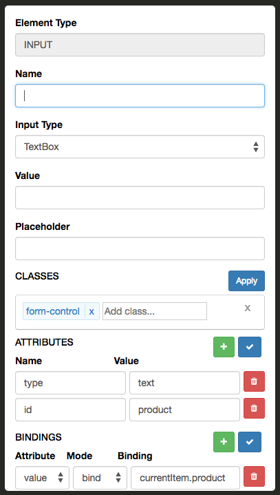

The **Property Grid** binds to the element selected on the designer surface. If the `input` element had a `placeholder`, you would see it in the **Placeholder** control. 

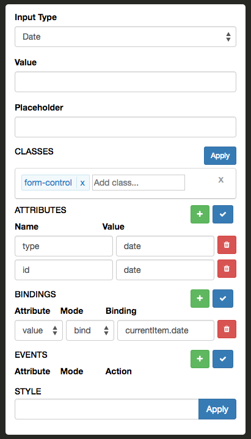

There a common sections to the **Property Grid** that most all elements will correspond:

- Classes
- Attributes
- Bindings
- Events
- Styles

### Classes

The Classes section is used to add and remove classes from a given element. You can either click in the control for a dropdown to appear or you can type a class in the input element. If you use the dropdown and select an element, you must click on the blue apply button to apply your changes to the element. Otherwise, you can simply hit enter in the input element to add the class directly to the selected element in the designer. The same is true when you remove a class or all the classes, you much click on the blue apply button to apply your changes to the element.

The following is a screen shot of the classes section:

This is a screen shot of the dropdown for selecting an existing class. The contents of the dropdown corresponds to the CSS library selected:

* For a list of Bootstrap classes provided see [ Bootstrap Classes ](../../../reference/css/bootstrap-classes.md)
* For a list of Flexbox classes provided see [ Flexbox Classes ](../../../reference/css/flexbox/flexbox-classes.md)
* For a list of Layout classes provided see [ Layout Classes ](../../../reference/css/layout-classes.md)

### Attributes

The Attributes section is used to add and remove attributes from a given element. You must click on the blue check button to apply your changes to the element. It consists of two parts:

* **Name** - this is the name of the attribute
* **Value** - this is the value assigned to the attribute

The following is a screen shot of the attributes section:

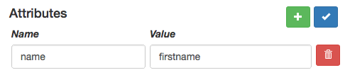

### Bindings

> #### danger::
>Currently bindings and events are only in the format for `Aurelia`. Now that we have topics, we will be able to extend the **Property Grid** to contextually change based on the repository topics defined.

The Bindings section is used to define all of your bindings for a given element. It consists of three parts:

* **Attribute** - this is the attribute for which the binding is associated with, e.g. 'value'
* **Mode** - this is the type type of binding, e.g. 'bind', 'two-way', 'one-time', and 'one-way'
* **Binding** - this is the binding expression

You have the ability to add or remove as many bindings as you like. You must click on the blue check button to apply your changes to the element. 

The following is a screen shot of the bindings section:

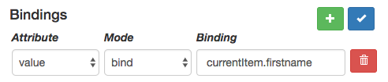

### Events

> #### danger::
>Currently bindings and events are only in the format for `Aurelia`. Now that we have topics, we will be able to extend the **Property Grid** to contextually change based on the repository topics defined.

The Events section is used to define all of your event handlers for a given element. It consists of three parts:

* **Attribute** - this is the attribute for which the event handler is associated with, e.g. 'click', 'keydown', 'change', etc.
* **Mode** - this is how the event is raised, e.g. 'delegate', 'trigger', or 'call'
* **Action** - this is the function reference that will be called when the event is raised

You have the ability to add or remove as many events as you like. You must click on the blue check button to apply your changes to the element. 

The following is a screen shot of the events section:

### Styles

The Styles section is used to add and remove styles directly on a given element. You must click on the blue apply button to apply your changes to the element.

The following is a screen shot of the styles section:

