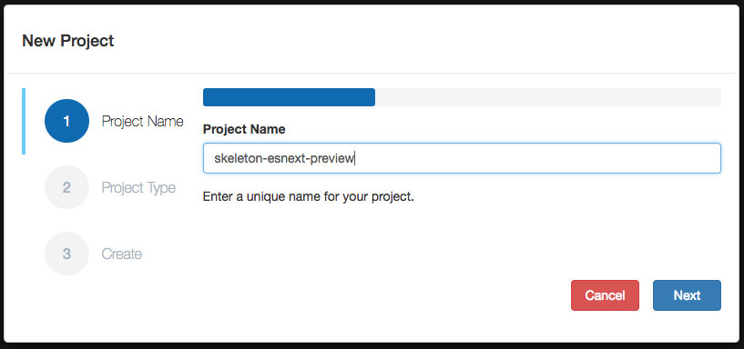
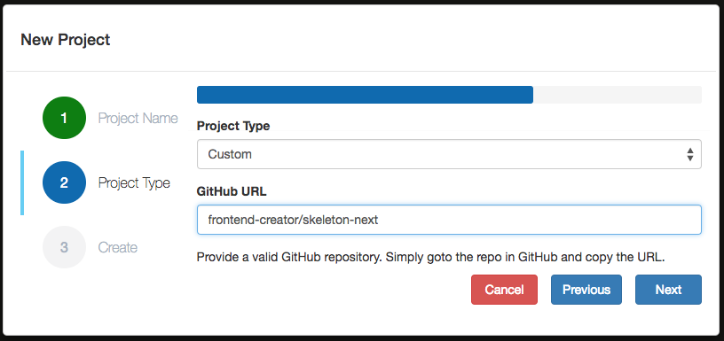
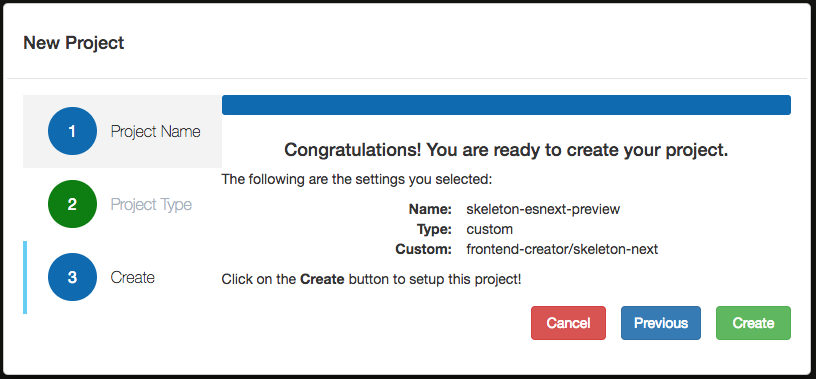
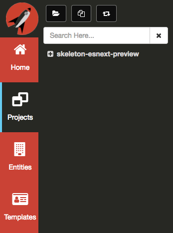
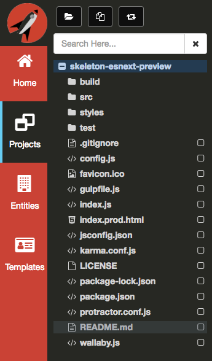
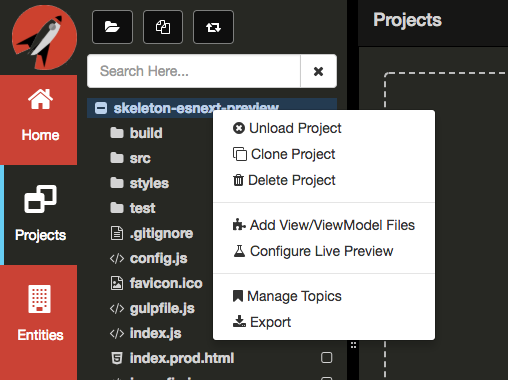
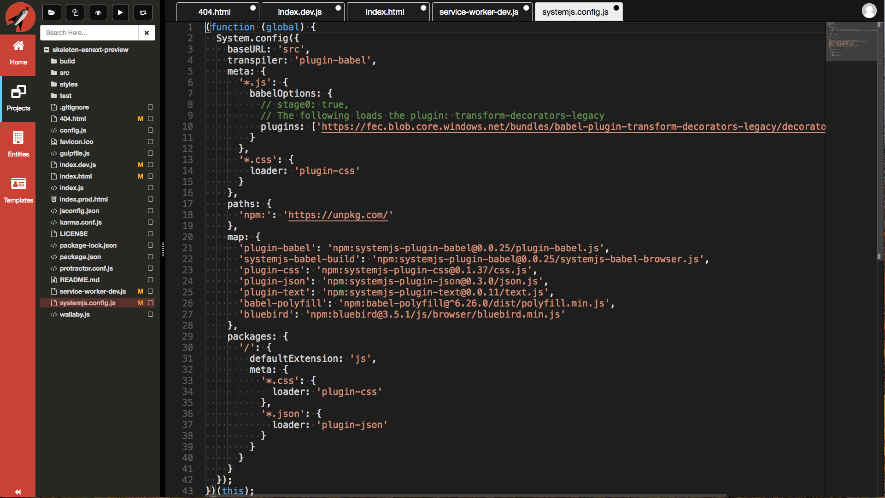
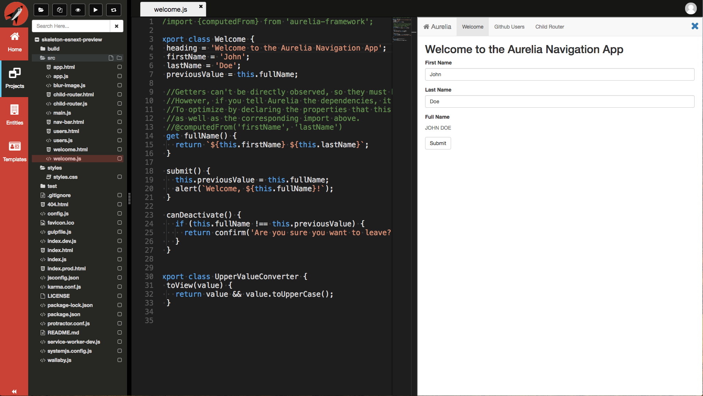
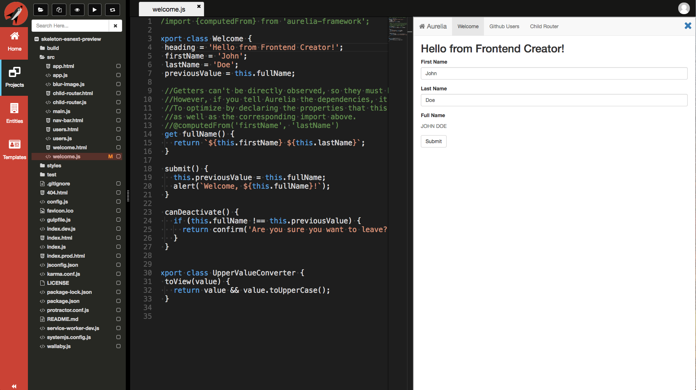

# Live Preview
**Frontend Creator** uses GitHub Pages for rendering your static web applications. GitHub Pages are great for static content but when you are developing your application and making rapid changes, you may find that you are waiting for GitHub Pages to update with your latest changes.

This is where Live Preview provides a much better experience by communicating directly with the inline preview IFrame or any tab launched from **Frontend Creator** for preview.

There are few steps required to enable live preview. We will address them now. 

1. First, you will need to have already gone through the [GitHub Configuration](../../github/readme.md) steps
2. Once, you have your GitHub username and personal access token setup, we will use the **New Project** dialog to create a new project
3. Click on the **New Project** button in the Navigation Panel
4. Enter `skeleton-esnext-preview`, or any unique name, for the name of the project and click `Next`

  

5. Select `Custom` for the **Project Type** and enter `mattduffield/skeleton-esnext` for the **GitHub URL** and click `Next`

  

6. You should now be ready to create the new project. This will copy all of the contents of the project specified in the **GitHub URL** and create a repository with the unique name you provided earlier. Click `Create` to proceed

  

7. **Frontend Creator** will create your new project. It can take several seconds to complete. Once completed, you should see your new project in the `Navigation Panel`

  

9. Before we continue, let's enable [GitHub Pages](../../github-pages/readme.md) so that we can preview our changes

10. We are finally ready to start configuring our project for Live Preview. We begin by creating a new file: `index.prod.html` and copy all of the contents from `index.html` into it

11. Next, we will delete the `index.html` file as it will be generated for us. You tree should look like the following:

  

12. Now, `right-click` the root of your project and select `Configure Live Preview`

  

> #### danger::
>Take care to call this only once!

13. You should now see that five new files have been created for you

  

These files are how we can support Live Preview:
  - 404.html - GitHub Pages look for a 404.html file when requesting anything other than `index.html`
  - index.dev.js - this file builds the SystemJS config settings dynamically. It does this by looking at the `package.json` file. Therefore, it is necessary to have your dependencies defined. The file also registers the `service-worker-dev.js` as well as listens to the `message` event. When a file is changed, the samed cached file is updated so that the service worker will get the correct cached version
  - index.html - This file works with the `404.html` file. It also brings in SystemJS and does an initial configuration using `systemjs.config.js` as well as brings in `index.dev.js`
  - service-worker-dev.js - This file allow us to use the Cache API and store Fetch requests
  - systemjs.config.js - This is a simple baseline setup for SystemJS. All additional project specific entries are accomplished via the `index.dev.js` file

14. Before you do anything else, commit your changes by right-clicking the root folder of your project and select `Commit`

15. You should be able to now close all of these newly created files

16. Open the `welcome.js` file under the `src` folder

17. Click on the `eye` icon to Preview the app

  

18. Now, change the heading to `Hello from Frontend Creator!` and hit `Ctrl|Cmd + S` to save your changes locally. The page will refresh with the new changes

  

> #### danger::
> We curretly refresh your page and reset it to the root so if you are using a router and were testing a certain route, you will need to navigate back

19. That's it! Live preview is setup. It will keep track of all of your changed files and ensure that the IFrame or any launched tabs are always in sync
