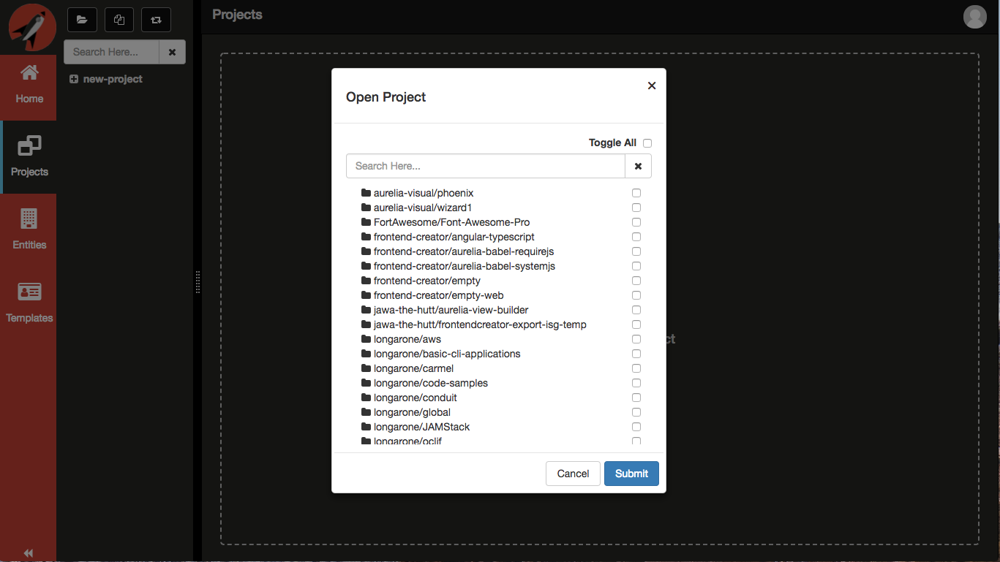
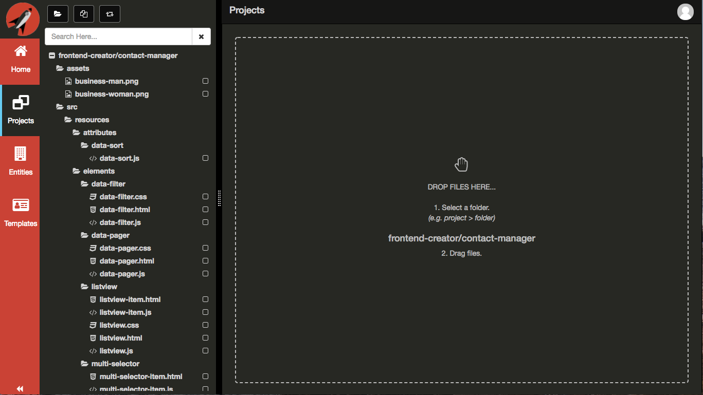
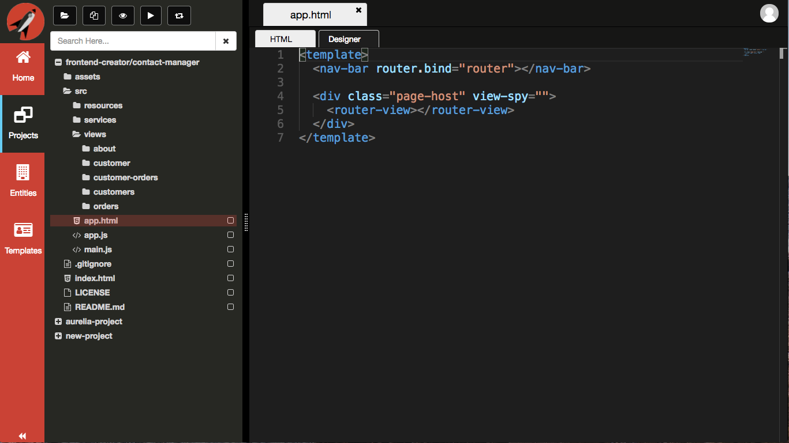
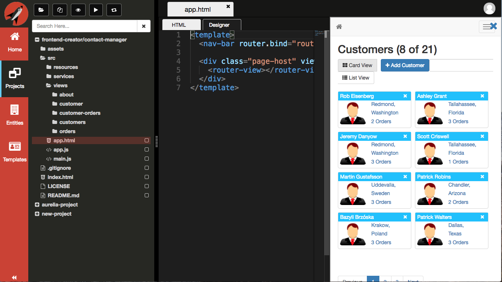
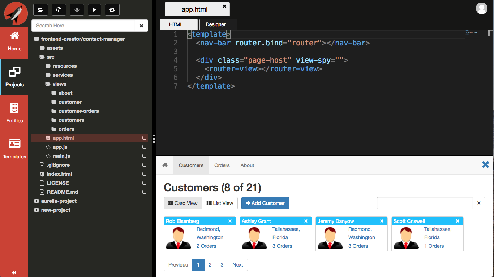
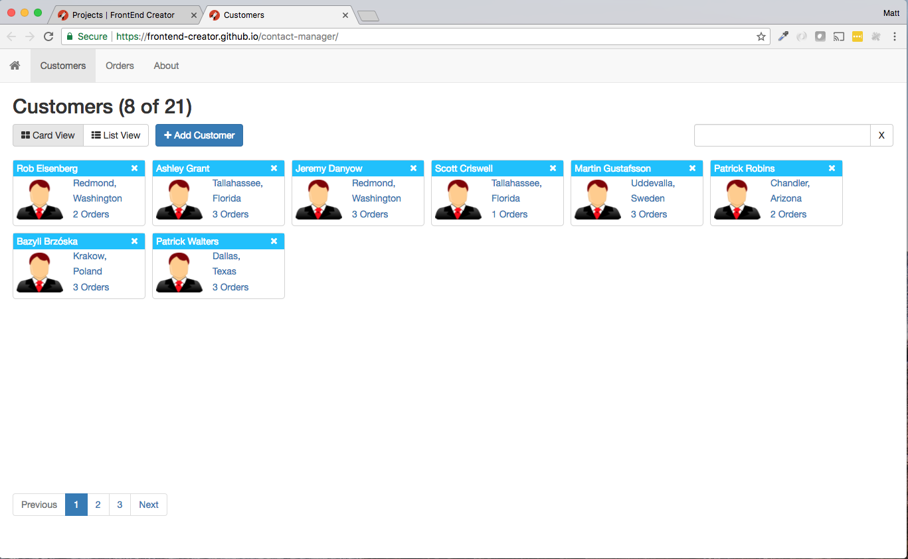
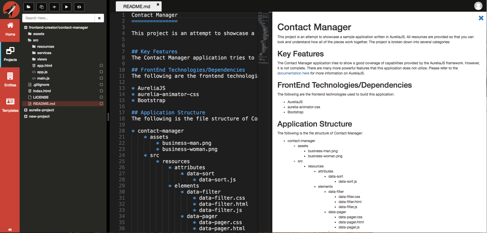
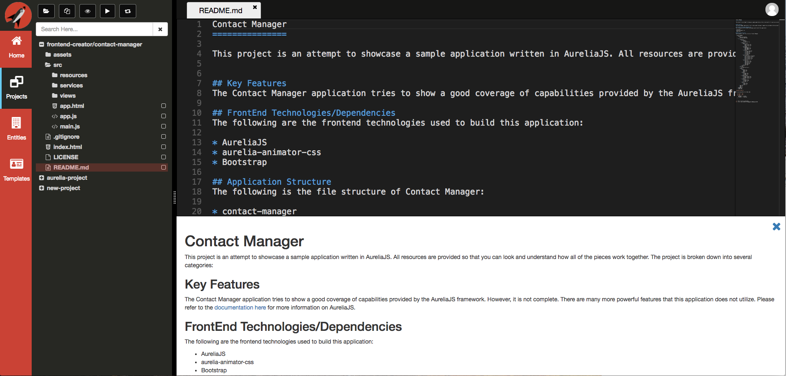

# Load Existing Projects
You have access to all of your projects in GitHub. **Frontend Creator** will cache your loaded projects for speed and performance. If there is an existing project you wish to load, click on the `open-folder` icon.

> #### danger::
>We are currently using Azure Functions to host our serverless API. The first time using a function can take a second, but once awake it runs fast!

You will be presented with all of your repositories from GitHub. This includes both public and private as well as any repositories that have been added as a collaborator.

> #### danger::
>You will see repositories where you are a collaborator with their user or organization as the first part followed by a forward slash (/) and the repository name following.

Select any project you want to work on.

In this case, we selected the `frontend-creator/contact-manager` project.

> #### danger::
>You may find that you need to adjust the splitter so that the project name does not wrap.

Here is a look at the tree after we expand the root.

Click on the `app.html` file to load it.

## Project Preview
It is possible to preview your changes using either `eye` icon or the `play` icon from the **Navigation Panel**.

Click on the `eye` icon to Preview your project vertically.

> #### danger::
>You will need to configure your project in GitHub to allow for [GitHub Pages](../github-pages/readme.md). If you would like this to be automatic, please email support@frontendcreator.com so that we can request it to be added on GitHub's internal feature request list.

Once you have GitHub Pages setup for your repository, you should see the following:

Click on the `eye` icon again to Preview your project horizontally.

Click on the `play` icon to launch your application in a separate browser tab

## Remember
> #### danger::
> You must save any changes in order for them to be reflected in the Preview window.

## Markdown Preview
Being able to preview your application is a necessary feature but so is being able to preview your Markdown as you author it. Whenever you open a Markdown file, you are able to preview it exactly as your users would see it.

Click on the `readme.md` file to load it.

Click on the `eye` icon to Preview your markdown.

> #### danger::
> You made need to ensure that your browser is wide enough to display both the editor and the Preview.

 Click on the `eye` icon again to Preview markdown vertically.

Congratulations! You have successfuly loaded an existing project.