# New Project

In order to create a new project, you need to click on the `new project` icon on the **Navigation Panel**.

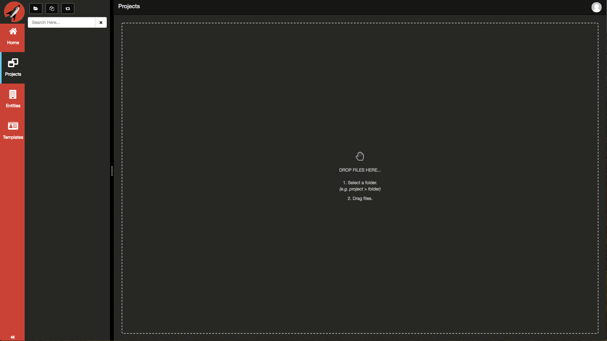

This will launch the *New Project* dialog.

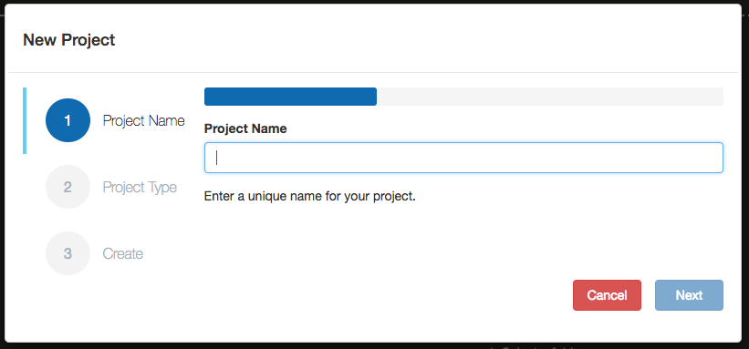

You will need to provide a valid unique name for your project. All rules enforced by *Git* apply here.

In this example, we typed in `new-project`.

Click on the *Next* button to select a Project Type. The system will check to ensure that the project name does not already exist and either continue or display a toast message stating the project name already exists.

You will now be able to select the type of project you wish to create. Currently, **Frontend Creator** supports the following types:

Type | Description
---- | -----------
Empty Project | This is an empty project
Empty Web | This is an empty web project with an index.html file
Aurelia | This is a basic Aurelia project
Custom | This allows you to clone any public *GitHub* repository 

> #### danger::
>More project types are coming soon, like Angular, React, Vue, etc.

## Empty Web Project

Select `Empty Web` from the dropdown and click *Next*

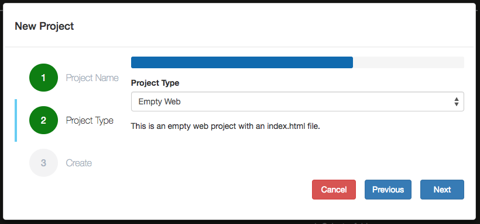

You will then go to the *Create* step. Here, you be presented with your settings and given the option to create your project.

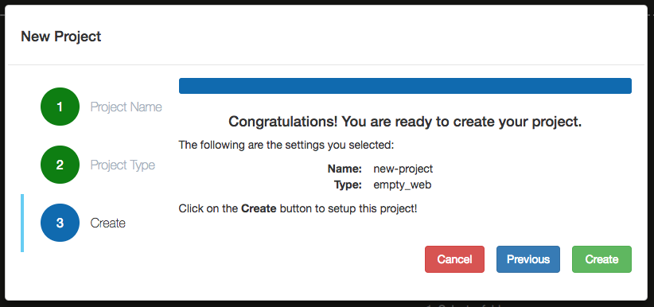

Click on the *Create* button. The *New Project* dialog will now create your new project. This may take a minute or so to complete.

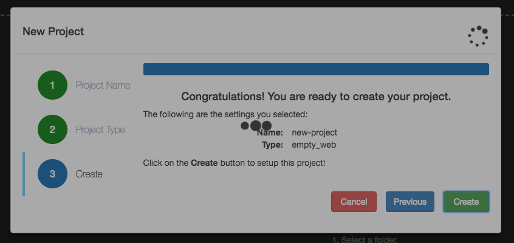

Once it completes, the dialog will go away and you will be presented with the new project in the **Navigation Panel**.

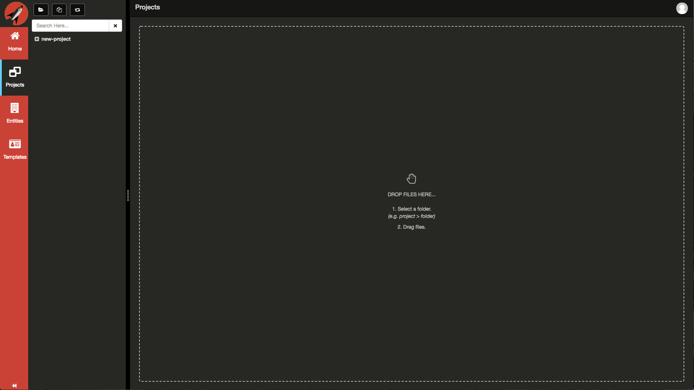

Click on the folder to expand it

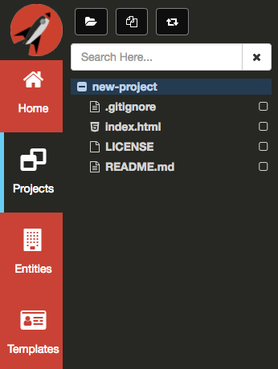

Click on the `index.html` file to open it

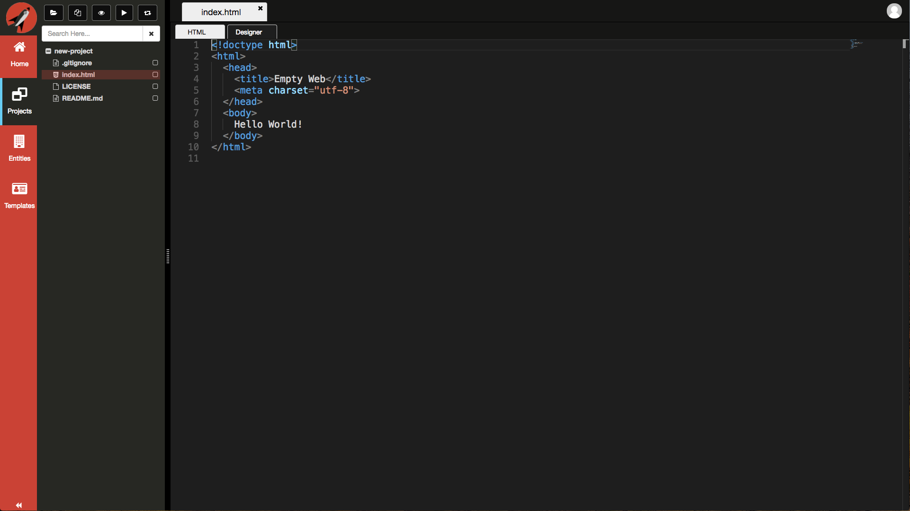

## Aurelia Project
Let's now try and create an `Aurelia` project.

Again, click on the `new project` icon on the Navigation Panel to launch the *New Project* dialog.

You will need to provide a valid unique name for your project. All rules enforced by *Git* apply here.

In this example, we typed in `aurelia-project`.

Click on the *Next* button. The system will check to ensure that the project name does not already exist and either continue or display a toast message stating the project name already exists.

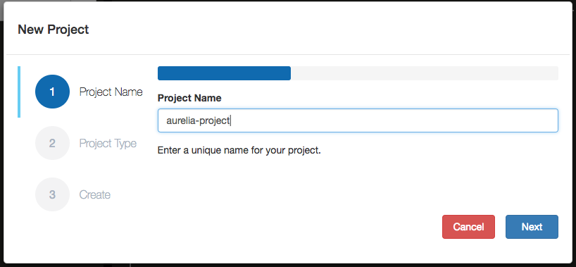

On the Project Type step, you will be able to select the type of project you wish to create. Currently, **Frontend Creator** supports the following types:

Type | Description
---- | -----------
Empty Project | This is an empty project
Empty Web | This is an empty web project with an index.html file
Aurelia | This is a basic Aurelia project
Custom | This allows you to clone any public *GitHub* repository 

Select `Aurelia` from the dropdown. 

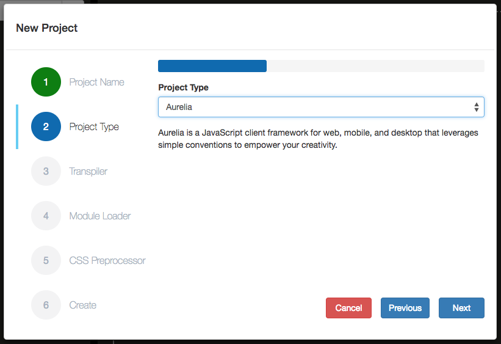

Click *Next* to continue.

On the Transpiler step, you have the option to select one of the following:

Transpiler | Description
---- | -----------
None | No transpiler selected
Babel | Uses the Babel transpiler
<!-- TypeScript | Uses the TypeScript transpiler -->

> #### danger::
>Currently, we only support Babel. We will extend this to support TypeScript as well.

Select `Babel` from the dropdown.

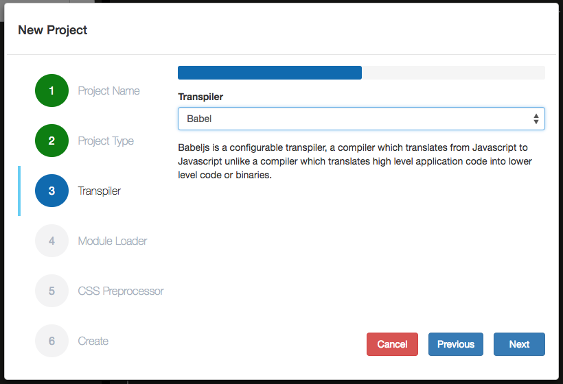

Click *Next* to continue.

On the Module Loader step, you have the option to select one of the following:

Module Loader | Description
---- | -----------
None | No loader selected
RequireJS | Uses the RequireJS module loader
SystemJS | Uses the SystemJS module loader

Select `SystemJS` from the dropdown.

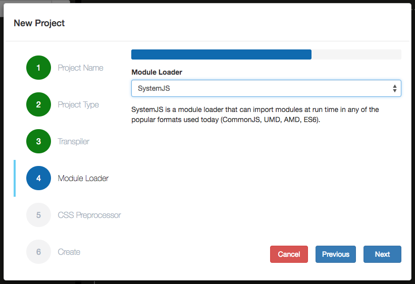

Click *Next* to continue.

On the CSS Preprocessor step, you have the option to select one of the following:

CSS Preprocessor | Description
---- | -----------
None | No CSS preprocessor selected
<!-- SASS | Uses the Sass preprocessor -->

> #### danger::
>Nothing is supported just yet, we will extend this to support SASS as the first step.

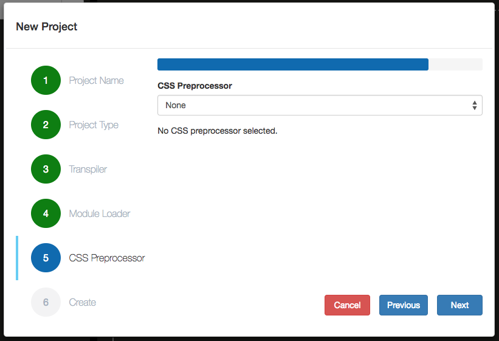

Click *Next* to continue.

You will then go to the *Create* step. Here, you be presented with your settings and given the option to create your project.

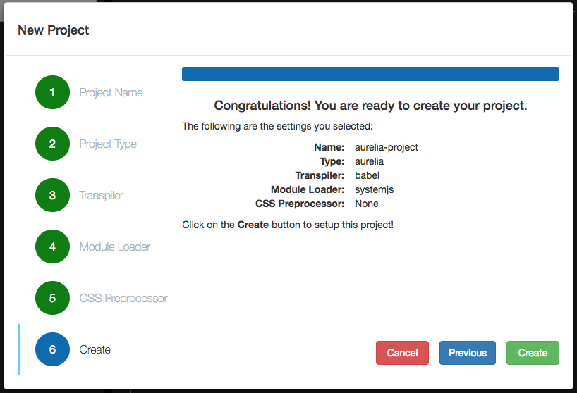

Click on the *Create* button. The *New Project* dialog will now create your new project. This may take a minute or so to complete.

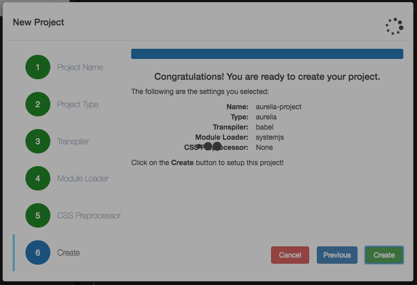

Once it completes, the dialog will go away and you will be presented with the new project in the **Navigation Panel**.

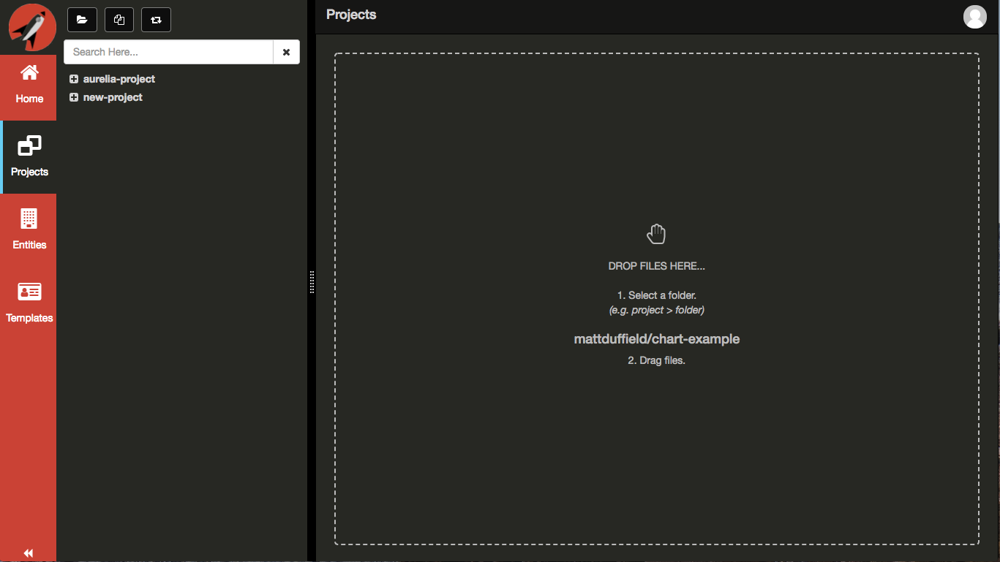

Click on the `aurelia-project`, `src`, and `styles` folders to expand them.

Click on the `app.js` file to load it.

It is possible to preview your changes using either `eye` icon or the `play` icon from the Navigation Panel.

Click on the `eye` icon to Preview your project vertically.

> #### danger::
>You will need to configure your project in GitHub to allow for [GitHub Pages](../github-pages/readme.md). If you would like this to be automatic, please email support@frontendcreator.com so that we can request it to be added on GitHub's internal feature request list.

If you have already configured GitHub Pages, then you should see the following:

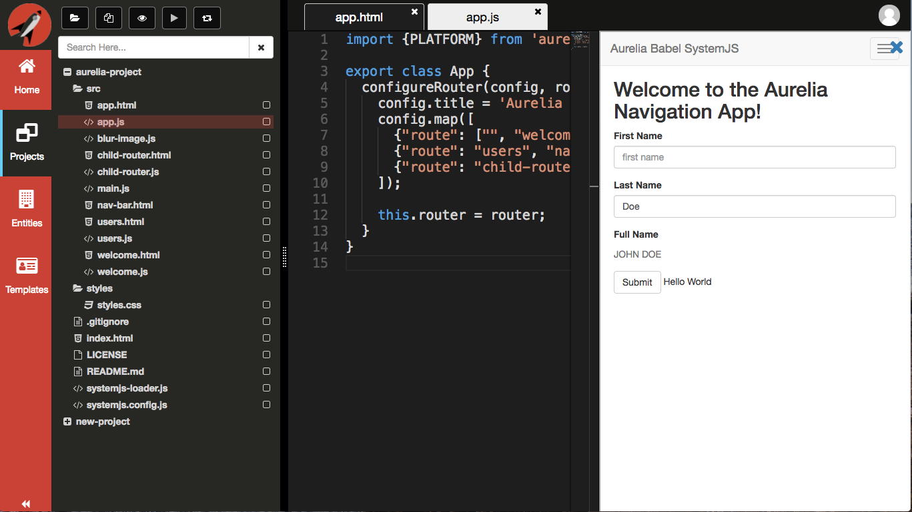

Congratulations! You have created your first Aurelia project!

## Tips
The *New Project* dialog may seem limited at first but you have a lot of power here. You are able to clone any GitHub repository that you have access. It doesn't matter if the repository is web or not.