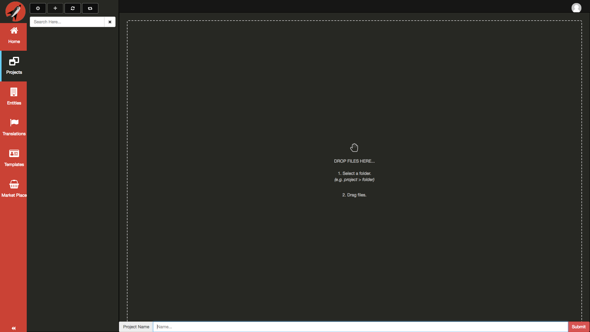
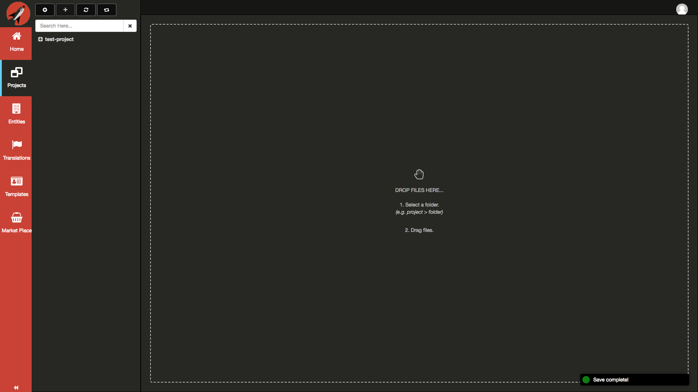
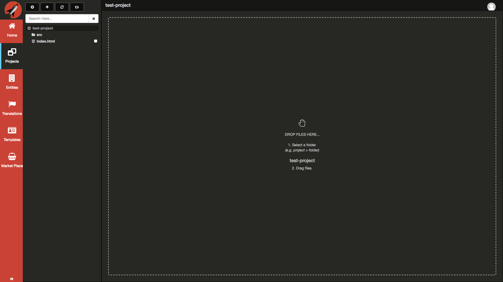
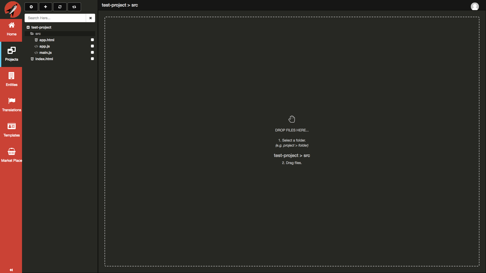
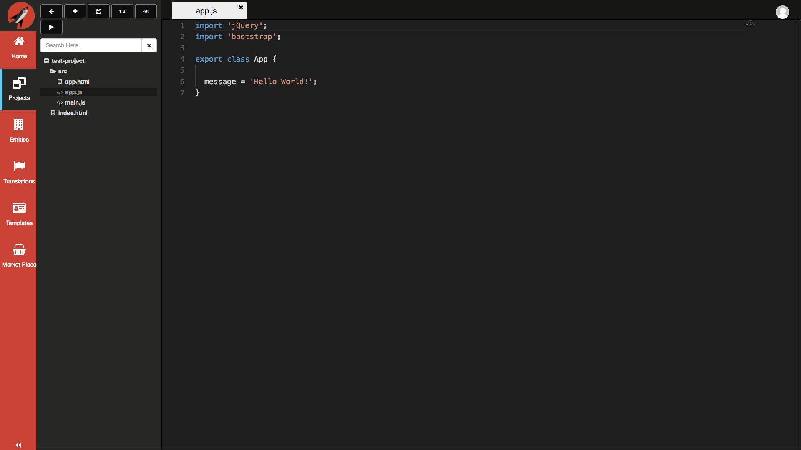
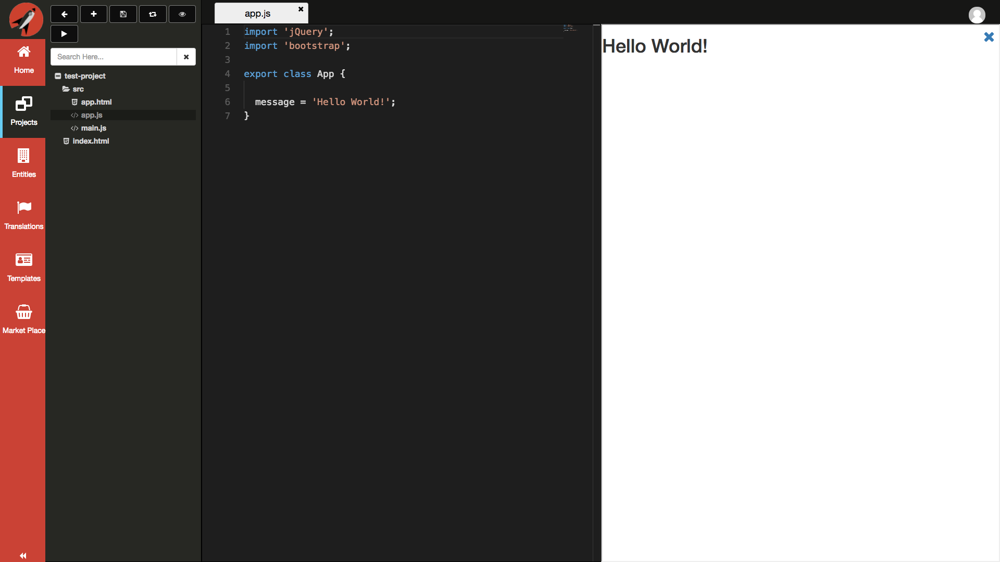
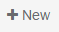
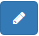
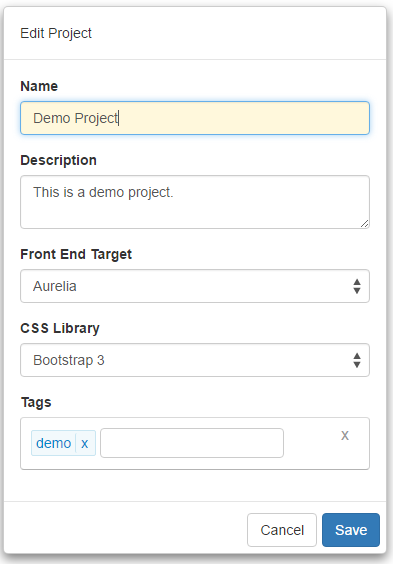
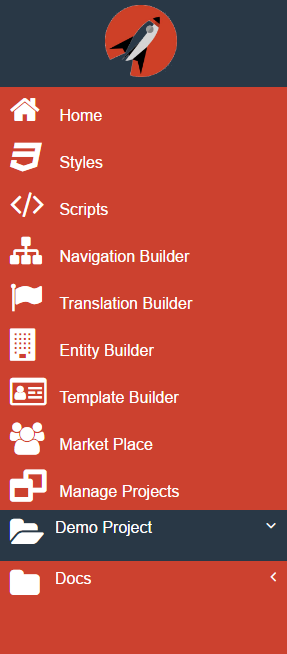

# Projects

To access your Projects, click on the **Projects** menu item from the Navigation Menu on the left. Think of projects in terms of an application. If you have already created some projects, you will see them listed in the Navigation Panel immediately to the right.

## New Project

In order to create a new project, you need to click on the first button on the left in the Navigation Panel.

Next, you will need to provide a valid name for your project. All project names must start of with a valid character and be lowercase. The system will save the project name lowercase for you regardless of what case you use.

Type in `test-project` for the name of your project.

Click on the **Submit** button to create your new project. You should now see the Project tree refresh with the new project as well as a toast notification.

Click on the `test-project` folder to expand it.

Click on the `src` folder to expand it.

Click on the `app.js` file to load it.

Click on the button with the `eye` icon to Preview your project.

<!-- ## Add/Edit Project Dialog

The following is a screen shot of the add/edit dialog that is displayed when you click on the New Button  button at the right side of the header bar or the Edit Button  asscoiated with each project:

Every project has a project name, description, and front end target. Currently Aurelia is the only supported target but long term plans are that we will be adding more framework targets in the future. Next, you will select a CSS library, Bootstrap is currently the only officially supported CSS framework but long term plans include supporting more of these in the future as well.  Finally, you can add Tags to the project so that it makes it easier to search for it in the future.

If you are adding a new Project, then once you click Save you will see that the Project will appear at the bottom of the Navigation Menu.

 -->