# Projects

To access your Projects, click on the **Projects** menu item from the **Navigation Menu** on the left. If you are familiar with Git than you can think of projects just like a repository. If you have already created some projects, you will see them listed in the **Navigation Panel** immediately to the right.

> #### danger::
>If you haven't setup [GitHub Configuration](../github/readme.md), go do that now before continuing.

## New Project
**Frontend Creator** uses a new project wizard to help you quickly setup a new project. You can create your first project by following the [New Project](./new/readme.md) steps.

## Load Existing Projects
**Frontend Creator** uses a dialog to display all of your repositories on GitHub. You can load you an existing project by following the [Load Existing Project](./load/readme.md) steps.

## Project Preview
Once a project has been either created or loaded, it is possible to preview your changes using either `eye` icon or the `play` icon from the **Navigation Panel**.

> #### danger::
>You will need to configure your project in GitHub to allow for [GitHub Pages](../github-pages/readme.md). If you would like this to be automatic, please email support@frontendcreator.com so that we can request it to be added on GitHub's internal feature request list.

If you try to preview a project that has not been setup to use [GitHub Pages](../github-pages/readme.md), you will see the following:

Once you have [GitHub Pages](../github-pages/readme.md) setup for your repository, you should see the following

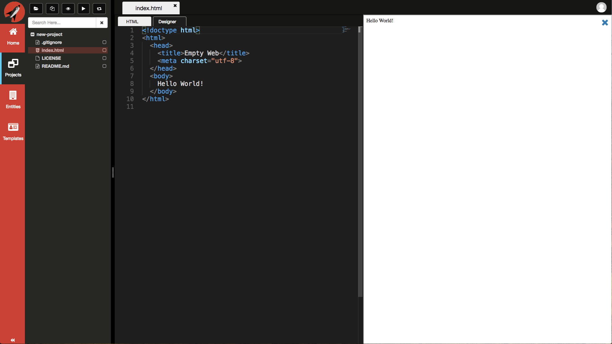

Click on the `eye` icon again to Preview your project horizontally

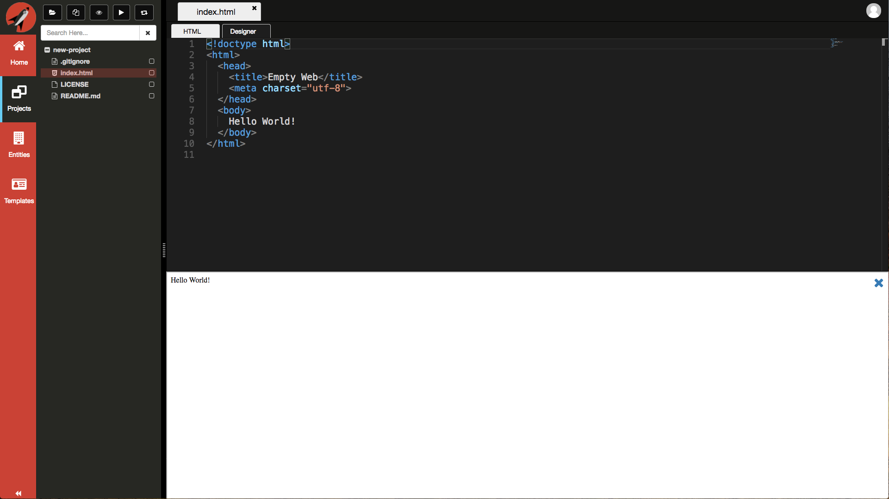

Click on the `play` icon to launch your application in a separate browser tab

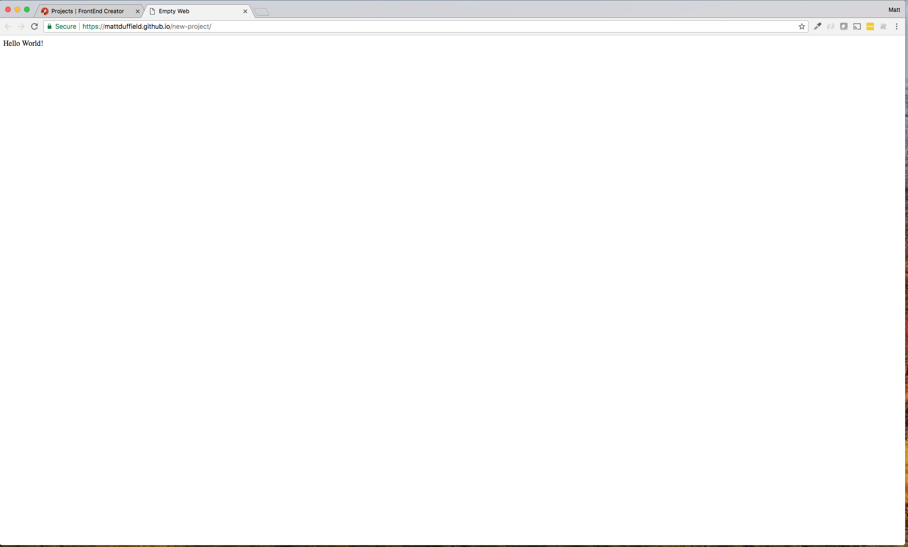

## Navigation Panel Buttons
When working with Projects, there are several buttons that you will use. 

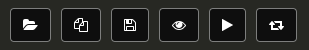

- Load - this launches the Open Project dialog
- New - this launches the New Project dialog
- Save - this will only appear when a file has changes
- Toggle Preview - this toggles the inline preview
- Launch Preview - this launches a preview in a separate browser tab
- Toggle Expand - this toggles the expansion of the tree

> #### danger::
>If the splitter is too small, you are able to scroll the buttons to the left or right.

## Navigation Panel Buttons - Designer 
When you are working with `HTML` files and decide to use the *Designer* tab, the **Navigation Panel** buttons change.

As you can see, we have the same buttons as before but we now have a few more.

- Toolbox (wrench) - this will display standard HTML elements for dragging on to the designer surface
- Custom Elements (code) - this will display custom elements available for dragging on to the designer surface
- Bootstrap (flag) - this will display Bootstrap 3 elements for dragging on to the designer surface
- Entities (database) - this will display Entities that have been define for quickly adding Forms or Tables
- Toggle DOM Tree (sitemap) - this will toggle the display of the DOM tree

## Sharing Preview Links
The same links that you use to preview your project can be shared with your clients. When you launch the preview in a separate tab, you can copy the link and share it. Using this link requires no authentication from **FrontEnd Creator**. This is because you have already configured your repository to have GitHub Pages enabled.

This makes for an excellent workflow where you can share these links with clients and show work in progress.

## Project Context Menu
The project tree context menu contains the following items:

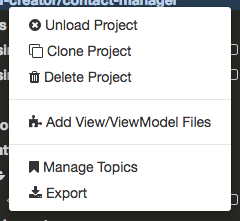

### Unload Project
This allows you to remove the project from the tree but not delete the repository from source control. You will receive a confirmation dialog verifying your decision prior to unloading the project.

### Clone Project
This allows you to clone the existing project providing a new name.

### Delete Project
This allows you to delete the repository from source control. It also removes the project from the tree. You will receive a confirmation dialog verifying your decision prior to deleting the repository.

### Add View/ViewModel Files
This menu item is currently only visible if your repository has a named topic, `aurelia`. More custom menu items will appear as we expand our support for better contextual user experiences.

When you select this option, a text input will appear at the bottom of the screen where you can name the view and view model. Don't provide an extension as the system will do that for you.

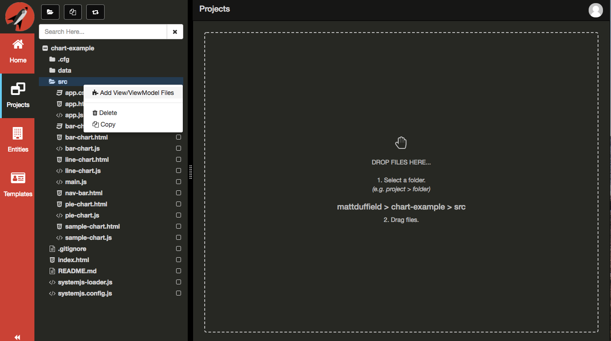

Hit the `Submit` button to complete creating the view and view model.

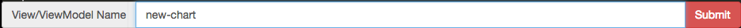

The system will create the view and view model files and load them into the tabs as shown below. You will also see a toast message stating successful creation of the files.

Make any changes you want to both of them and then save your changes by pressing `Cmd|Ctrl + S` while in the editor.

You will be prompted with providing a comment for the commit.

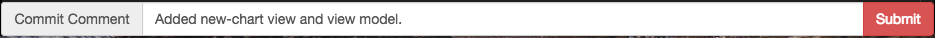

Click the `Submit` button to commit your changes back to the repository. You will see that your tabs will update from showing a dirty status to unchanged. You will also see several toast messages echoing the status of the commit.

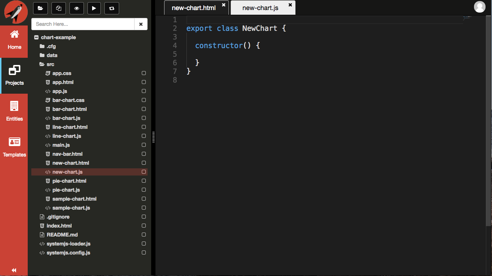

### Manage Topics
It is possible to assign topics to your repositories in *GitHub*. This extra metadata provides **Frontend Creator** with the ability to dynamically respond to differing types of projects based on what topics have been assigned to each corresponding repository.

When you are on GitHub.com, you can assign topics to any of your repositories.

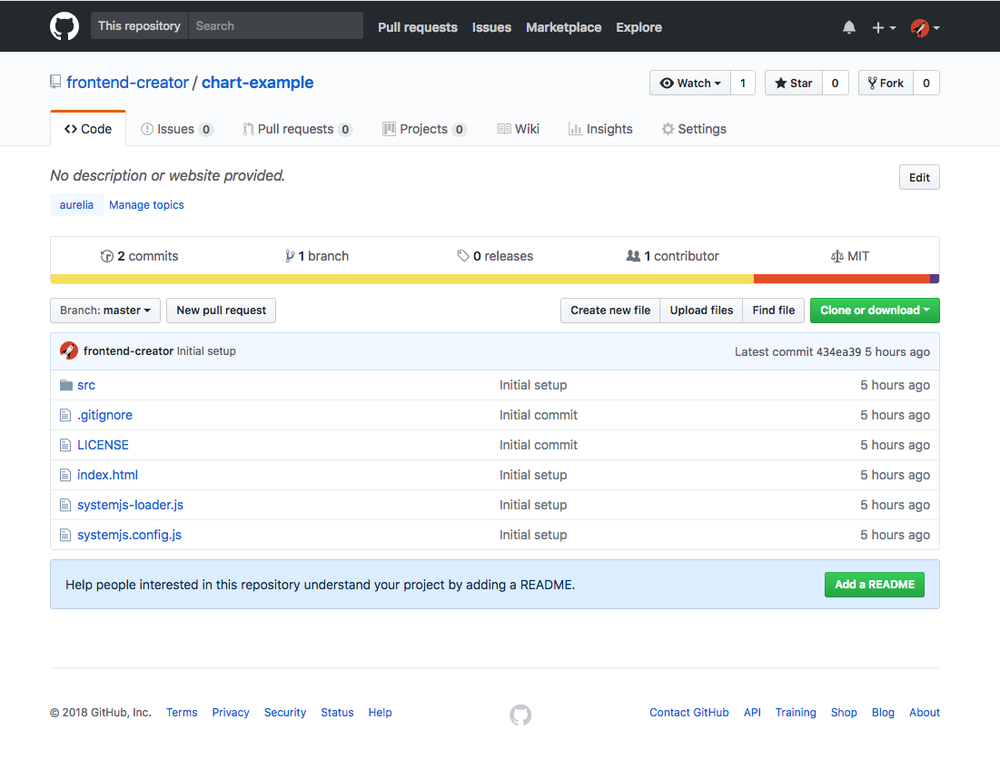

You can seee that you have the option to `Manage topics` right under the description of your repository.

You have this same ability within **Frontend Creator**. Simply click on the `Manage Topics` from the context menu item and you will be presented with the following dialog:

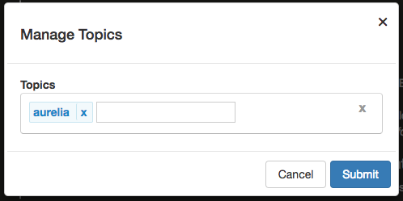

> #### danger::
>You will see all the topics currently set for your repository. Add or remove any you wish.

### Export
This gives you the ability to export the selected project to your local drive as a zip file. This can be memory intensive for larger projects.

## Project Folder Context Menu
When you **right-click** on any folder under a project, the context menu contains the following items:

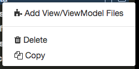

### Add View/ViewModel Files
This menu item is currently only visible if your repository has a named topic, `aurelia`. More custom menu items will appear as we expand our support for better contextual user experiences.

When you select this option, a text input will appear at the bottom of the screen where you can name the view and view model. Don't provide an extension as the system will do that for you.

Hit the `Submit` button to complete creating the view and view model.

The system will create the view and view model files and load them into the tabs as shown below. You will also see a toast message stating successful creation of the files.

Make any changes you want to both of them and then save your changes by pressing `Cmd|Ctrl + S` while in the editor.

You will be prompted with providing a comment for the commit.

Click the `Submit` button to commit your changes back to the repository. You will see that your tabs will update from showing a dirty status to unchanged. You will also see several toast messages echoing the status of the commit.

### Delete
This allows you to delete the currently selected tree item. You will receive a confirmation dialog verifying your decision prior to deleting the repository.

### Copy
This allows you to clone the currently selected tree item.

## Project File Context Menu
When you **right-click** on any folder under a project, the context menu contains the following items:

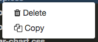

### Delete
This allows you to delete the currently selected tree item. You will receive a confirmation dialog verifying your decision prior to deleting the repository.

### Copy
This allows you to clone the currently selected tree item.

## Upload files
It is possible to upload files after you have created your project. Refer to [Upload Files](./upload/readme.md)