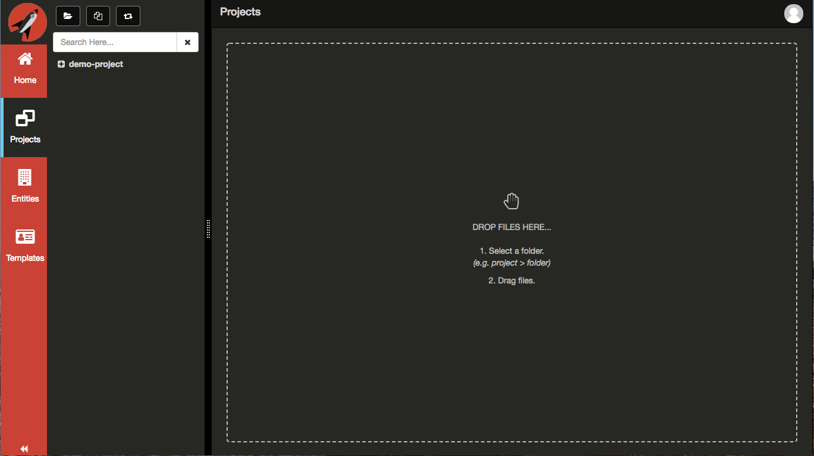
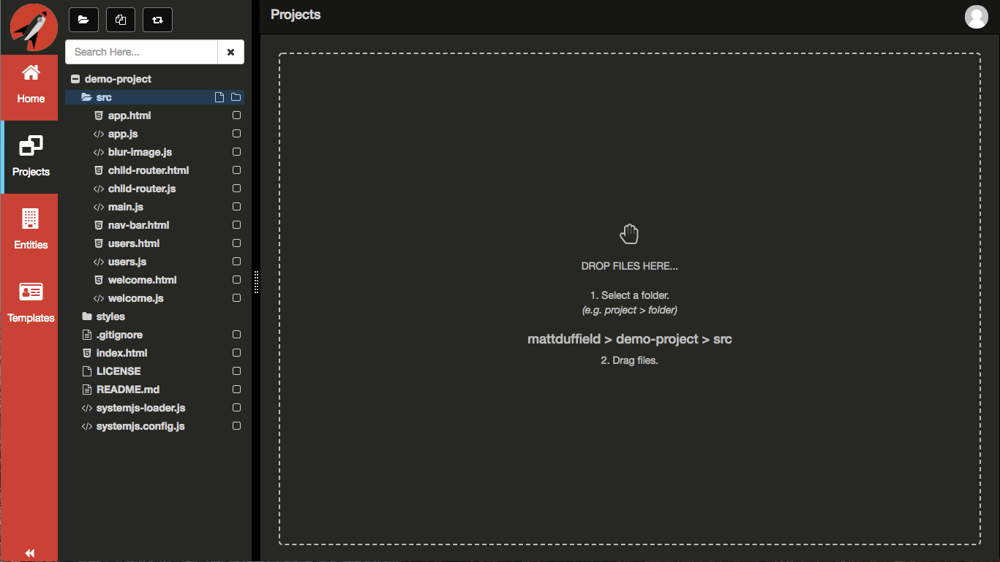
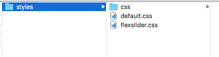
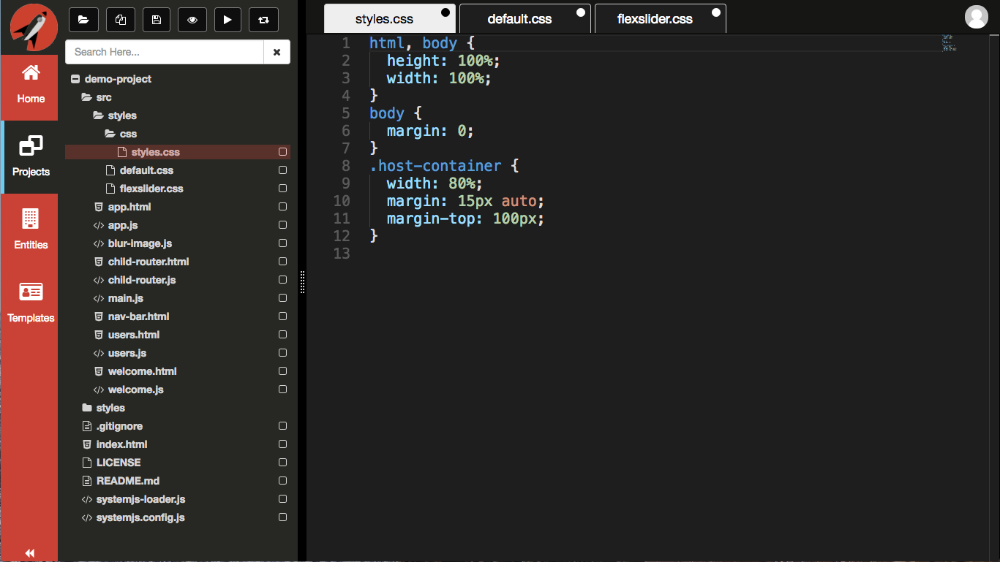
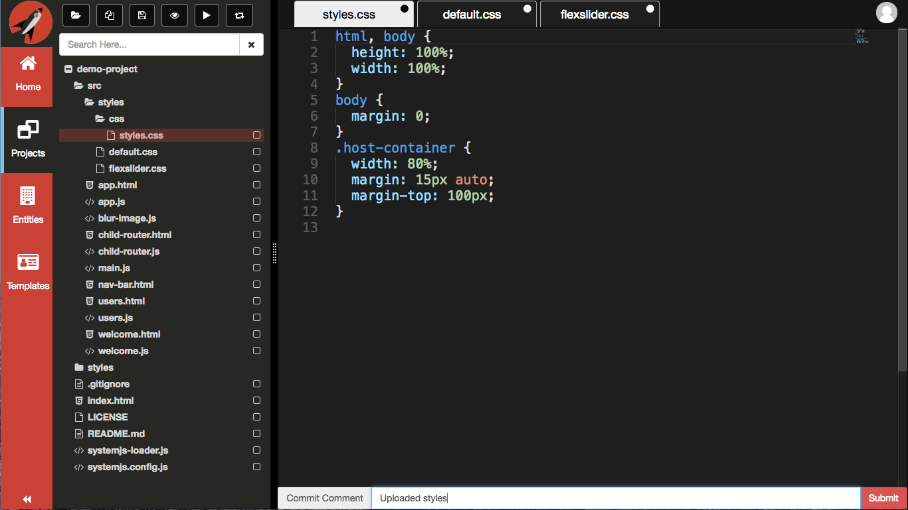
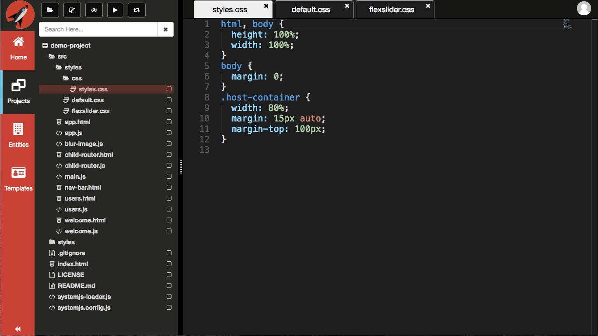

# Upload Files
**Frontend Creator** provides the ability to upload files for saving to the server via drag and drop.

In order to create a new project, you need to click on the `new project` icon on the **Navigation Panel**.

When preparing to upload files, it is important that you have a folder selected first. You will received a toast notification stating that you first need to select the root or any child folder of your project before that system will allow you to drag and drop files.

Once you have selected a folder, you will notice that the **Projects** area will display what folder you have selected.

Next, drag and drop some files from your desktop onto the **Projects** area and release. In this example we are going to selected a parent folder that has multiple files as well as a sub-folder.

After you drop the files, it may take a second or two depending on the number of files. The files are simply added to the selected folder and opened in the editor for review. 

In order to complete the upload process, you need to commit your changes back to the server. 

The system will take a few seconds, depending on the number of files you dropped, to save to the repository. After you save, the tabs will reflect no changes.

> #### danger::
>Currently, uploading images will open an empty tab. It isn't until after you save that the tab will update to show the corresponding image. This is due to the image preview pointing to the file on the server instead of in memory.
