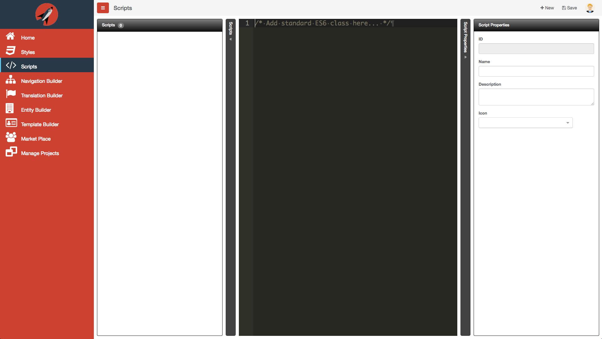
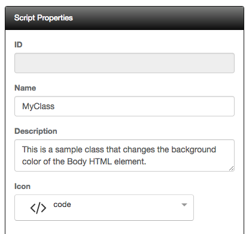
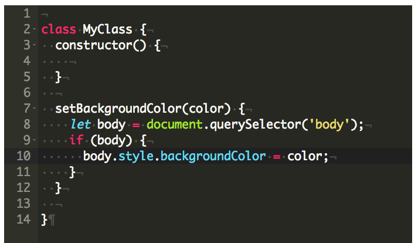
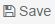
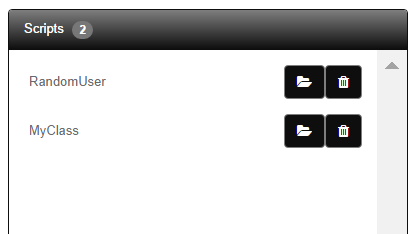
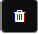
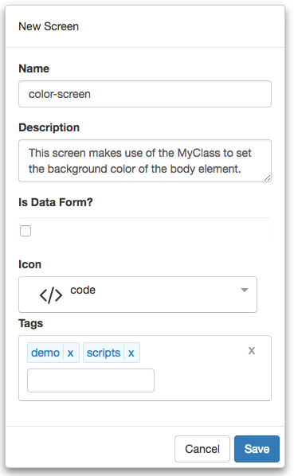
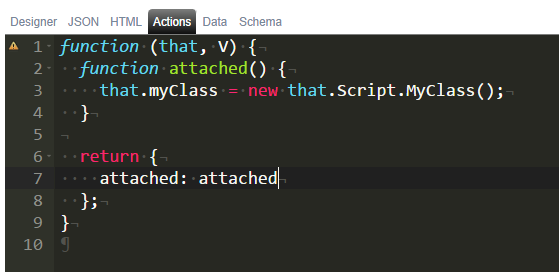

# Scripts

There may come a time when you have a lot of complex logic or want to use a third-party library in your application. This is where Scripts come in. You can create as many scripts as you like for a given project. You may find that you are repeating a lot of logic in the Actions tab would like to consolidate it under a single JavaScript `class` so that it can reused across all your screens. The following is a screen shot of the scripts editor:



## New Script

Please Note:  When the screen loads, you are in the context of a new script. 
You can simply start typing in the editor. You can collapse the dock-panes at any time. It is important to provide Script Properties prior to saving the script. 

Field | Description
----- | -----------
ID | This is readonly and simply represents the ID of the script
Name | This is the name of the script. Typically, you will want to use pascal-case, e.g. `MyClass` for the name of the script. 
Description | This is just a general description of the script
Icon | This is used to visually identify your script

The following is a screen shot of the Script Properties:



Let's now look at what the script looks like. The following is a screen shot of the script editor:



As you can see, we are simply creating a standard ES6 class. When we save our script by clicking the header's save  icon, it will automatically be added to the Scripts list on the left dock-pane as shown below:



## Edit Script

At any time, you can load any of the scripts listed from the left dock-pane by clicking on the open folder  icon. Be sure to save any of your changes prior to loading a new script or they will be lost.

## Delete Script

It is also possible to remove any scripts by clicking the delete  icon next to the script you wish to delete in the script list. 

> #### danger::
> Deleting a script here will not remove the script reference in a given screen so take care when you remove a script. You will need to make sure any screen that referenced the given script is updated to a new script or the reference is removed.

## Referencing a Script from a screen

We have built our script and now want to use. Let's walk through how we can accomplish this. First, we will create a new screen called, `color-screen`. 



Click on the Settings tab and select `MyClass` from the Screen Scripts section:


Let's now take a look at how we use our script from the Actions tab:



As you can see, we have placed our code in the `attached` function. Next, we are simply creating a new instance of the `MyClass` object. Finally, we call the method `setBackgroundColor` and pass in the string value `green`. 

**Remember** All scripts are available off of the `Script` object literal.

Once you save, you can then click on the Preview button and should get the following screenshot:


**Note:** The script name is an important property. It is used as the name that is attached to the `Script` object for reference in your Actions tab. Therefore, it is important to be sure that you have a valid name entry.

## Dependency Inject

Let's look at another use case. Say you want to use Aurelia's HttpClient and need it injected into your custom class. You can do this by simply adding the `@inject(...)` decorator above your class.

```javascript
@inject(HttpClient)
class MyClass {
  constructor(http) {
    this.http = http;
  }
}
```

You would then be able to use the HttpClient just like normal. 

In order to get an instance of your MyClass, you need to call a special function from the Actions tab as follows:

```javascript
function (that, V) {
  function attached() {
    that.myClass = that.classBuilder(that.Script.MyClass,
      that.Script.MyClass_inject);
  }

  return {
    attached: attached
  };
}
```

### Available Dependencies

The following are the Aurelia objects available for injection into your own Scripts:

Dependency | Description 
--- | --- 
Router | References the aurelia-router
EventAggregator | References the aurelia-event-aggregator
HttpClient | References the aurelia-http-client
HttpFetchClient | References the aurelia-fetch-client
Notifier | References Notifier


Refer to the [ REST API Screen Tutorial ](../../tutorials/randomuser-screen.md) for tutorial on using dependency injection with your own scripts.
