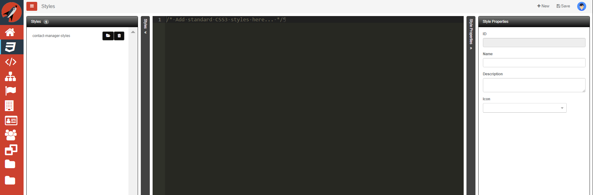
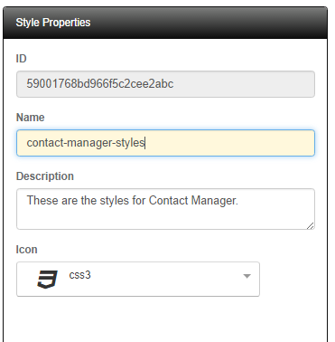
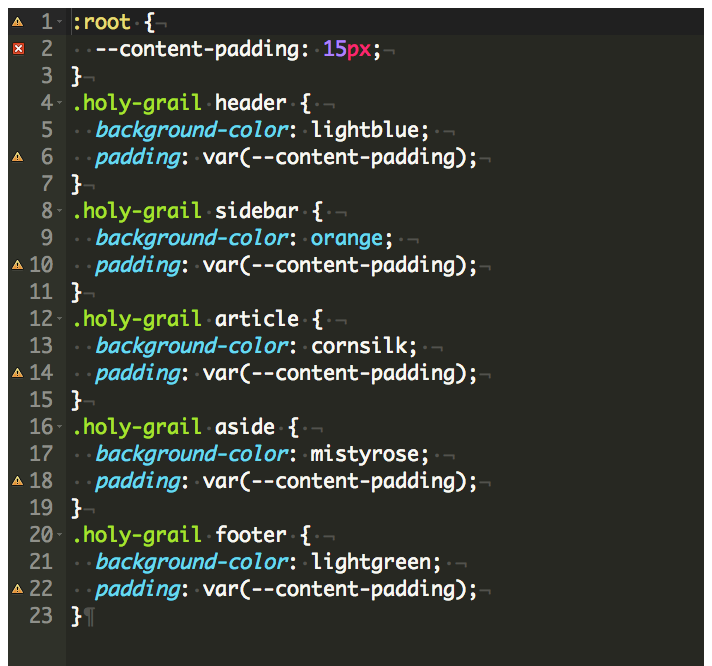
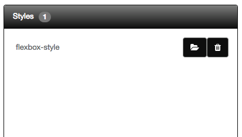
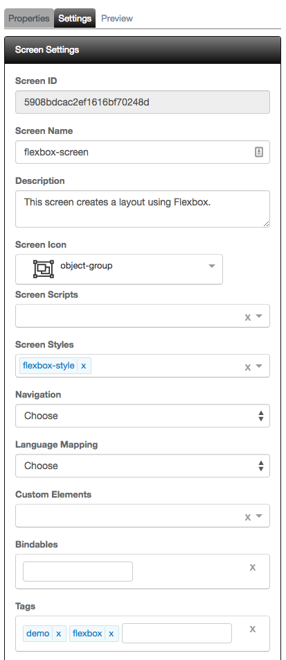
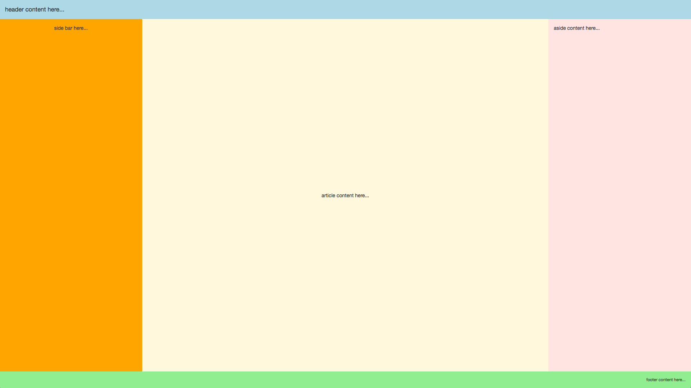

# Styles

You will find that sometimes it would be nice to author your own set of CSS rules. This is really easy using the Style editor. These styles can then be referenced from all of your screens in a project. The nice thing is that they will only be loaded once. The following is a screen shot of the styles editor:

## New Style

When the screen loads, you are in the context of a new style. You can simply start typing in the editor. You can collapse the dock-panes at any time. It is important to provide Style Properties prior to saving the style. 

Field | Description
----- | -----------
ID | This is readonly and simply represents the ID of this style
Name | This is the name of the style 
Description | This is just a general description of the style
Icon | This is used to visually identify your style

The following is a screen shot of the Style Properties:

Let's now look at what the style looks like. The following is a screen shot of the style editor:

As you can see, we are simply creating standard CSS rules. When we save our script with the header's save  icon it will automatically be added to the Styles list on the left dock-pane as shown below:

## Edit Style

At any time, you can load any of the styles listed from the left dock-pane by clicking on the open folder  icon. Be sure to save any of your changes prior to loading a new style or they will be lost.

## Delete Style

It is also possible to remove any style by clicking the delete  icon next to the style you wish to delete in the script list. 
> #### danger::
> Deleting a script here will not remove the script reference in a given screen so take care when you remove a script. You will need to make sure any screen that referenced the given script is updated to a new script or the reference is removed.

## Referencing a Style from a screen

We have built our style and now want to use. When creating a new screen, it is as simple as selecting the new style from the Settings tab under the Screen Styles section. The following is a screen shot of the Settings tab in the designer showing `flexbox-style` as a selected style:

After you have saved your screen and have designed the screen the way you want, you can then click on the Preview button to see your selected styles in action. The following is a screenshot of using the above style:

Refer to the [ Flexbox Tutorial ](../../tutorials/flexbox-screen.md) for tutorial on using your own styles.
