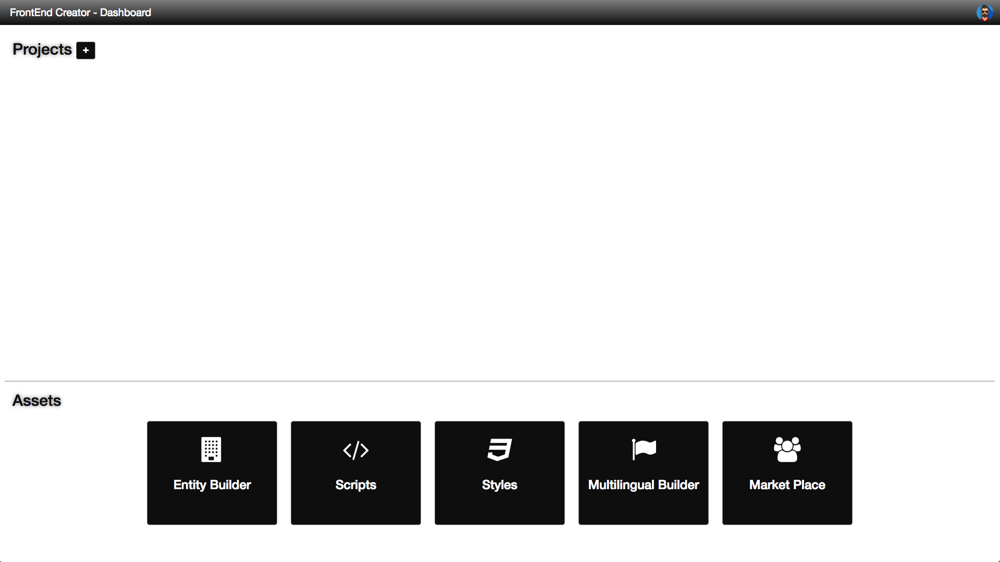
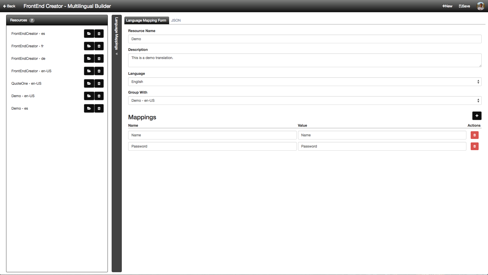
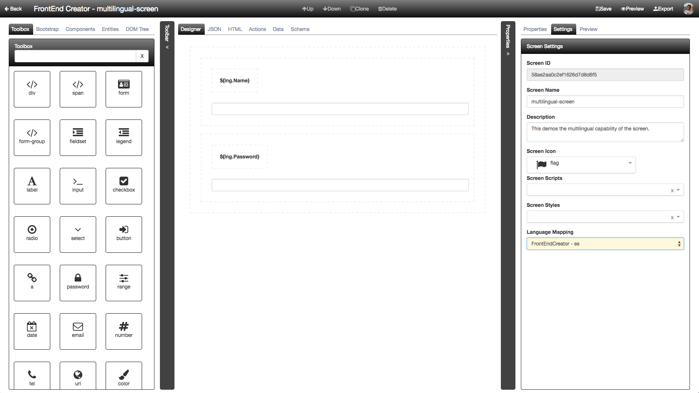
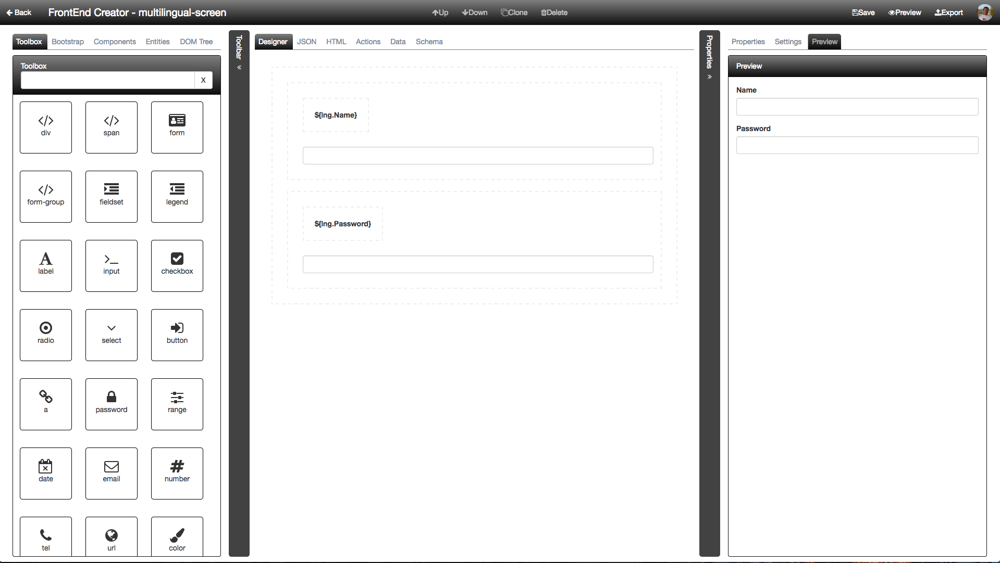
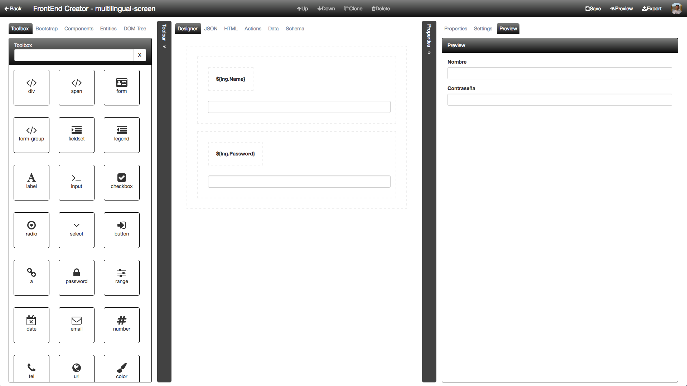

# Translation Builder

The translation builder gives you the ability to enable your application to support multiple languages. It stores each of the language resource files on the server and only loads the one you need. The following is a screenshot of a new user right after they have logged in and set their avatar.

When you click on the Translation Builder button at the bottom of the screen, you will be presented wit the following screen:

Here you can see that we have several resources created. By convention, all related resources have the same name but are assigned a different `Language`. We also use the `Group With` field to tag all related resources together.

You can add mappings which are simply `name` and `value` pairs.

Here is a screenshot of what the mappings look like as JSON:

In order to manage all of the language translations, we use the Microsoft Translation App Toolkit. We will go into more detail with the following tutorial as to our workflow. Let's just say that it is pretty easy to create your primary translation and then add more translations as you go.

Here is a screenshot of the Spanish version of our translation:

You can see that we are grouping this Spanish version with the `en-US` version as it is our primary version.

Let's now shift gears and look at a simple screen where we want to use this capability. Consider the screenshot below:

Notice that we have a new dropdown that allows us to pick our Language Mapping. Also notice that our bindings for our `Label` elements use the following `${lng.<property name>}` notation. 

Every screen has a new `lng` property that exposes the Language Mapping selected.

If we click the `Preview` tab after we save, we will see our screen as follows:

Now, if we switch back over to the `Settings` tab and change the `Language Mapping` to `Demo - es` and click the `Save` button, you should now see the following output:

This only works if you change your language preference at the operating system level. You will need to close all instance of the browser you are using for this to take effect. However, it is still pretty easy to test your languages. 

> #### info::
> We detect the preferred language from the operating system the user is using. The browser then identifies this language and we try to load it if available. It is important that you have all related languages grouped to the same value so that the application can find the correct corresponding language. 
