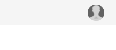
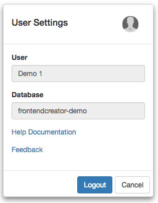
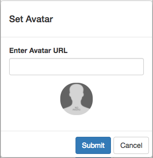
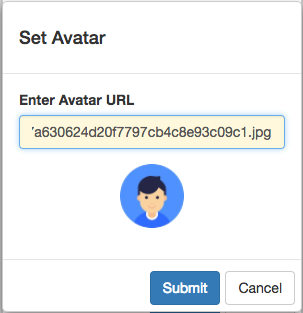
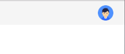

# User Avatar

After you have successfully logged in, you will probably want to set your user profile avatar to something other than the default one as shown below:


You can change this and add your own by following these simple steps:

1) Click on the User button in the top right corner of the application as shown below:



It should launch the `User Settings Dialog` as shown below:



2) Next, click on the avatar in the top right corner of the dialog screen to launch the `Set Avatar` dialog:



3) Here, you can paste in a valid URL to an avatar that you would like to use. Once you have entered in a valid URL, you should see a preview of the avatar as shown below:



For the example above, we used the following URL:

```javascript
https://s-media-cache-ak0.pinimg.com/236x/7c/c7/a6/7cc7a630624d20f7797cb4c8e93c09c1.jpg
```

4) Finally, click the `Submit` button to save your avatar to your user profile.



5) You should now see your new avatar in all of your screens. It will also be used in the Market Place when you upload an asset.

