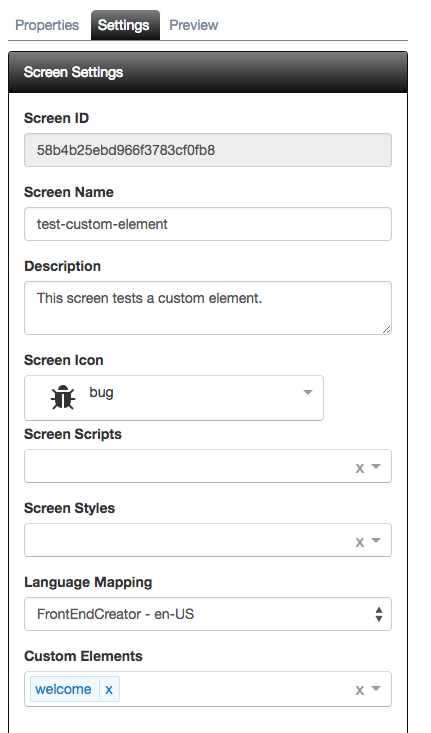

# Custom Elements

**FrontEnd Creator** comes ready with some already valuable custom elements to use right from the Toolbox. 

It is important to note that any screen that you create can be used in subsequent screens as custom elements as well.

The following is a quick demo of using custom elements:

## Overview

As you have already seen, it is possible to create a new screen with a hybrid of previosly saved screens by simply dragging and dropping the screen from the `Components` tab. This is great but the moment you drop the element on the designer surface, you know have a copy of the HTML and it becomes static. Also, if you had previously wired up any behavior, you will now need to refactor and have that behavior applied to the current screen's `Actions` tab.

In Aurelia, custom elements provide great encapsulation of behavior and markup. This allows you, the developer, to create a custom element and use it on multiple views. Later, if you need to change its look and feel, you can simply update the custom element and all views using it will now have the update. 

## Custom Element Workflow

This is now possible with **FrontEnd Creator**. You can select any other screen to be used as a custom element under the `Settings` tab. There is a label, "Custom Elements" that allows you to select the screens you wish to use.

The following is a screenshot with a screen selected:

Next, you will need to **require** the custom element, just as you would a standard Aurelia custom element. Then, you can simply use the element in your markup as show below:

As you can see, once you save, the `Preview` tab renders the contents of the custom element. 

**Note:** The designer does not know how to render the custom element as it treats it as pure markup. 

Now, if you were to change the `welcome` text, etc. and save. You would immediately get those changes the next time you rendered your new screen.

[ <- Previous ](dialogs) | [ Home ](home) | [ Next -> ](flexbox)
