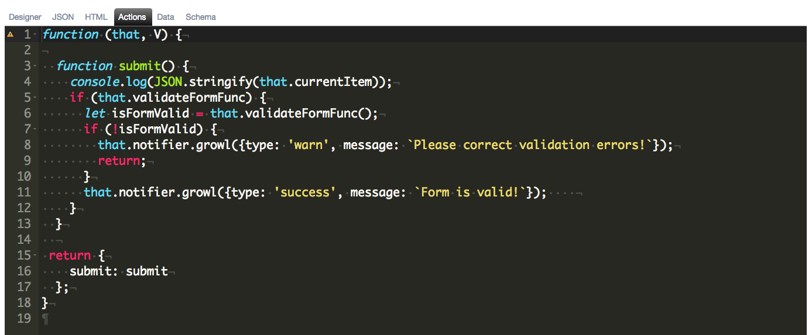

# Actions Tab

As with any screen development, there may come a time when you will want to provide custom behavior. This is accomplished using the Actions tab. You have the ability to inject your own behavior here. The application uses convention over configuration and if you name a function 'activate' or 'attached', it will execute these during the screen activation lifecycle.

The following is a screen shot of the actions tab:

This is where you would reference any scripts that you selected under the Settings tab. All scripts can be accessed from the `Scripts` object. There will be a whole section dedicated to actions and how to use them in your screens as well as Scripts.
