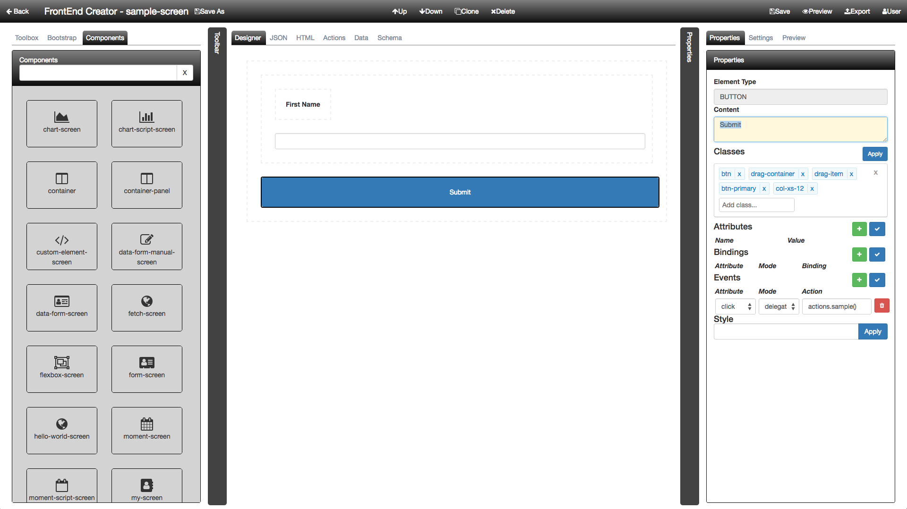

# Designer Tab

The designer tab is used to drag and drop elements from the Toolbox and also configure properties. When using the designer tab, you will most likely use the properties tab from the right dock pane.

The following is a screen shot of the designer surface with the properties tab:

#### Up/Down Buttons

The Up/Down buttons give you the ability to move the selected element up/down within the same parent container.

The following animation demonstrates this:

#### Clone/Delete Buttons

The Clone/Delete buttons give you the ability to clone/delete the selected element.

The following animation demonstrates this:

