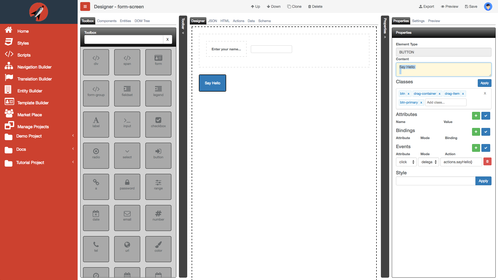
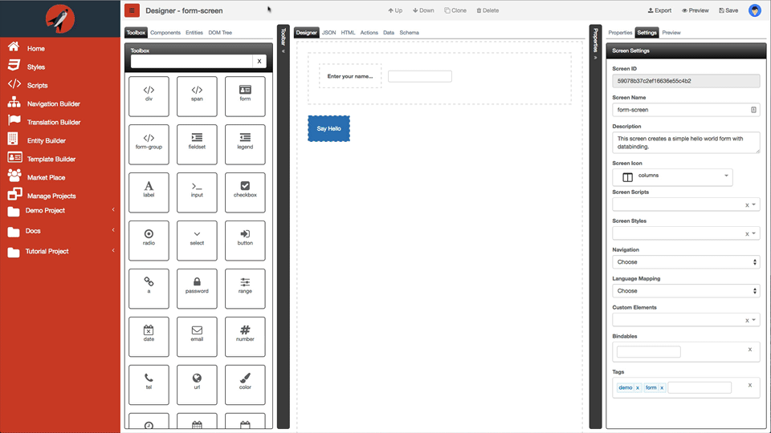
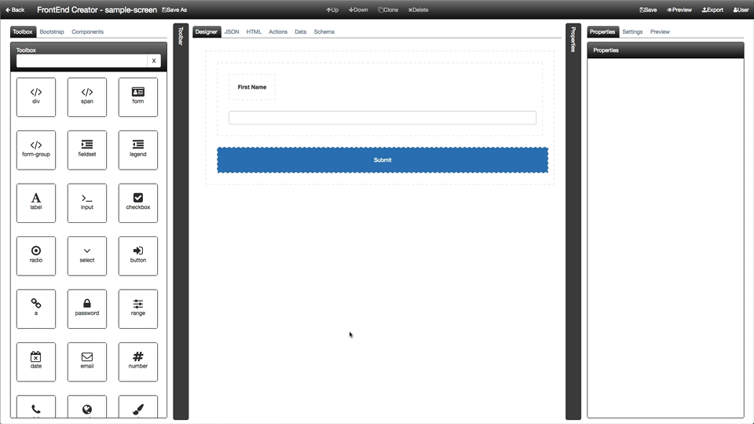

# Designer Tab

The designer tab is used to drag and drop elements from the Toolbox and also configure properties. When using the designer tab, you will most likely use the properties tab from the right dock pane.

The following is a screen shot of the designer surface with the properties tab:

#### Collapse Panes

All of the panes in the designer can take up valuable realestate. The following animation will show you how you can get back your space:

Use the keyboard mnemonic `Cmd|Ctrl + F1` to toggle the Navigation Menu states. Use the keyboard mnemonic `Cmd|Ctrl + F2` or `Cmd|Ctrl + F3` to toggle the left and right panes respectively. 

#### Up/Down Buttons

The Up/Down buttons give you the ability to move the selected element up/down within the same parent container.

The following animation demonstrates this:

Once an element is selected, it is possible to move it up or down using keyboard mnemonics. You can also use the keyboard mnemonic `Cmd|Ctrl + Up` or  `Cmd|Ctrl + Down` to move an element up or down respectively.

#### Clone/Delete Buttons

The Clone/Delete buttons give you the ability to clone/delete the selected element.

The following animation demonstrates this:

Once an element is selected, it is possible to clone or delete it using keyboard mnemonics. Use the keyboard mnemonic `Cmd|Ctrl + Plus` or  `Cmd|Ctrl + Minus` to clone or delete an element respectively.
