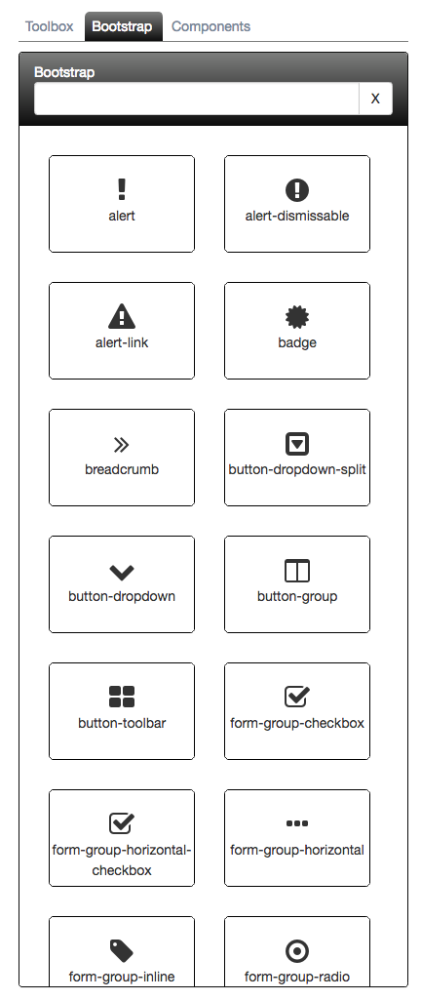

# Bootstrap Tab

If you selected Bootstrap as your CSS library in the Project settings, then you will see this tab. Other tabs will come as we continue to build out support for other CSS libraries.

The following is a screen shot of the Bootstrap tab:

To add a Bootstrap component on to the designer surface, simply click and drag the element from the Bootstrap tab onto the designer surface.

> #### danger::
> You may find the designer acts strange when mixing Bootstrap with non-Bootstrap elements due to how the Bootstrap Grid works. Usually you can adjust your existing elements by adding a `row` or `col-...` class.