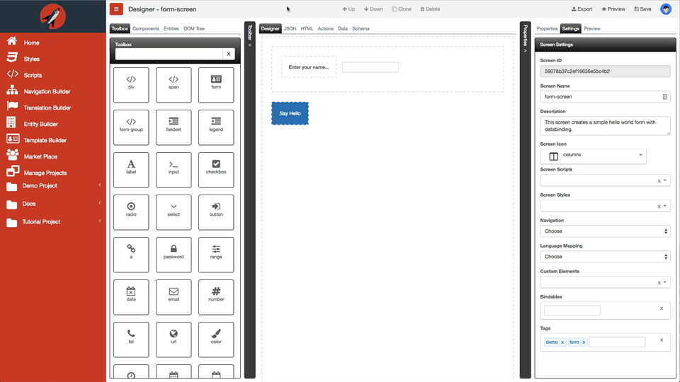

# Left Dock Pane

The left dock pane contains the following tabs:

*	[Toolbox](toolbox/readme.md) 
* [Bootstrap](bootstrap/readme.md)
* [Components](components/readme.md)
* [Entities](entities/readme.md)
* [DOM Tree](dom-tree/readme.md)

The items in these tabs will allow you drag and drop them into the central area with the exception of the DOM Tree. 

You can collapse the pane so that you have more surface to work on as well. The following animation shows how you can toggle the left dock pane:

 

You can toggle the left pane by using the keyboard mnemonic `Cmd|Ctrl + F2`.
