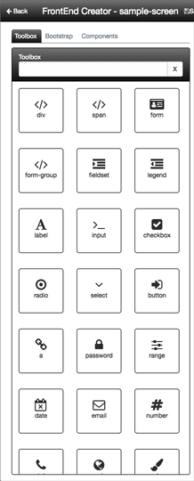
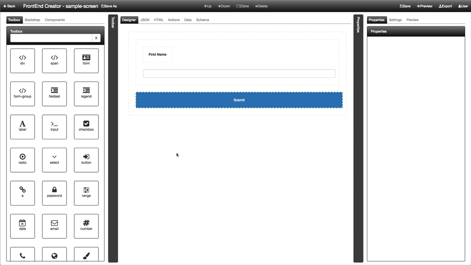

# Toolbox Tab

The Toolbox provides a list of all the elements that you can drag and drop onto the designer surface. You have the ability to search for a given element. If you want to revert back to all of the elements, simply clear the search input.

The following animation shows how you can use the toolbox as well as filter its contents:

As you saw in the animation, the search input uses partial name matching as well as tags. The following is a list of existing tags that controls are grouped by:

* flow
* form
* image
* inline
* input
* list
* media
* phrase
* sectioning
* table
* text
 
To add an element on to the designer surface, simply click and drag the element from the toolbox onto the designer surface.

You will notice that if you have anything selected in the designer that you will not be able to drag anything until you deselect the element.

