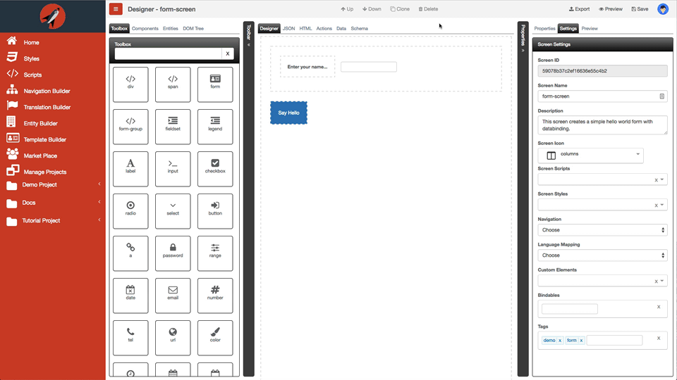

# Right Dock Pane

The right dock pane contains the following tabs:
*   [Properties](properties/readme.md)
*   [Settings](settings/readme.md)
*   [Preview](preview/readme.md)

You can collapse the pane so that you have more surface to work on as well. The following animation shows how you can toggle the right dock pane:

You can toggle the right pane by using the keyboard mnemonic `Cmd|Ctrl + F3`.
