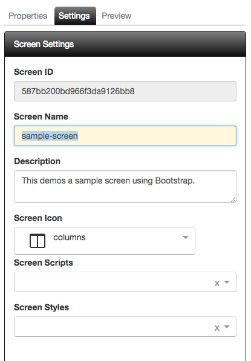

# Settings

The screen settings tab is the same as the one you saw on the Project Screens screen. It allows you to do quick changes to the name or description without leaving the view.

The following is a screen shot of the settings tab:

Aside from the same information you provided when creating the screen, you now have a screen ID, screen scripts, and screen styles. **FrontEnd Creator** uses the screen ID as part of the dynamic route for when you preview your work. You also have the ability to select any scripts and styles that you have authored at the project level.