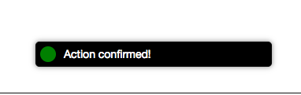

# Dialogs

**FrontEnd Creator** uses the aurelia-dialog plugin to provide dialogs. It has been wrapped to allow for an easy workflow. The following are the steps required to create a dialog and use it within a given screen:

## Overview

Dialogs are treated just like screens but have slightly different behavior. Instead of responding to routes and being displayed, they respond to user interactions. You have the ability to craft the dialog as much as you like within the guidelines of the aurelia-dialog plugin.

Let's take the steps to create a dialog:

1. Create a new Screen and call it, "confirm-dialog"

  

2. Inside the designer, on the HTML tab, replace the contents with the following:
  ```html
<ai-dialog>
  <ai-dialog-header>
    Confirm Action
  </ai-dialog-header>

  <ai-dialog-body>
    <form submit.trigger="controller.ok(true)">
      <div class="form-group">
        <label for="fn">
          Are you sure you want to perform this action?
        </label>
      </div>
    </form>
  </ai-dialog-body>

  <ai-dialog-footer>
    <button class="btn btn-default" click.trigger="controller.cancel()">Cancel</button>
    <button class="btn btn-primary" click.trigger="controller.ok(true)">Do it!</button>
  </ai-dialog-footer>
</ai-dialog>
  ```
3. Save your work.
4. Copy the Screen ID, we will use this a little later
5. Click the `Back` button to return to the Screens view.
6. Create a new Screen and call it, "dialog-test"

  

7. Drag a button onto the designer set its contents to: "Confirm"
8. Add a `click.delegate` to the button pointing to, "actions.confirm($event)". Your screen should look like the following:

  

9. In the `Actions` tab, make sure your code looks like the following:
  ```javascript
function (that, V) {

  function activate() {
    return that.actions.getResources();
  }

  function attached() {
  }

  function getResources() {
    let confirmDialogId = "<put screen id here...>";
    return Promise.all([
      that.dataService.findById(that.database, "screens", confirmDialogId)
    ]).then(values => {
      that.confirmDialog = values[0];
    }).catch(error => {
      console.error(error);
    });    
  }
  
  function confirm(e) {
    e.stopPropagation();
    let data = {};
    let payload = {screen: that.confirmDialog, owner: that, data: data};
    that.dialogService.show2(payload).then (response => {
      if (response && response.output) {
        that.notifier.growl({ message: "Action confirmed!" });
      }
    });
  }

  return {
    activate: activate,
    attached: attached,
    getResources: getResources,
    confirm: confirm
  };
}
  ```
  Looking at the above code, you can see that we are loading the dialog when our view is activated. Next, we wire up the confirm function by creating a payload to use with the `dialogService`. This service wraps the `aurelia-dialog` and facilitates calling it and passing all the information it needs. 

  **Note:** We can pass in any data that we like so that the dialog and use it as part of its workflow, if necessary. We also pass in a pointer to parent view model so that you want the dialog to perform a specific action, it can easily.

  Finally, we show the dialog and then if it was an actionable response, we display a toast message. In our case, actionable was calling "ok" on the dialog controller passing it `true`. Again, you can pass back any value or object you like.

10. Remember to paste the Screen ID where it says, "<put screen id here...>"
11. Save your work.
12. You should now be able to test your dialog. Click on the `Preview` tab and click the `Confirm` button.
13. You should see something like the following:

  

14. If you click, "Do it!", then you should also see the following:

  

15. Otherwise, you will not see anything as the dialog did not pass back a response.

This covers using dialogs. If you are interested to learn more, feel free to take a look at the [ Aurelia Dialog](https://github.com/aurelia/dialog) documentation.

[ <- Previous ](notification) | [ Home ](home) | [ Next -> ](custom-elements)
