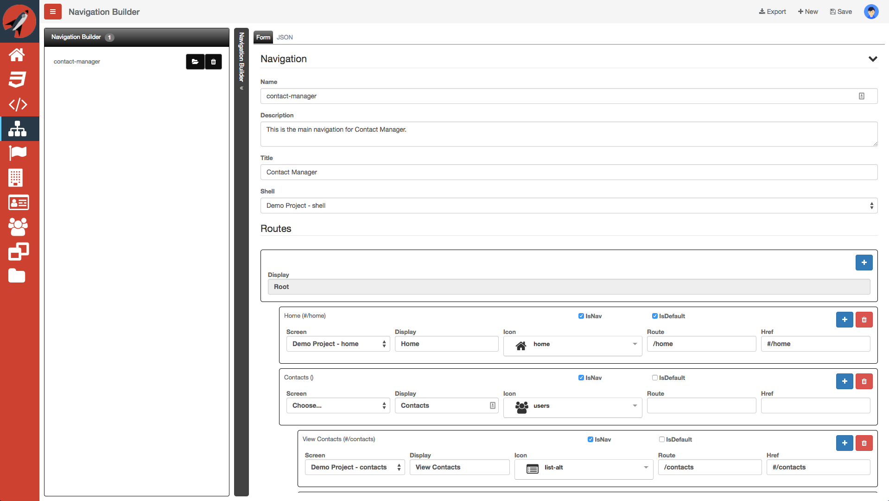
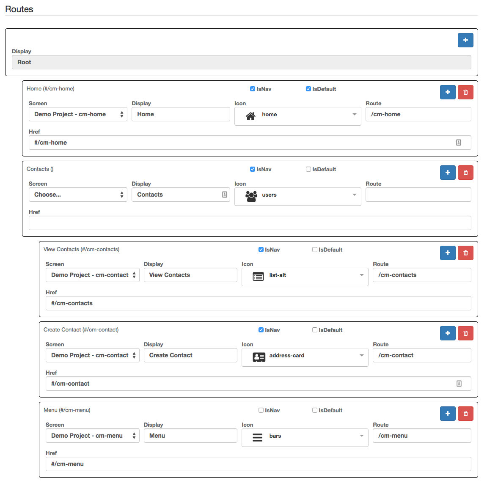

# Navigation Builder

**WARNING: THIS DOCUMENT IS STILL UNDER CONSTRUCTION** 

**PLEASE WAIT UNTIL THIS WARNING HAS BEEN REMOVED TO TRY TO FOLLOW ANY STEPS PROVIDED**

The navigation builder allows you to define your overall routes for your application. Although the navigation builder allows you to create hierarchical menus, it will always be flattened out when in order to define a set of routes that correspond to all screens in a given navigation.

Let's first go over all of the components of the navigation builder. The navigation builder has the following properties:

- Name - this is the name of the navigation. If you plan on exporting an application using the navigation builder, then this is going to be the name of the .zip file downloaded
- Description - this is the description of the navigation
- Title - this is the title used in the `configureRouter` function to set the title of the application
- Shell - this allows you to pick a top level container. Typically, this is a screen that container a `router-view` custom element
- Routes - this hierarchy allows you to define routes as well as labels so that you can use this for you main menu as well as defining all of the routes in the `configureRouter` function

You have the following actions that you can perform on a navigation:

- Export - after you have all of your screens ready and a navigation with corresponding routes, you can export the application to your local file system. Please refer to the [ Application Export ](application-export) document for guidance on running your application locally
- New - this allows you to create a new navigation. The mnemonic to execute this button is `Ctrl|Cmd + Plus`
- Save - this allows you to save your current navigation. The mnemonic to execute this button is `Ctrl|Cmd + S`
- Load - this allows you to load an existing navigation
- Delete - this allow you to delete an existing navigation
- Add new route - this allows you to add a new route at the level where the button is clicked
- Delete route - this allows you to remove a route and all children at the level where the button is clicked

Let's now take a look at the fields that make up an individual route: 

- IsNav - this is a checkbox that determines if the route should be visible when creating a menu from the router
- IsDefault - this indicates which of the routes is identified as the default route. **Note:** currently, you can check all routes with this value. Only one route should ever have this selected
- Screen - this is a dropdown that lists all of your screens across all projects. You may have projects where you have created screens or dialogs that are common across all applications
- Display - this is what is display in the menu
- Icon - this is an icon that can be used for display in the menu or the screen. This defaults to the icon selected when creating the screen
- Route - this is the route for the router. It defaults to the name of the screen
- Href - this is the href for the router. It may not be necessary. It defaults to the name of the screen

As you can see from the screenshot above, we have a hierarchical menu representation that we want our application to use. You will also notice that we have a `Contacts` route entry that is not a screen but a parent to children. In this way, the `Contacts` entry is ignored in the router but is present in the menu. 

You will also notice that we have an entry that is not included with the IsNav checkbox. This is due to the fact that the menu screen is not a route. We include it here so that when we export it is included as the list of screens to include.

[ <- Previous ](entity-builder) | [ Home ](home) | [ Next -> ](application-export)
