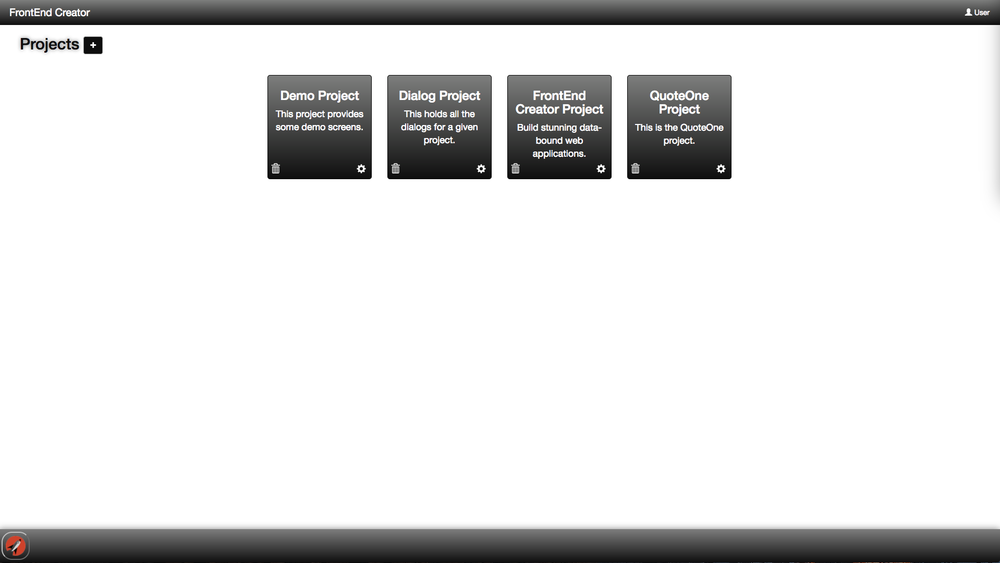

# Projects

Once you have completed authenticating, you will be presented with all the projects that you are working on. Think of projects in terms of an application. You can have as many screens associated with a project as you like. The following is a screen shot of the projects screen:

## Add/Edit Project Dialog

The following is a screen shot of the add/edit dialog that is displayed when you click on the + button or the cog icon:

Every project has a project name, description, and front end target. Currently Aurelia is the only supported target we will be adding more targets in the future. Next, you will select a CSS library, Bootstrap is currently the only officially supported CSS framework but this will also change in the future as well.

Once you click save on a project, you will automatically launch into the Project Screens view.

[ <- Previous ](login) | [ Home ](home) | [ Next -> ](project-dashboard)
