# Configuring CloudFlare and SSL
The following are the steps required to setup an account for CloudFlare and SSL

1. Navigate to http://www.cloudflare.com and setup a free account
2. Use flexible SSL as this will not require any changes to the backend
3. Change name server where DNS is managed to the ones given by CloudFlare
4. Change DNS A record to point to server where your backend server is running. (See the last image)
5. Change everything in your **Frontend Creator** code from `HTTP` to `HTTPS`
6. Ensure that you have [GitHub Pages](../../../basics/github-pages/readme.md) configured correctly

The following are screens shots:

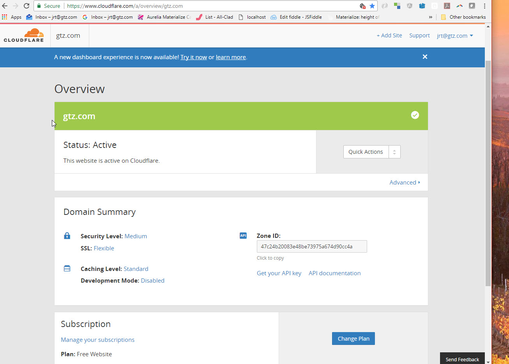
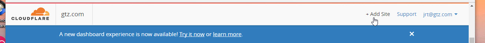
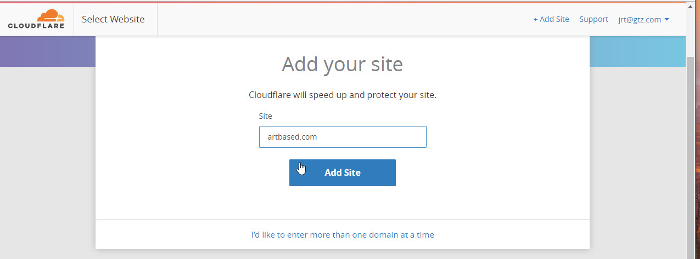
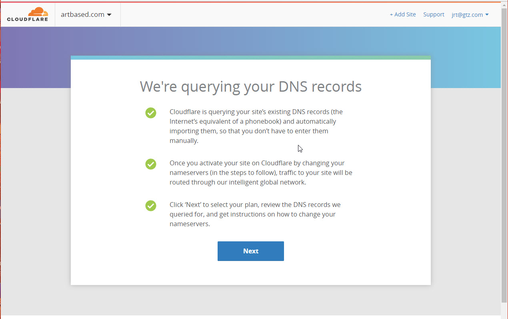
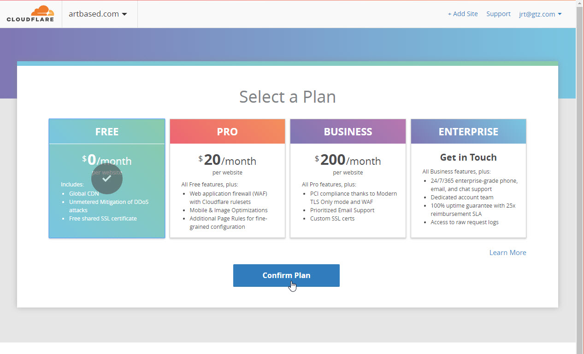

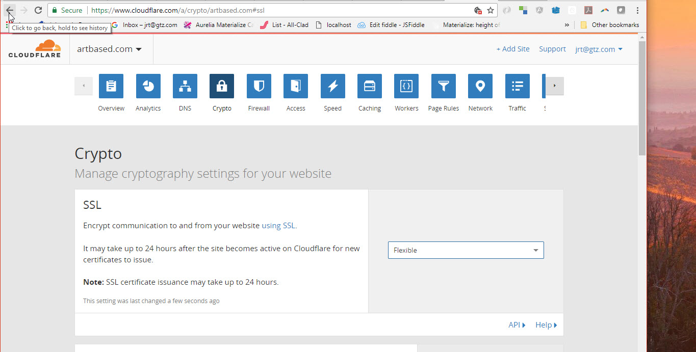
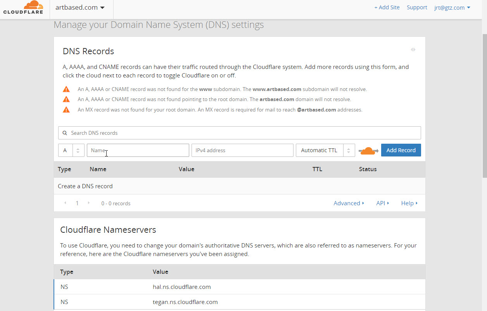
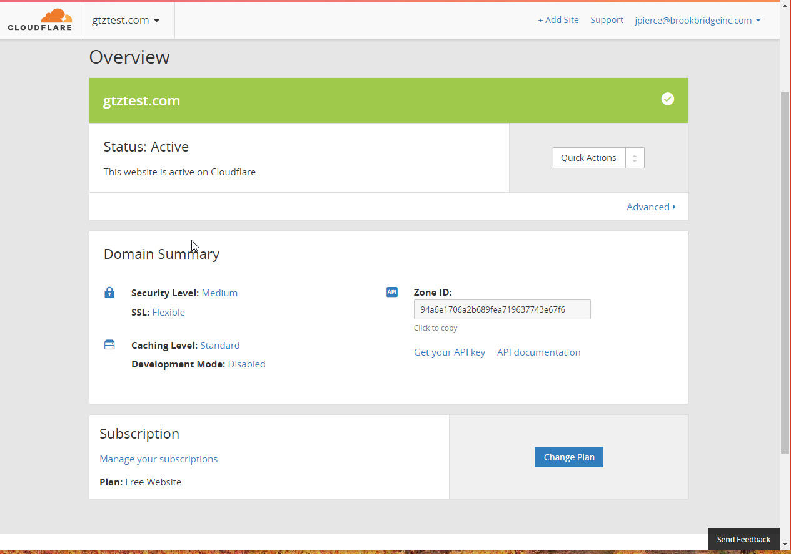
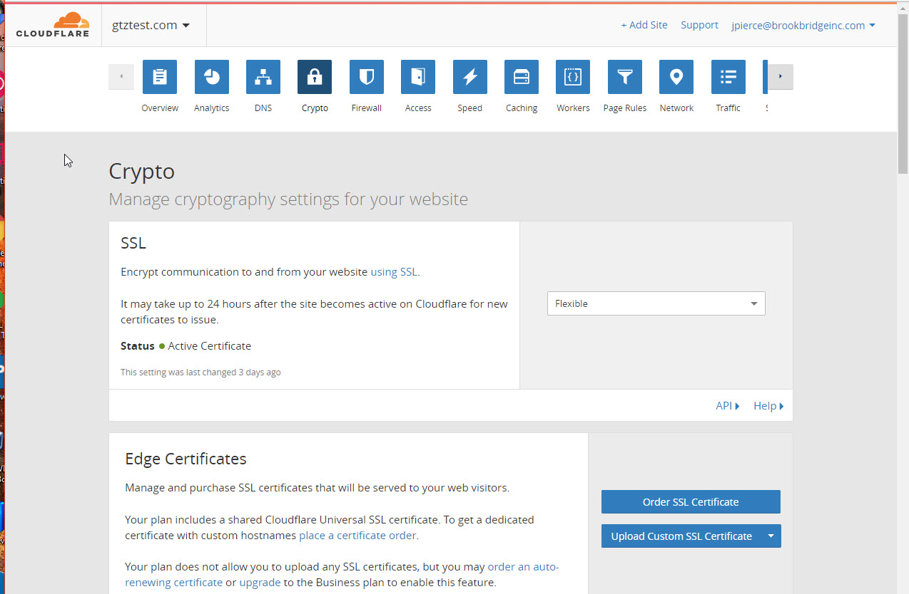
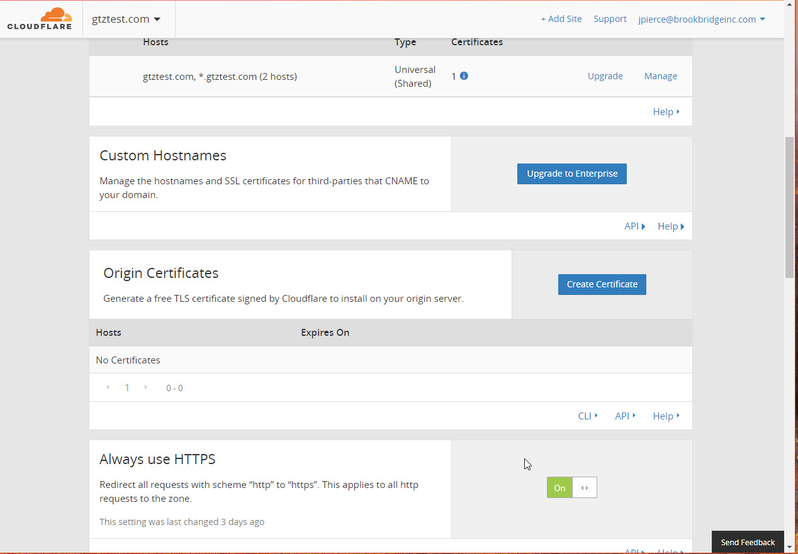
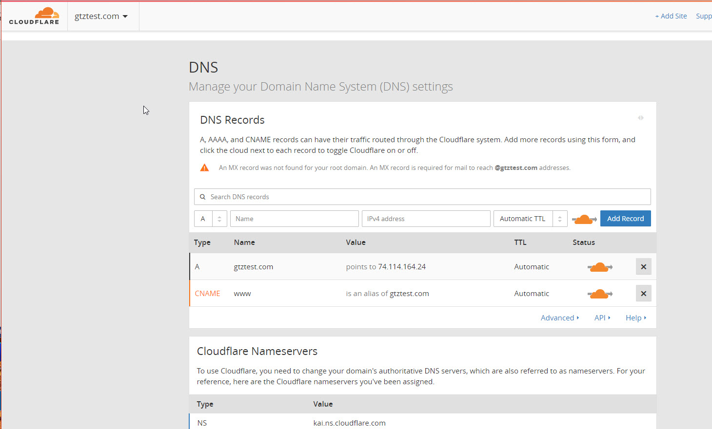
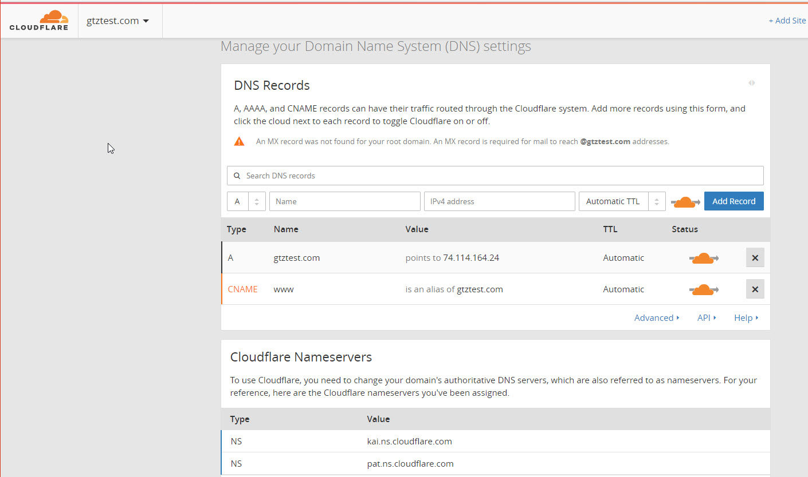
