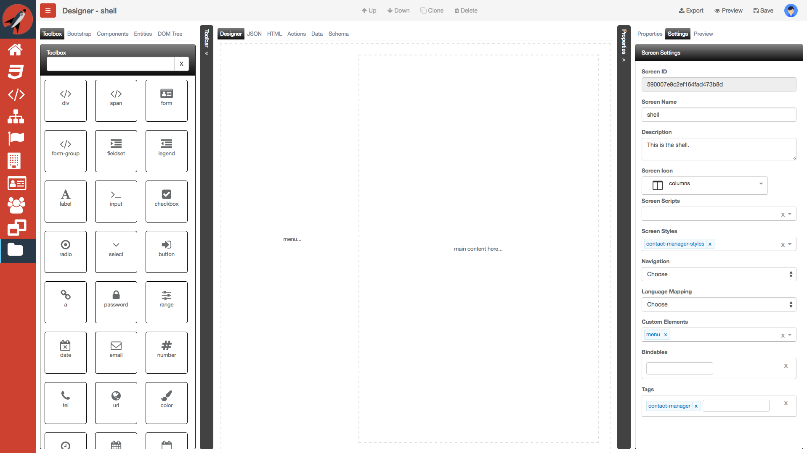
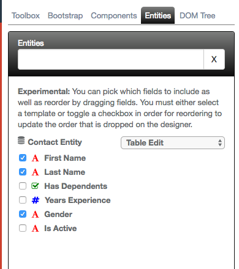
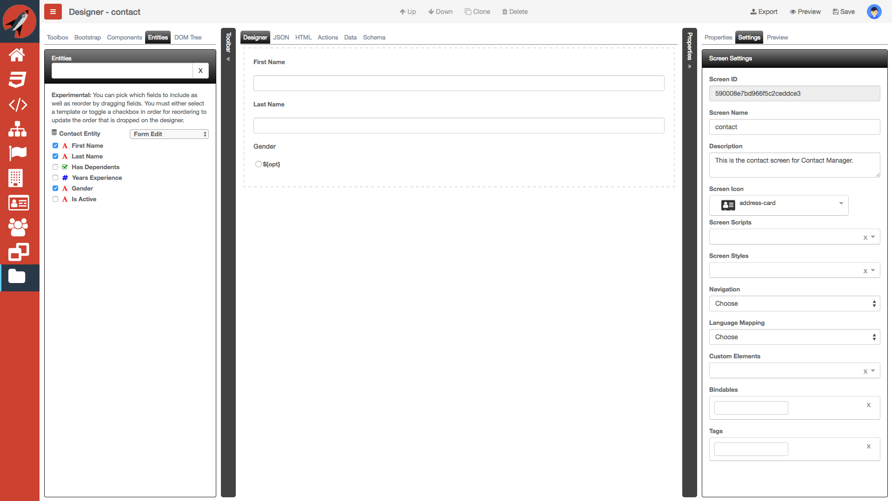

# Contact Manager
This tutorial is the culmination of all of the other tutorials by building a contact manager sample application. The following is a screenshot of the final product that we are going to build:


### Styles

We are going to need to create a single styles sheet so that we can reference it from our screens:

1. Navigate to the Styles screen and create a new style and call it `contact-manager-style`
2. In the Styles editor, add the following CSS:
  ```css
  :root {
    --page-bg-color: #fff;
    --page-color: #676a6c;
    --page-border-color: lightgray;
    --menu-bg-color: #33691E;
    --menu-active-bg-color: #1B5E20;
    --menu-active-border-color: #9CCC65;
    --menu-item-color: #E0E0E0;
    --menu-item-active-color: #9CCC65;
  }

  html, body, .page-host {
    height: 100%;
    margin: 0;
  }

  .cm-page {
    background-color: var(--page-bg-color);
    color: var(--page-color);
    padding: 15px;
    margin: 20px;
    border: 1px solid var(--page-border-color);
    box-shadow: 5px 5px 5px var(--page-border-color);
  }
  .cm-menu-background {
    background-color: var(--menu-bg-color);
  }
  .cm-menu {
    margin:0;
    padding:0;
    background-color: var(--menu-bg-color);
    padding-left: 15px;
  }
  .cm-menu-item {
    border-left: 4px solid transparent;
    color: var(--menu-item-color);
  }
  .cm-menu-item a,
  .cm-menu-item label {
    padding: 7px 15px;
    display: block;
    text-decoration: none;
    font-weight: 600;
  }
  .cm-menu-item a {
    color: var(--menu-item-color);
  }
  .cm-menu-item:hover,
  .cm-menu-item:hover>a,
  .cm-menu-item:hover>div>a,
  .cm-menu-item:hover>div>label {
    background: var(--menu-active-bg-color);
    color: var(--menu-item-active-color);
  }
  .cm-menu > .parent-active {
    border-left: 4px solid var(--menu-active-border-color);
    background: var(--menu-active-bg-color);
  }
  .cm-menu .item-active,
  .cm-menu .item-active > a,
  .cm-menu .item-active > label {
    color: var(--menu-item-active-color);
  }
  .cm-menu .item-active,
  .cm-menu .item-active * {
    background: var(--menu-active-bg-color);
  }
  /* animate page transitions */
  .au-enter-active {
    -webkit-animation: fadeInRight 1s;
    animation: fadeInRight 1s;
  }

  /* animation definitions */
  @-webkit-keyframes fadeInRight {
    0% {
      opacity: 0;
      -webkit-transform: translate3d(100%, 0, 0);
      transform: translate3d(100%, 0, 0)
    }
    100% {
      opacity: 1;
      -webkit-transform: none;
      transform: none
    }
  }

  @keyframes fadeInRight {
    0% {
      opacity: 0;
      -webkit-transform: translate3d(100%, 0, 0);
      -ms-transform: translate3d(100%, 0, 0);
      transform: translate3d(100%, 0, 0)
    }
    100% {
      opacity: 1;
      -webkit-transform: none;
      -ms-transform: none;
      transform: none
    }
  }
  ```
  You will notice that we are using some CSS3 variables. They should be support in all browsers.

Now, let's move on and create our screens. We are going to prefix all of our screens just to be sure that we don't have a naming collision with the default HTML elements.

From the navigation screenshot above, we are going to need to create five (5) screens:

- menu - this will be the application menu and will live in the shell
- shell - this will be our shell for the application. It will contain the custom element `router-view`
- home - this is our home screen
- contacts - this will display a list of contacts in a table
- contact - this will allow us to edit an individual contact


### Menu screen

1. Create another screen and call it, `cm-menu`
2. In the designer, add the following HTML:
  ```html
  <ol class="cm-menu tree flex-column-1 drag-container drag-item padding-top-15">
    <li repeat.for="item of navigation" title="${item.display}" class="cm-menu-item">
      <a if.bind="item.routes.length == 0" href.bind="item.href" class="user-select-none">
        <i if.bind="item.icon" class="fa fa-${item.icon} fa-2x margin-right-10 pointer-events-none"></i>
        <span class="pointer-events-none">${item.display}</span>
      </a>
      <div if.bind="item.routes.length > 0" class="">
        <label for="${item.id}" class="cm-menu-label user-select-none">
          <div class="flex-row-1">
            <i class="flex-row-none fa fa-${item.icon} fa-2x margin-right-10 pointer-events-none"></i>
            <span class="flex-row-1 pointer-events-none">${item.display}</span>
            <i class="cm-menu-caret fa ${inputCheck.checked ? 'fa-angle-down' : 'fa-angle-left'} pointer-events-none"></i>
          </div>
        </label>
        <input ref="inputCheck" type="checkbox" id="${item.id}" class="cm-menu-parent pointer-events-none">
        <ol class="cm-sub-menu flex-column-1">
          <li show.bind="sub.nav" class="cm-menu-item field user-select-none" repeat.for="sub of item.routes">
            <a href.bind="sub.href" class="user-select-none">
              <i if.bind="sub.icon" class="fa fa-${sub.icon} fa-lg margin-right-10 pointer-events-none"></i>
              <span class="pointer-events-none">${sub.display}</span>
            </a>
          </li>
        </ol>
      </div>
    </li>
  </ol>
  ```
  Here is how the designer should appear:

  

  As you can see, you really cannot see much from the designer perspective as the menu is really data-driven.

3. In the settings tab, make sure that you include `contact-manager` under the Navigation field. It uses the navigation object to create the menu dynamically
4. Save your screen

### Shell screen

1. Create a new screen and call it `cm-shell`
2. In the settings tab, make sure you include `contact-manager-styles` under the Screen Styles field
3. Also, make sure that you include `cm-menu` under the Custom Elements field
4. In the designer, add the following HTML:
  ```html
  <div class="drag-container drag-item flex-row full-height">
    <require from="cm-menu"></require>

    <sidebar class="flex-column-1 min-max-width-300">
      <cm-menu class="flex-column-1"></cm-menu>
    </sidebar>
    <main class="drag-container drag-item flex-column-1">
      <router-view swap-order="after" class="flex-column-1"></router-view>
    </main>
  </div>
  ```
  As you can see from above, we have a simple shell that has two columns. It also contains a reference to our `cm-menu` screen as a custom element. Finally, we also are referencing the `router-view` Aurelia custom element. Here is how the designer should appear:

  

5. In the actions tab, add the following JavaScript:
  ```javascript
  function (that, V) {
    
    function attached() {
      that.cmMenu = document.querySelector(".cm-menu");
      that.cmMenu.addEventListener("click", that.actions.activateLink.bind(that));
    }
    
    function detached() {
      that.cmMenu.removeEventListener("click", that.actions.activateLink.bind(that));
    }

    function activateLink(e) {
      console.log('shell:activateLink', e);
      if (e.target.nodeName === "OL") return;
      let cls = that.cmMenu.querySelectorAll(".item-active, .parent-active");
      if (cls) {
        cls.forEach(item => {
          item.classList.remove("item-active");
          item.classList.remove("parent-active");
        });
      }
      if (e.target.nodeName === "INPUT") {
        e.target.parentElement.classList.add("item-active");
      } else {
        e.target.classList.add("item-active");
      }

      let parent = that.actions.findChildWithParentClass(e.target, "cm-menu");
      if (parent) {
        parent.classList.add("parent-active");
      }
      return true;
    }
    
    function findChildWithParentClass(target, cls) {
      let node = target;
      while (node.parentElement != null) {
        if (node.parentElement.classList.contains(cls)) return node;
        node = node.parentElement;
      }
      return null;
    }
    
    return {
      attached: attached,
      detached: detached,
      activateLink: activateLink,
      findChildWithParentClass: findChildWithParentClass
    };
  }
  ```
6. Save your screen

### Home screen

1. Create another screen and call it, `cm-home`
2. In the designer, add the following HTML:
  ```html
  <section class="cm-page flex-column-1 au-animate drag-container drag-item">
    <h2 class="drag-container drag-item">
      Welcome to the Contact Manager!
    </h2>
  </section>
  ```
  Here is how the designer should appear:

  

3. Save your screen

### Contacts screen

1. Create another screen and call it, `cm-contacts`
2. In the designer use the Entities tab and select the Contact entity. Check the fields as shown below as well as pick `Table Edit` from the dropdown and drag onto the designer

  

  Here is how the designer should appear:

  

3. You will want to modify the HTML slightly by wrapping existing markup with the following section element:
  ```html
  <section class="cm-page flex-column-1 au-animate drag-container drag-item">
    ...
  </section>
  ```
4. By wrapping the markup, we are able to automatically enlist into Aurelia's CSS animation
5. In the data tab, add the following JSON:
  ```json
  {
    "genderList": [
      "male",
      "female"
    ]
  }
  ```
  We do this so that the radio options are created properly.

6. Save your screen

### Contact screen

1. Create another screen and call it, `cm-contact`
2. In the designer, use the Entities tab and select Contact Entity. Check the fields as shown below as well as pick `Form Edit` from the dropdown and drag onto the designer

  Here is how the designer should appear:

  

3. You will want to modify the HTML slightly by wrapping existing markup with the following section element:
  ```html
  <section class="cm-page flex-column-1 au-animate drag-container drag-item">
    ...
  </section>
  ```
4. By wrapping the markup, we are able to automatically enlist into Aurelia's CSS animation
5. In the data tab, add the following JSON:
  ```json
  {
    "genderList": [
      "male",
      "female"
    ]
  }
  ```
  We do this so that the radio options are created properly.

6. Save your screen

## Testing your application

We are now ready to test the application. It should look like the application from animation at the beginning of the Quick Start.

In order to test your application, you will need to construct a URL that points to your application. You can achieve this by using the following steps:

`http://frontendcreator.com/editor/0.9.14/?app=<navigationID>&db=frontendcreator`

- You will need to replace the `navigationID` with the ID property from the Navigation screen. Currently, you can acces it by copying it from the JSON tab.
- Also note, that the version of the editor may have changed.

## Uh, there's no data...

We have come a long ways but we still need to have data. This next section will get you setup with some random data for testing.

### RandomUser script

1. Create a new Script and call it, `RandomUser`
2. Add the following JavaScript to the editor:
  ```javascript
  @inject(HttpFetchClient)
  class RandomUser {
    constructor(http) {
      this.http = http;
      this.baseUrl = `https://randomuser.me/`;
      this.http.configure(config => {
        config
          .withBaseUrl(this.baseUrl)
          .withDefaults({
            headers: {
              'Accept': 'application/json',
              'X-Requested-With': 'Fetch'
            }
          });
      });
    }

    getUsers(numberUsers = 10) {
      let path = `api?nat=us&results=${numberUsers}`;
      return this.http.fetch(path)
        .then(response => response.json());
    }
  }

  ``` 

  This uses the HTTP Fetch client to grab data from the `randomuser.me` address. We will use this script in the Contacts screen.
3. Save your script

### Contacts screen

1. Load the `cm-contacts` screen
2. In the settings tab, make sure you include `RandomUser` under the Screen Scripts field
3. In the actions tab, add the following JavaScript:
  ```javascript
  function (that, V) {
    function attached() {
      that.randomUser = that.classBuilder(that.Script.RandomUser,
        that.Script.RandomUser_inject);
      return that.randomUser.getUsers(5)
        .then(data => {
          let map = data.results.map((r,i) => {
            return { 
              id: i,
              firstName: r.name.first,
              lastName: r.name.last,
              gender: r.gender
            };
          });
          that.data = map;
        });
    }
    
    return {
      attached: attached
    };
  }
  ```
4. Save your screen


