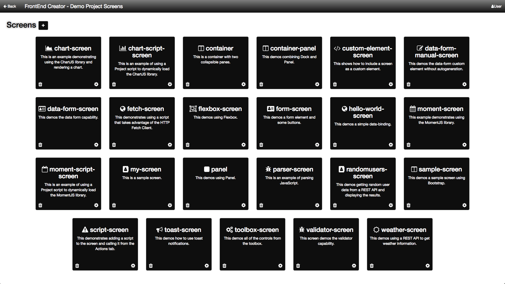
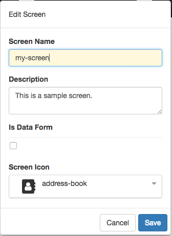

# Screens

After you have selected the project you want to work on, you will be presented with all of the available screens for that project. The following is a screen shot of some screens for a given project:

## Add/Edit Screen Dialog

The following is a screen shot of the add/edit dialog that is displayed when you click on the + button or the cog icon:

Every screen has a screen name, description, flag asking whether this is a Data Form, and a screen icon. The icon is used on the designer. Currently the icons you can select from are from FontAwesome. When you select the Data Form checkbox, it allows you to quickly scaffold admin screens by creating a form with inputs corresponding to the data provided. It also provides for validation and several settings on how to control validation as well as showing a validation summary.

### Note
The screen name, description, and icon will show up on the Screens view. Therefore it is important that you provide meaningful names and descriptions as well as a useful icon.

Once you have saved your screen addition or modification, you will navigate immediately to the designer screen.

[ <- Previous ](project-dashboard) | [ Home ](home) | [ Next -> ](designer)
