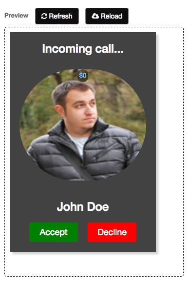

# Template Builder

The template builder allows you to quickly create templates that work off of entities. To allow for the most flexibility, you must provide a sample entity. The easiest way to do this is create an entity first in the **Entity Builder** and then copy the JSON and simply paste it in the Sample Entity tab.


As you can see from the animation above, it is very easy to make quick changes to your template and re-render them so that you can see what it looks like immediately. In the animation above, we are simply changing out some of the style settings but you could change out the HTML as well and test that.

The Template tab allows you to create templates quickly and render them on the right side. You have the option to use placeholders for where string interpolation will occur or simply provide your own. 

Most of the templates created by **FrontEnd Creator** embed styles into the template so that you can visualize them immediately. However, it is recommended that you pull those styles and put them in a Styles editor and reference them in the corresponding screen which will host the template.

The template builder has the following properties:

* ID - this is readonly and represents the template ID
* Name - this is the name of the template
* Description - this is the description of the template
* Template Type - this determines what type of template you are building. You have the following options:
  * Form Edit - this type represents an editable form for use with a single record. It will only show the Sample Entity tab
  * Form View - this type represents a view only form for use with a single record. It will only show the Sample Entity tab
  * Table Edit - this type represents an editable table for use with multiple records. It will only show the Sample Entity tab
  * Table View - this type represents a view only table for use with multiple records. It will only show the Sample Entity tab
  * Layout (Single Record) - this type allows you to provide a template for use with a single record using the Template tab
  * Layout (Multiple Records) - this type allows you to privide a template that will repeat across multiple records using the Template tab
* Order - this represents the order in which you would want the templates displayed for selection
* Number of Records - this indicates the number of records to be generated while previewing the template. It default value is one (1)

After the properties section, you have the Preview section. It contains two buttons and the preview area. The following is a description of each button:
* Refresh - this button will re-render the template and apply any data if any placeholders have been used. The mnemonic to execute this button is `Ctrl|Cmd + R`
* Reload - this button will re-load data based on the `Number of Records` propertry. You still need to click the Refresh button to re-render the template with the new data. The mnemonic to execute this button is `Ctrl|Cmd + D`

The template builder introduces a new concept called, **Placeholders**. This is how the template builder can remain generic and yet work with an existing entity to provide bindings on your templates when rendered. The following is an example of a template with several *placeholders*:

```html
<ul class="product-card grid">
  <li class="card" repeat.for="item of data" with.bind="item">
    <header title="$0">[0]</header>
    <main title="$1">[1]</main>
  </li>
</ul>

```

This template has two placeholders for real data to be represented. We have a position in the *header* element as well as in the *main* element. Observe that we use the brackets `[<number>]` with an index position inside to identify the order of the values rendered.

The template works in conjunction with an Entity. This is the reason for the Sample Entity tab. The following is the corresponding entity definition used with this template:

```json
{
  "name": "product",
  "fields": [
    {
      "name": "name",
      "alt": "",
      "type": "string",
      "defaultElement": "name",
      "includeField": true,
      "isRequired": false,
      "index": 0
    },
    {
      "name": "description",
      "alt": "",
      "type": "string",
      "defaultElement": "text",
      "includeField": true,
      "isRequired": false,
      "index": 1
    }
  ]
}
```

The important thing to note here is that we have two field entries. Each field has an `index` property. This should correspond to the *placeholder* you defined in template. So for the template markup we just saw, we are putting a string that represents a person name in the first (0) index position and a text string in second (1) index position.

To understand what your options are a given field, please refer to the documentation on [ Entity Builder ](entity-builder) and look at the corresponding tables.

## Quick Start
The following are the steps required to create a simple phone-card template:

1. Create a new tempalte by click on the New button.
2. Provide the name of the template: 'phone-card'
3. Select 'Layout (Multiple Records)' for the Template Type
4. Enter the number 10 for the Order
5. Enter the number 1 for the Number of Records
6. Add the following HTML for the Template:
  ```html
  <div>
    <style>
      section.fec-phone-cards {
        min-height: 475px;
      }
      .fec-phone-card {
        position: relative;
        list-style: none;
        max-height: 450px;
        max-width: 300px;
        background-color: #424242;
        color: white;
        margin-bottom: 15px;
        display: grid;
        grid-gap: 0;
        grid-template-rows: 1fr 6fr 1fr 1fr;
        box-shadow: 5px 5px 5px lightgray;
      }
      .fec-phone-card .image > img {
        flex-shrink: 0;
        min-width: 100%;
        min-height: 100%;
        border-radius: 150px;
      }
      .fec-phone-card .buttons > button {
        margin: 10px;
        width: 100px;
        height: 40px;
        font-size: large;
      }
      .fec-phone-card .green {
        background-color: green;
        color: white;
      }
      .fec-phone-card .red {
        background-color: red;
        color: white;
      }
      .fec-phone-card:hover [title]:before {
        position:absolute;
        float: left;
        color: rgba(128,200,255,1.0); 
        background-color: rgba(0,0,0,0.5); 
        content: attr(title);
        padding: 4px;
        border-radius: 10px;
      }
    </style>  
    <section class="fec-phone-cards">
      <li class="fec-phone-card" repeat.for="item of data" with.bind="item">
        <div class="margin-left-right-20">
          <h3 class="flex-row-1 justify-content-center">Incoming call...</h3>
        </div>
        <div title="$0" class="image padding-20 flex-row-1 justify-content-center">
          [0]
        </div>
        <div class="product margin-left-right-20">
          <h3 class="flex-row-1 justify-content-center">John Doe</h3>
        </div>
        <div class="buttons margin-left-right-20 margin-bottom-10 flex-row-1 justify-content-center">
          <button class="green flat">Accept</button>
          <button class="red flat">Decline</button>
        </div>
      </li>
    </section>
  </div>
  ```
7. Switch over to the Sample Entity tab and enter in the following:
  ```json
  {
    "name": "phone-card",
    "fields": [
      {
        "name": "poster",
        "alt": "",
        "type": "string",
        "defaultElement": "imgLarge",
        "includeField": true,
        "isRequired": false,
        "index": 0
      }
    ]
  }
  ```
8. Next, click on the Refresh button to render the template
9. You can change the Number of Records to see more of these templates and the click the Reload button followed by the Render button re-render the template
10. Trying changing out some of the embedded styles and click the Refresh button to see them applied 

That should do it! You should now have a template that looks something like the following with the exception of the image as it is random:


Notice, that we included some CSS to take advantage of the `title` attribute in the template. This allows to indicate *placeholders* that are substituted during the render phase from the sample entity. The following is the same screen but with the mouse hovering over the template:



As you can see, we see that there is a single *placeholder*. You can have as many placeholders as you like in a template. Just be sure that the corresponding entity has as many fields. Also remember that the index propertty of the fields is how the fields are ordered for matching the *placeholder* values.

Hopefully, you see how easy it is to create templates and visualize them. In the future, we will have the **Template Builder** available to the designer surface so that you can quickly create really nice looking screen layouts!

[ <- Previous ](application-export) | [ Home ](home) | [ Next -> ](translation-builder)
