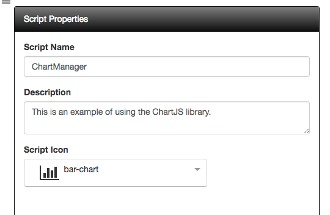
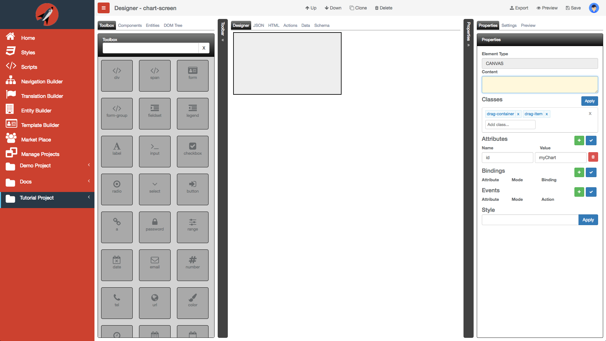

#Chart Screen Tutorial

The following are the steps required to use **FrontEnd Creator** and build a chart. It will make use of the *Scripts* capability as well as load the *ChartJS* external library on demand.


  https://www.youtube.com/watch?v=VKfqn33OuLI


Let's get started.

1) Click on the *Scripts* menu item from the navigation menu. Here we will add our first script. Enter the following into the Script Properties pane:



2) Next, copy and paste the following code into the editor:

```javascript
class ChartManager {

  constructor() {
    let url = 'https://cdnjs.cloudflare.com/ajax/libs/Chart.js/2.4.0/Chart.bundle';
    this.loadJS(url, this.onScriptLoaded.bind(this));
  }

  loadJS(url, callback) {
    require.config({
      paths: {
          "ChartJS": url
      },
      callback: callback,
      waitSeconds: 40
    });
  }
  onScriptLoaded(e) {
    require( ["ChartJS"],
      (Chart) => {
        this.Chart = Chart;
        this.initChart();
      }
    );
  }

 initChart() {
   let ctx = document.getElementById("myChart");
   let myChart = new this.Chart(ctx, {
     type: 'bar',
     data: {
       labels: ["Red", "Blue", "Yellow", "Green", "Purple", "Orange"],
       datasets: [{
         label: '# of Votes',
         data: [4, 1, 3, 5, 2, 3],
         backgroundColor: [
           'rgba(255, 99, 132, 0.2)',
           'rgba(54, 162, 235, 0.2)',
           'rgba(255, 206, 86, 0.2)',
           'rgba(75, 192, 192, 0.2)',
           'rgba(153, 102, 255, 0.2)',
           'rgba(255, 159, 64, 0.2)'
         ],
         borderColor: [
           'rgba(255,99,132,1)',
           'rgba(54, 162, 235, 1)',
           'rgba(255, 206, 86, 1)',
           'rgba(75, 192, 192, 1)',
           'rgba(153, 102, 255, 1)',
           'rgba(255, 159, 64, 1)'
         ],
         borderWidth: 1
       }]
     },
     options: {
       scales: {
         yAxes: [{
           ticks: {
             beginAtZero:true
           }
         }]
       }
     }
   });
 }    
}
```

3) As you can see we are using a standard ES6 class. We have a helper method `loadJS` that allows us to add any JavaScript library, preferable on a CDN. When the ChartJS library loads, we then call the `onScriptLoaded` method which assigns the chart object to `this` for access from other methods. Next, it calls the `initChart` method which does all the heavy work of creating the Chart. Take note that we are referencing a ID tag `myChart`. We will add that when we create our screen.

**Note** Bringing in third-party libraries should be familiar as we are using RequireJS syntax here.

4) Click the save button and the script should now show up on the left dock-pane.

5) We are now ready to start working on our screen.

6) Start by clicking on *Manage Projects* from navigation menu on the left pane.


7) Next, click on the New button and name the project, `Tutorial Project`. Add any description and leave the rest of the properties with their default values. You can add any tags you like to the project. Your should have something that looks like the following:


8) Once you click save, will notice that the project will automatically be added to the Manage Projects table as well as the navigation menu on the left:


9) Next, click on the Tutorial Project menu item from the navigation menu and select New Screen:


10) Name the scree, `chart-screen`. Add any description and pick any icon you wish for the screen. You can add any tags you like to the screen. You should have something that looks like the following:


11) Clicking save will navigate you to the designer.

12) Under the *Settings* tab, select the ChartManager script under the Screen Scripts section.

13) We are now ready to start building our layout. There is only a single element that we will use.

Here is a table representing the element and ID attribute value:

Element | ID
------- | ---- 
CANVAS | myChart

Here is a screenshot of the designer:



14) Save you work.

15) Click the Actions tab and enter the following code:

```javascript
function (that, V) {

  function attached() {
    that.chartManager = new that.Script.ChartManager();
  }

  return {
    attached: attached
  };
}
```

**Note** We use `that` as a reference to the parent view model. We also reference all scripts selected in the designer from the `Script` object.

16) Save your work.

17) Click on the Preview button and you should see something like the following:


18) Congratulations! You have finished this tutorial!!
