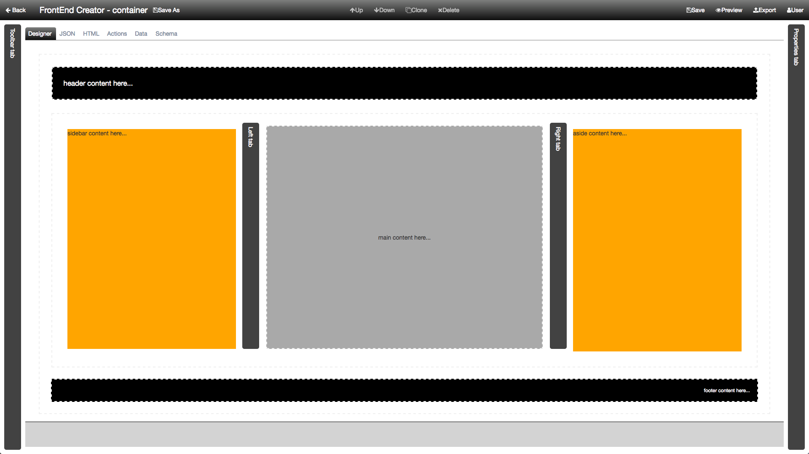
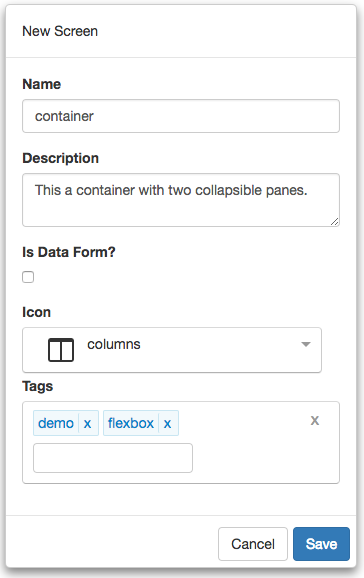

#Tutorial - Container with collapsible Panes, Part 1

The following are the steps required to use **FrontEnd Creator** to create a dock container using Flexbox. This is part 1 in a three-part series. We will create a dock container in this first tutorial. The container will have two collapsible panes. Here is a screen shot of the layout we are going to build:




Let's get started.

1) Start by clicking on *Manage Projects* from navigation menu on the left pane.


2) Next, click on the New button and name the project, `Tutorial Project`. Add any description and leave the rest of the properties with their default values. You can add any tags you like to the project. Your should have something that looks like the following:


3) Once you click save, will notice that the project will automatically be added to the Manage Projects table as well as the navigation menu on the left:


4) Next, click on the Tutorial Project menu item from the navigation menu and select New Screen:


5) Name the screen, `container`. Add any description and pick any icon you wish for the screen. You can add any tags you like to the screen. You should have something that looks like the following:



6) Clicking save will navigate you to the designer.

7) Now we are ready to start building our layout. Click on the HTML tab and replace the following snippet in the editor. 

```html
<div class="drag-container drag-item holy-grail flex-column full-height">  
  <style>
    .holy-grail header { background-color: black; color: white; padding: 15px; }
    .holy-grail sidebar { background-color: orange; padding: 15px; }
    .holy-grail article { background-color: darkgray; padding: 15px; }
    .holy-grail aside { background-color: orange; padding: 15px; }
    .holy-grail footer { background-color: black; color: white; padding: 15px; }
    .holy-grail .toggle-bar { cursor: pointer; padding: 10px; }
    .holy-grail .close-pane {
      flex: .00001;
      padding: 0;
      overflow: hidden;
      min-width: 0;
      max-width: 0;
      width: 0;
      margin:0;
    }
    .close-pane+.tab-header {
      cursor: auto;
    }
    #leftSide, #rightSide {
      transition: flex 350ms linear,
      min-width 350ms linear, 
      max-width 350ms linear, 
      width 350ms linear,
      min-height 350ms linear,
      max-height 350ms linear,
      height 350ms linear;
      overflow-x: auto;
    } 
  </style> 
  <header class="drag-container drag-item flex-row-none">
    header content here...  
  </header>  
  <main class="drag-container drag-item flex-row-1">  
    <sidebar id="leftSide" class="flex-row-1 min-max-width-400">
      sidebar content here...  
    </sidebar>  
    <div class="toggle-bar flex-none tab-header width-40" click.delegate="actions.toggleLeftSide()">  
      <span class="vertical-text">Left tab  
      </span>  
    </div>  
    <article class="drag-container drag-item flex-row-3 align-items-center justify-content-center">
      main content here...  
    </article>  
    <div class="toggle-bar flex-none tab-header width-40" click.delegate="actions.toggleRightSide()">  
      <span class="vertical-text">Right tab  
      </span>  
    </div>  
    <aside id="rightSide" class="flex-row-1 min-max-width-400">
      aside content here...  
    </aside>  
  </main>  
  <footer class="drag-container drag-item flex-row-none justify-content-end">
    footer content here...  
  </footer>
</div>
```

Before we move on, notice how we are using inline styles to help us with styling this page. This is done more for seeing what the layout looks like in the designer more than anything else.

The best practice would be to take the style and create a new sheet in the Style editor. Refer to the following [ Style Sheet Tutorial ](tutorials/style-sheet.md) if you would to do that. Just remember that you will not see the styles applied until you *Preview* your screen.

Another approach, but less recommended, is by setting the the styles attribute of individual elements. This is not very flexible as you will not be able to use CSS to affect styles that have been applied at the element level.

--> video here <--

Here is a recap of each of the elements that were added and settings. 

###Element Classes
The following is a breakdown for each element on the screen with its corresponding *class* values:

Element | Host | Class 
--- | --- | --- |---
DIV |  | flex-column full-height
HEADER | DIV | flex-row-none
MAIN | DIV | flex-row-1
SIDEBAR | MAIN | flex-row-1 min-max-width-400 margin-15
DIV | MAIN | flex-none tab-header margin-right-10 width-40
DIV | DIV | vertical-text
ARTICLE | MAIN | flex-row-3 align-items-center justify-content-center
DIV | MAIN | flex-none tab-header margin-left-10 width-40
DIV | DIV | vertical-text
ASIDE | MAIN | flex-row-1 min-max-width-400 margin-15
FOOTER | DIV | flex-row-none justify-content-end

###Element Content
The following is a breakdown for each element on the screen with its corresponding *content* values:

Element | Host | Content
--- | --- | ---
DIV |  |  
HEADER | DIV | header content here...
MAIN | DIV | 
SIDEBAR | MAIN | sidebar content here...
DIV | MAIN | 
DIV | DIV | Left tab
ARTICLE | MAIN | main content here...
DIV | MAIN | 
DIV | DIV | Right tab
ASIDE | MAIN | aside content here...
FOOTER | DIV | footer content here...

###Element Events
The following are the events on the elements:

Element | Attribute | Mode | Action
--- | --- | --- |---
DIV | click | delegate | actions.toggleSidebar() 
DIV | click | delegate | actions.toggleAside() 

8) Save you work.

9) Click the Actions tab and enter the following code:

```javascript
function (that, V) {

  function toggleSidebar() {
      var sb = document.querySelector('#sidebar-tab');
      if (sb && sb.classList.contains('close-tab')) {
        sb.classList.remove('close-tab');      
      } else {
        sb.classList.add('close-tab');      
      }
    }
   
   function toggleAside() {
      var sb = document.querySelector('#aside-tab');
      if (sb && sb.classList.contains('close-tab')) {
        sb.classList.remove('close-tab');      
      } else {
        sb.classList.add('close-tab');      
      }
    }
  
 return {
    toggleSidebar: toggleSidebar,
    toggleAside: toggleAside
  };
}
```

10) Save your work.

11) Click on the *Preview* button and you should see something like the following:


That's it! You have completed part 1! Congratulations!

