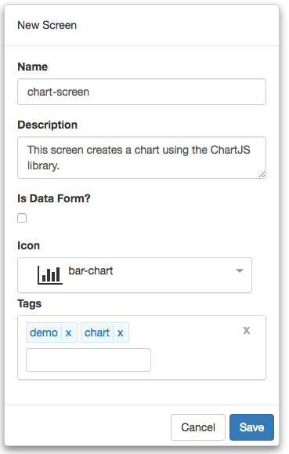

#Tutorial - Container with collapsible Panes, Part 1

The following are the steps required to use **FrontEnd Creator** to create a dock container using Flexbox. This is part 1 in a three-part series. We will create a dock container in this first tutorial. The container will have two collapsible panes. Here is a screen shot of the layout we are going to build:


Let's get started.

1) Start by clicking on *Manage Projects* from navigation menu on the left pane.


2) Next, click on the New button and name the project, `Tutorial Project`. Add any description and leave the rest of the properties with their default values. You can add any tags you like to the project. Your should have something that looks like the following:


3) Once you click save, will notice that the project will automatically be added to the Manage Projects table as well as the navigation menu on the left:


4) Next, click on the Tutorial Project menu item from the navigation menu and select New Screen:


5) Name the scree, `chart-screen`. Add any description and pick any icon you wish for the screen. You can add any tags you like to the screen. You should have something that looks like the following:




6) Clicking save will navigate you to the designer.

7) Now we are ready to start building our layout. Click on the HTML tab and replace the following snippet in the editor. 

```html
<div class="drag-container drag-item holy-grail flex-column full-height">
  <style>
    .holy-grail header { background-color: black; color: white; }
    .holy-grail sidebar { background-color: orange; }
    .holy-grail article { background-color: darkgray; }
    .holy-grail aside { background-color: orange; }
    .holy-grail footer { background-color: black; color: white; }
  </style>
  <header class="drag-container drag-item flex-row-none padding-10">
    header content here...
  </header>
  <main class="drag-container drag-item flex-row-1">
    <sidebar tag="left-pane" class="flex-row-1 min-max-width-400 margin-15" id="sidebar-tab">
      sidebar content here...
    </sidebar>
    <div tag="tab-header" class="flex-none tab-header margin-right-10 width-40" click.delegate="actions.toggleSidebar()">
      <span class="vertical-text">Left tab</span>
    </div>
    <article class="drag-container drag-item flex-row-3 align-items-center justify-content-center">
      main content here...
    </article>
    <div tag="tab-header" class="flex-none tab-header margin-left-10 width-40" click.delegate="actions.toggleAside()">
      <span class="vertical-text">Right tab</span>
    </div>
    <aside tag="right-pane" class="flex-row-1 min-max-width-400 margin-15" id="aside-tab">
      aside content here...
    </aside>
  </main>
  <footer class="drag-container drag-item flex-row-none justify-content-end padding-10">
    footer content here...
  </footer>
</div>
```

Before we move on, notice how we are using inline styles to help us with styling this page. We could have taken this further and replaced some of the classes that we have on the elements. Just remember that you can do this either by setting the style attribute on the element itself or by providing some CSS. Both of these approaches do no require any interpolation or bindings.

Here is a recap of each of the elements that were added and settings. In each element we set specific classes and styles. The following is a breakdown for each element:

Element | Host | Class 
--- | --- | --- |---
DIV |  | flex-column full-height
HEADER | DIV | flex-row-none
MAIN | DIV | flex-row-1
SIDEBAR | MAIN | flex-row-1 min-max-width-400 margin-15
DIV | MAIN | flex-none tab-header margin-right-10 width-40
DIV | DIV | vertical-text
ARTICLE | MAIN | flex-row-3 align-items-center justify-content-center
DIV | MAIN | flex-none tab-header margin-left-10 width-40
DIV | DIV | vertical-text
ASIDE | MAIN | flex-row-1 min-max-width-400 margin-15
FOOTER | DIV | flex-row-none justify-content-end

Element | Host | Content
--- | --- | ---
DIV |  |  
HEADER | DIV | header content here...
MAIN | DIV | 
SIDEBAR | MAIN | sidebar content here...
DIV | MAIN | 
DIV | DIV | Left tab
ARTICLE | MAIN | main content here...
DIV | MAIN | 
DIV | DIV | Right tab
ASIDE | MAIN | aside content here...
FOOTER | DIV | footer content here...


## Events
The following are the events on the elements:

Element | Attribute | Mode | Action
--- | --- | --- |---
DIV | click | delegate | actions.toggleSidebar() 
DIV | click | delegate | actions.toggleAside() 

8) Save you work.

9) Click the Actions tab and enter the following code:

```javascript
function (that, V) {

  function toggleSidebar() {
      var sb = document.querySelector('#sidebar-tab');
      if (sb && sb.classList.contains('close-tab')) {
        sb.classList.remove('close-tab');      
      } else {
        sb.classList.add('close-tab');      
      }
    }
   
   function toggleAside() {
      var sb = document.querySelector('#aside-tab');
      if (sb && sb.classList.contains('close-tab')) {
        sb.classList.remove('close-tab');      
      } else {
        sb.classList.add('close-tab');      
      }
    }
  
 return {
    toggleSidebar: toggleSidebar,
    toggleAside: toggleAside
  };
}
```

10) Save your work.

11) Click on the Preview button and you should see something like the following:


That's it! You have completed part 1! Congratulations!

[ Tutorials ](tutorials/tutorials) | [ Next -> ](container-part-2)
