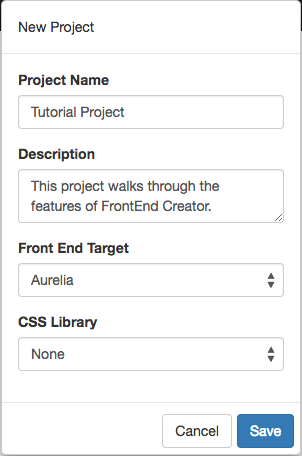
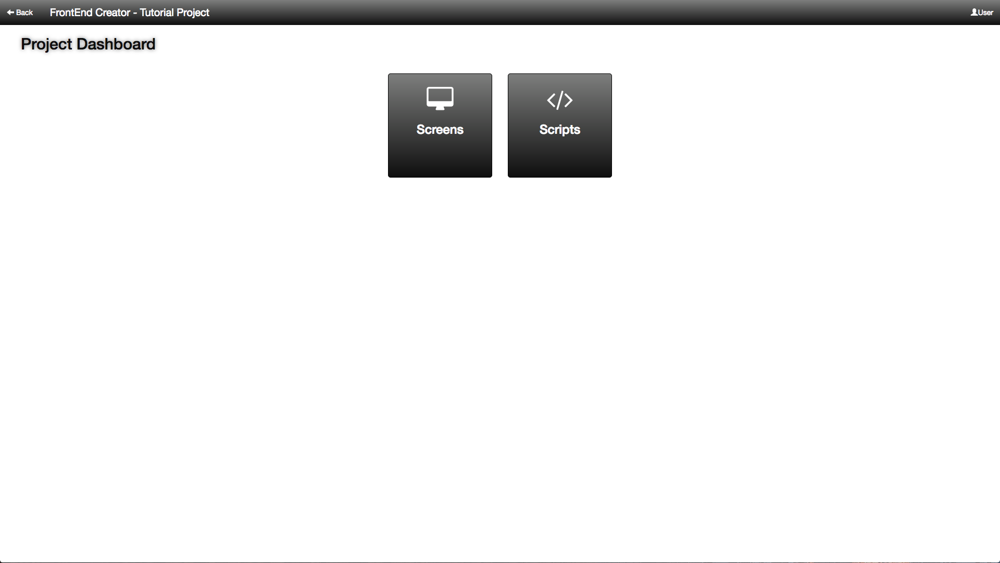

#Tutorial - Container with collapsible Panes, Part 3

So far, we have built two separate components. We have a container with sliding panes and we now have a panel. In this tutorial, we are going to bring it all together by using composition and build out our container now with the panels included. Here is a screen shot of the layout we are going to build:

Let's get started.

1. Start by creating a project called, `Tutorial Project`. Add any description and left the rest of the properties with their default values. Your screen should look like the following:

  

2. Once you click save, you will go to the Project Dashboard. We will go straight to the screens.

  

3. Click on the plus button to add a new screen.

  

4. The next steps is best shown with video and audio. We will simply be dragging our two previously created components and adjusting a few minor settings. Follow the steps in the video here then come back and continue:

  

5. Save you work.

6. Click on the Preview button and you should see something like the following:

  

That it! You have completed part 3! Congratulations!

[ Tutorials ](tutorials/tutorials)

