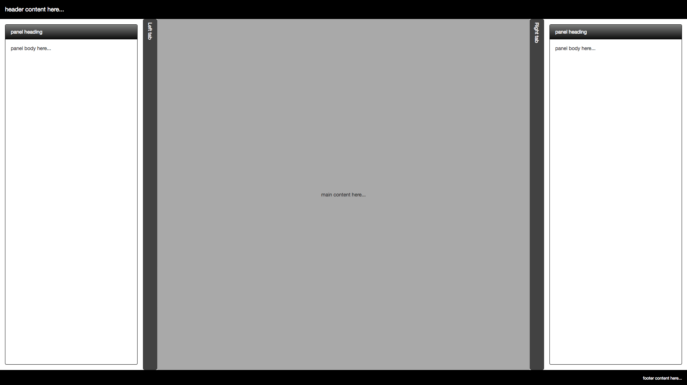
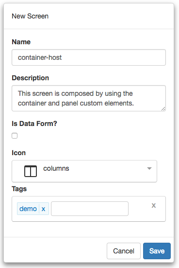

#Container Tutorial - Part 4 Custom Elements

In the previous tutorial, we created our `container-panel` using composition. This time through, we are going to create a container that uses Custom Elements. Here is a screen shot of the layout we are going to build:




Let's get started.

1) Start by clicking on *Manage Projects* from navigation menu on the left pane.


2) Next, click on the New button and name the project, `Tutorial Project`. Add any description and leave the rest of the properties with their default values. You can add any tags you like to the project. Your should have something that looks like the following:


3) Once you click save, will notice that the project will automatically be added to the Manage Projects table as well as the navigation menu on the left:


4) Next, click on the Tutorial Project menu item from the navigation menu and select New Screen:


5) Name the screen, `container-host`. Add any description and pick any icon you wish for the screen. You can add any tags you like to the screen. You should have something that looks like the following:



6) Now we are ready to start building our layout. The following video will walk you through the steps required to create our `container-host` screen using custom elements:


  https://youtu.be/0D4wTgGEhF8



We first had to make a few minor adjustments to the `container` screen so that we could drop our `panel` screen on it and it would render properly. This is achieved by use **slot** element.

7) Let recap what we did in the video:

In the `container` screen, we had to modify the HTML markup just a little to allow for dropping other elements. The following is the HTML markup:

```html

<div class="drag-container drag-item holy-grail flex-column full-height">  
  <style>
 .holy-grail header { background-color: black; color: white; padding: 15px; }
 .holy-grail sidebar { padding: 15px; }
 .holy-grail article { background-color: darkgray; padding: 15px; }
 .holy-grail aside { padding: 15px; }
 .holy-grail footer { background-color: black; color: white; padding: 15px; }
 .holy-grail .toggle-bar { cursor: pointer; padding: 10px; }
 .holy-grail .close-pane {
 flex: .00001;
 padding: 0;
 overflow: hidden;
 min-width: 0;
 max-width: 0;
 width: 0;
 margin:0;
 }
 .close-pane+.tab-header {
 cursor: auto;
 }
 #leftSide, #rightSide {
 transition: flex 350ms linear,
 min-width 350ms linear, 
 max-width 350ms linear, 
 width 350ms linear,
 min-height 350ms linear,
 max-height 350ms linear,
 height 350ms linear;
 overflow-x: auto;
 }  
  </style>  
  <header class="drag-container drag-item flex-row-none">
 header content here...  
  </header>  
  <main class="drag-container drag-item flex-row-1">  
    <sidebar id="leftSide" class="flex-row-1 min-max-width-400"> 
      <slot name="leftSlot">
      </slot> 
    </sidebar>  
    <div class="toggle-bar flex-none tab-header width-40" click.delegate="actions.toggleLeftSide()">  
      <span class="vertical-text">Left tab  
      </span>  
    </div>  
    <article class="drag-container drag-item flex-row-3 align-items-center justify-content-center">
 main content here...  
    </article>  
    <div class="toggle-bar flex-none tab-header width-40" click.delegate="actions.toggleRightSide()">  
      <span class="vertical-text">Right tab  
      </span>  
    </div>  
    <aside id="rightSide" class="flex-row-1 min-max-width-400"> 
      <slot name="rightSlot">
      </slot> 
    </aside>  
  </main>  
  <footer class="drag-container drag-item flex-row-none justify-content-end">
 footer content here...  
  </footer>
</div>
```

The only things of difference here is that we removed the `background-color` from the `sidebar` and `aside` CSS. We also added *named slots* as the content inside each corresponding `sidebar` and `aside`. This is how we can later add more content from another screen.

In the `container-host` scree, the following is the HTML markup for the `container-screen`: 

```html
<div class="full-height"> 
  <require from="container">
  </require> 
  <require from="panel">
  </require> 
  <container>
    <panel slot="leftSlot" class="flex-row-1">
    </panel>
    <panel slot="rightSlot" class="flex-row-1">
    </panel>
  </container>
</div>
```

As you can see we need to `require` our other screens so that we can use them. For each `panel`, we provide the `slot` names so that they are rendered in the correct location. Finally, we are setting the *class* attribute of the two panels so that they fit the screen properly.

**Note:** Since we are using Custom Elements in **FrontEnd Creator**, rendering them in the designer is problematic as the designer wants to deal with raw HTML instead of custom elements. We can easily *preview* our work but seeing in the designer will not show much.

8) Save you work.

9) Click on the Preview button and you should see something like the following:


That's it! You have completed part 4! Congratulations!
